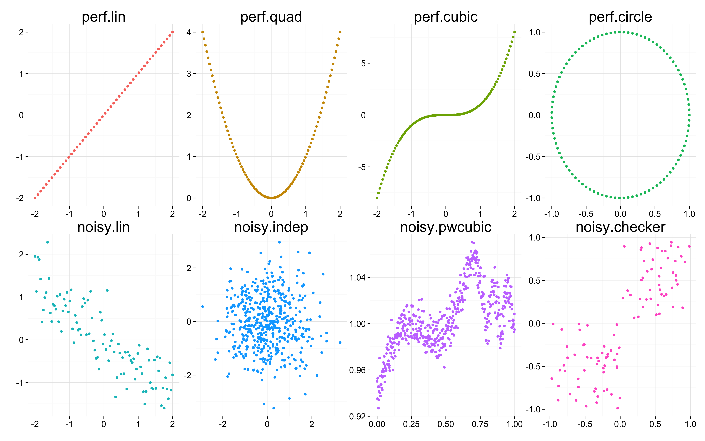

Ann Arbor R User Group
=======================================
width: 1024
height: 768
css: slides.css
font-family: Optima
transition-speed: fast

Agenda:
- 6:30 Socializing
- 6:45 Introductions, tips, tricks, and cool stuff found
- 7:00 Introduction to plyr


Introduction to plyr
========================================================
type: section

#### Ellis Valentiner
#### 9/18/2014

Outline
========================================================
Motivation

Basic strategy: split-apply-combine

Examples:
- US baby names
- New York air quality
- ACE data

Wrap up: how it all fits together

Motivation
========================================================

a common pattern in the analysis of large data is to perform the same analysis on many (many many) smaller subsets of data

- fit the same model to subsets of a data frame
- quickly calculate summary statistics for each group
- perform group-wise transformations like scaling or standardizing

Features of plyr:

- common, easy syntax
- less code
- code can be run in parallel

Basic strategy
========================================================
**Split** up a big dataset

**Apply** a function to each piece

**Combine** all the pieces back together

Base R vs. plyr
========================================================

#### Base R functions

             |   array | data frame |    list | nothing
-------------|---------|------------|---------|---------
**array**        | `apply` |    |  |
**data frame**   |  | `aggregate`    | `by` |
**list**         | `sapply` |     | `lapply` |
**n replicates** | `replicate` |     | `replicate` |
**function args**| `mapply` |     | `mapply` |

#### plyr functions

             |   array | data frame |    list | nothing
-------------|---------|------------|---------|---------
**array**        | `aaply` | `adply`    | `alply` | `a_ply`
**data frame**   | `daply` | `ddply`    | `dlply` | `d_ply`
**list**         | `laply` | `ldply`    | `llply` | `l_ply`
**n replicates** | `raply` | `rdply`    | `rlply` | `r_ply`
**function args**| `maply` | `mdply`    | `mlply` | `m_ply`

Core functions
===========================================================

### `**ply(.data, .variables, .fun, ...)`

for each **split** of a [*array, list, data frame, ...*], **apply** a function, then **combine** the results into a [*array, list, data frame, ...*]

Choice | Description
-------|-------------
a | array
l | list
d | data frame
m | multiple inputs
r | repeat multiple times
_ | nothing

Core functions cont.
========================================================

### `ddply(.data, .variables, .fun, ...)`

for each **split** of a *data frame*, **apply** a function, then **combine** the results into a data frame

### `ldply(.data, .fun, ...)`

for each **split** of a *list*, **apply** a function, then **combine** the results into a data frame

### `adply(.data, .margins, .fun, ...)`

for each **split** of a *array*, **apply** a function, then **combine** the results into a data frame

Some (but not all) helper functions
========================================================

Function | Description
---------|-------------
`transform(df, var1 = exp1, ...)` | modifies an existing data frame (base function)
`mutate` | add new columns or modifying existing columns, like `transform`, but new columns can refer to other columns that you just created
`summarize(df, var1 = exp1, ...)` | like `mutate`, but creates a new data frame and does not preserve any columns in the old data frame
`count(df, vars, ...)` | quickly count unique combinations and return as a data frame
`arrange(df, var1, ...)` | re-order the rows of a data frame by specifying the columns to order by

Examples
===========================================================
type: section

Baby names
===========================================================

Dataset:
- Top 1,000 male and female baby names in the US from 1880 to 2008
- 258,000 records (1,000 * 2 * 129)
- Only four variables: year, name, sex, and percent

### Goal:
Compute the rank of a name given sex and year

Approach 1: Base R
===========================================================


```r
# Split
pieces <- split(bnames,
  list(bnames$sex, bnames$year))
# Apply
results <- vector("list", length(pieces))
for(i in seq_along(pieces)) {
  piece <- pieces[[i]]
  piece <- transform(piece,
    rank = rank(-percent, ties.method =
      "first"))
  results[[i]] <- piece
}
# Combine
result <- do.call("rbind", results)
```

Approach 2: plyr
===========================================================


```r
result <- ddply(bnames, c("sex", "year"),
  transform,
  rank = rank(-percent,
    ties.method = "first"))
```

Approch 3: plyr + parallel
=============================


```r
bnames <- ddply(bnames, c("sex", "year"),
  transform,
  rank = rank(-percent,
    ties.method = "first"),
  parallel = TRUE)
```

Speed comparison
=============================
class: big-table

Runtime for each approach in seconds:

Approach | User | System | Elapsed
---------|------|--------|---------
base R   | 2.813| 1.798  | 3.046
plyr     | 4.331| 1.918  | 4.131
plyr + parallel | 2.561 | 1.202 | 2.486

Most common name by sex for each year
=============================


```r
top_names <- ddply(bnames, .(year, sex),
  summarize, 'Most common' =
  name[which.max(percent)])
head(top_names)
```

```
  year  sex Most common
1 1880  boy        John
2 1880 girl        Mary
3 1881  boy        John
4 1881 girl        Mary
5 1882  boy        John
6 1882 girl        Mary
```

Example 2
===========================================================
type: section

New York Air Quality Measurements
========================================================

Daily air quality measurements in New York, May to September 1973.

- Ozone: Mean ozone in parts per billion from 1300 to 1500 hours at Roosevelt Island
- Solar.R: Solar radiation in Langleys in the frequency band 4000–7700 Angstroms from 0800 to 1200 hours at Central Park
- Wind: Average wind speed in miles per hour at 0700 and 1000 hours at LaGuardia Airport
- Temp: Maximum daily temperature in degrees Fahrenheit at La Guardia Airport

Goal
===========================================================

Create a summary table that reports the $N$, and mean temperature and standard deviation for each month.


```r
ddply(airquality, .(Month), summarize,
  "N" = sum(!is.na(Temp)),
  "Mean" = mean(Temp),
  "SD" = sd(Temp))
```

```
  Month  N  Mean    SD
1     5 31 65.55 6.855
2     6 30 79.10 6.599
3     7 31 83.90 4.316
4     8 31 83.97 6.585
5     9 30 76.90 8.356
```

Example 3
===========================================================
type: section

ACE Algorithm Data
===========================================================

Alternative conditional expectations (ACE) data contains a list of 8 lists of $x, y$ coordinate pairs.


```r
load("Data/ace.Rdata")
str(ace.data, list.len = 3)
```

```
List of 8
 $ perf.lin     :List of 2
  ..$ x: num [1:50] -2 -1.92 -1.84 -1.76 -1.67 ...
  ..$ y: num [1:50] -2 -1.92 -1.84 -1.76 -1.67 ...
 $ perf.quad    :List of 2
  ..$ x: num [1:100] -2 -1.96 -1.92 -1.88 -1.84 ...
  ..$ y: num [1:100] 4 3.84 3.68 3.53 3.38 ...
 $ perf.cubic   :List of 2
  ..$ x: num [1:100] -2 -1.96 -1.92 -1.88 -1.84 ...
  ..$ y: num [1:100] -8 -7.52 -7.07 -6.63 -6.21 ...
  [list output truncated]
```

Problem
===========================================================

Nested list structures can be difficult to process and analyse.

How can we convert this to something easy to work with?

Solution
===========================================================

This is easy with `ldply`!


```r
result <- ldply(ace.data, data.frame,
  .id = 'Group')
head(result)
```


```
     Group      x      y
1 perf.lin -2.000 -2.000
2 perf.lin -1.918 -1.918
3 perf.lin -1.837 -1.837
4 perf.lin -1.755 -1.755
5 perf.lin -1.673 -1.673
6 perf.lin -1.592 -1.592
```

Plotting the data
===========================================================

 


Wrap up: bring it all together
===========================================================
type: section

plyr
========================================================

An approach to perform the same analysis on many (many many) smaller subsets of data

- fit the same model to subsets of a data frame
- quickly calculate summary statistics for each group
- perform group-wise transformations like scaling or standardising

Features of plyr:

- common, easy syntax
- less code
- code can be run in parallel

End
===========================================================
type: section
