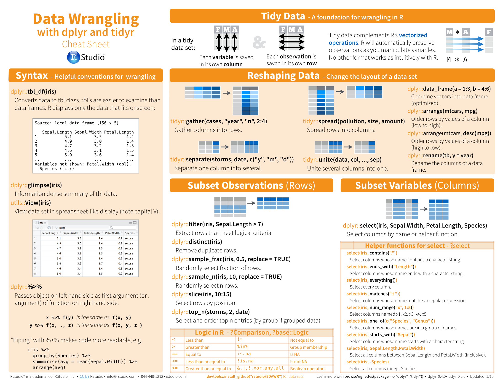
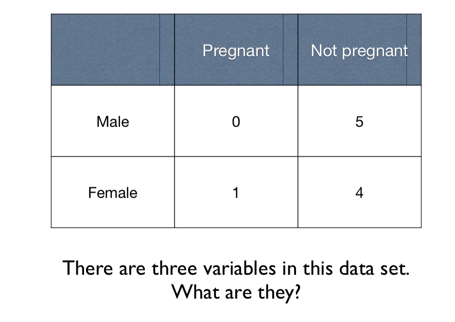
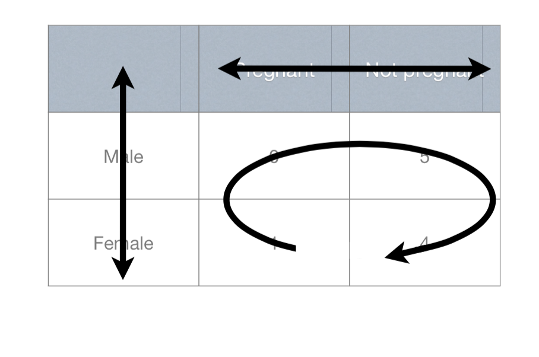
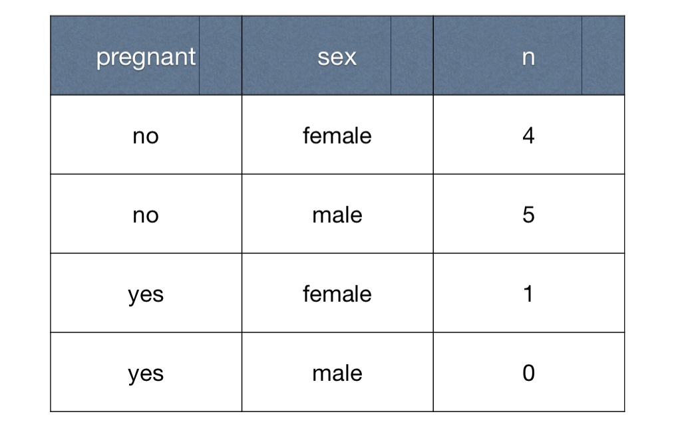

Tidy Data in R
========================================================
author: Kun Deng
date: 2/18/2015


Introduction
========================================================

Examples in this presentation are mostly from Rstudio help
and online materials.  No copyright is claimed.  

- History of **tidyr** and **dplyr** package
- Tidy data with **tidyr**
- Transform data with **dplyr**  (not today)


History of tidyr and dplyr
========================================================

- About **Tidyr**. 

**reshape** $\Longrightarrow$ **reshape2** $\Longrightarrow$ **tidyr**.  
All three packages are developed by Hadley Wickham. 

- About **dplyr** 

Learning tidyr
========================================================


- read http://blog.rstudio.org/2014/07/22/introducing-tidyr/

- read http://cran.r-project.org/web/packages/tidyr/vignettes/tidy-data.html


- keep http://www.rstudio.com/wp-content/uploads/2015/02/data-wrangling-cheatsheet.pdf 


Cheatsheet
=========================================================



Common causes of messiness
========================================================

- Column headers are values, not variable names. $\checkmark$
- Multiple variables are stored in one column. $\checkmark$
- Variables are stored in both rows and columns. $\checkmark$
- Multiple types of observational units are stored in the same table. 
- A single observational unit is stored in multiple tables.


Example 1: column headers are values
=======================================================


Example 1: column headers are values
=======================================================


Example 1: column headers are values
=======================================================



Example 1: 
=======================================================

```r
library(tidyr)
library(dplyr)

messy <- data.frame(
  name = c("Wilbur", "Petunia", "Gregory"),
  a = c(67, 80, 64),
  b = c(56, 90, 50)
)
messy
```

```
     name  a  b
1  Wilbur 67 56
2 Petunia 80 90
3 Gregory 64 50
```
a and b are two types of drugs.  
numeric values are person's heart rates. 


Example 1: Solution
=======================================================

```r
messy %>%
  gather(drug, heartrate, a:b)
```

```
     name drug heartrate
1  Wilbur    a        67
2 Petunia    a        80
3 Gregory    a        64
4  Wilbur    b        56
5 Petunia    b        90
6 Gregory    b        50
```
 
**param 1**: new variable name for the keys (scattered as column headers in old data); 
**param 2**: new variable name for values. 
**param 3**: old columns headers.


Example 2: multiple variables are stored in one column
=====================================================

```
'data.frame':	4 obs. of  6 variables:
 $ id     : int  1 2 3 4
 $ trt    : Factor w/ 2 levels "control","treatment": 2 1 2 1
 $ work.T1: num  0.0851 0.2254 0.2745 0.2723
 $ home.T1: num  0.616 0.43 0.652 0.568
 $ work.T2: num  0.114 0.596 0.358 0.429
 $ home.T2: num  0.0519 0.2642 0.3988 0.8361
```
Time spent on phones, measured at two locations (work and home), at two times. 

Example 2: multiple variables are stored in one column
=====================================================

```r
tidier <- messy %>%
  gather(key, time, -id, -trt)
tidier %>% head(8)
```

```
  id       trt     key       time
1  1 treatment work.T1 0.08513597
2  2   control work.T1 0.22543662
3  3 treatment work.T1 0.27453052
4  4   control work.T1 0.27230507
5  1 treatment home.T1 0.61582931
6  2   control home.T1 0.42967153
7  3 treatment home.T1 0.65165567
8  4   control home.T1 0.56773775
```

Example 2: multiple variables are stored in one column
=====================================================

```r
tidy <- tidier %>%
  separate(key, into = c("location", "time"), sep = "\\.") 
tidy %>% head(8)
```

```
  id       trt location time       time
1  1 treatment     work   T1 0.08513597
2  2   control     work   T1 0.22543662
3  3 treatment     work   T1 0.27453052
4  4   control     work   T1 0.27230507
5  1 treatment     home   T1 0.61582931
6  2   control     home   T1 0.42967153
7  3 treatment     home   T1 0.65165567
8  4   control     home   T1 0.56773775
```


Example 3: Variables are stored in both rows and columns
=====================================================

```
Classes 'tbl_df', 'tbl' and 'data.frame':	22 obs. of  35 variables:
 $ id     : chr  "MX17004" "MX17004" "MX17004" "MX17004" ...
 $ year   : int  2010 2010 2010 2010 2010 2010 2010 2010 2010 2010 ...
 $ month  : int  1 1 2 2 3 3 4 4 5 5 ...
 $ element: chr  "tmax" "tmin" "tmax" "tmin" ...
 $ d1     : num  NA NA NA NA NA NA NA NA NA NA ...
 $ d2     : num  NA NA 27.3 14.4 NA NA NA NA NA NA ...
 $ d3     : num  NA NA 24.1 14.4 NA NA NA NA NA NA ...
 $ d4     : num  NA NA NA NA NA NA NA NA NA NA ...
 $ d5     : num  NA NA NA NA 32.1 14.2 NA NA NA NA ...
 $ d6     : num  NA NA NA NA NA NA NA NA NA NA ...
 $ d7     : num  NA NA NA NA NA NA NA NA NA NA ...
 $ d8     : num  NA NA NA NA NA NA NA NA NA NA ...
 $ d9     : logi  NA NA NA NA NA NA ...
 $ d10    : num  NA NA NA NA 34.5 16.8 NA NA NA NA ...
 $ d11    : num  NA NA 29.7 13.4 NA NA NA NA NA NA ...
 $ d12    : logi  NA NA NA NA NA NA ...
 $ d13    : num  NA NA NA NA NA NA NA NA NA NA ...
 $ d14    : num  NA NA NA NA NA NA NA NA NA NA ...
 $ d15    : num  NA NA NA NA NA NA NA NA NA NA ...
 $ d16    : num  NA NA NA NA 31.1 17.6 NA NA NA NA ...
 $ d17    : num  NA NA NA NA NA NA NA NA NA NA ...
 $ d18    : logi  NA NA NA NA NA NA ...
 $ d19    : logi  NA NA NA NA NA NA ...
 $ d20    : logi  NA NA NA NA NA NA ...
 $ d21    : logi  NA NA NA NA NA NA ...
 $ d22    : logi  NA NA NA NA NA NA ...
 $ d23    : num  NA NA 29.9 10.7 NA NA NA NA NA NA ...
 $ d24    : logi  NA NA NA NA NA NA ...
 $ d25    : num  NA NA NA NA NA NA NA NA NA NA ...
 $ d26    : num  NA NA NA NA NA NA NA NA NA NA ...
 $ d27    : num  NA NA NA NA NA NA 36.3 16.7 33.2 18.2 ...
 $ d28    : num  NA NA NA NA NA NA NA NA NA NA ...
 $ d29    : num  NA NA NA NA NA NA NA NA NA NA ...
 $ d30    : num  27.8 14.5 NA NA NA NA NA NA NA NA ...
 $ d31    : num  NA NA NA NA NA NA NA NA NA NA ...
```

Example 3: Variables are stored in both rows and columns 
=====================================================

```
Source: local data frame [66 x 6]

        id year month day element value
1  MX17004 2010     1  30    tmax  27.8
2  MX17004 2010     1  30    tmin  14.5
3  MX17004 2010     2   2    tmax  27.3
4  MX17004 2010     2   2    tmin  14.4
5  MX17004 2010     2   3    tmax  24.1
6  MX17004 2010     2   3    tmin  14.4
7  MX17004 2010     2  11    tmax  29.7
8  MX17004 2010     2  11    tmin  13.4
9  MX17004 2010     2  23    tmax  29.9
10 MX17004 2010     2  23    tmin  10.7
11 MX17004 2010     3   5    tmax  32.1
12 MX17004 2010     3   5    tmin  14.2
13 MX17004 2010     3  10    tmax  34.5
14 MX17004 2010     3  10    tmin  16.8
15 MX17004 2010     3  16    tmax  31.1
16 MX17004 2010     3  16    tmin  17.6
17 MX17004 2010     4  27    tmax  36.3
18 MX17004 2010     4  27    tmin  16.7
19 MX17004 2010     5  27    tmax  33.2
20 MX17004 2010     5  27    tmin  18.2
21 MX17004 2010     6  17    tmax  28.0
22 MX17004 2010     6  17    tmin  17.5
23 MX17004 2010     6  29    tmax  30.1
24 MX17004 2010     6  29    tmin  18.0
25 MX17004 2010     7   3    tmax  28.6
26 MX17004 2010     7   3    tmin  17.5
27 MX17004 2010     7  14    tmax  29.9
28 MX17004 2010     7  14    tmin  16.5
29 MX17004 2010     8   5    tmax  29.6
30 MX17004 2010     8   5    tmin  15.8
31 MX17004 2010     8   8    tmax  29.0
32 MX17004 2010     8   8    tmin  17.3
33 MX17004 2010     8  13    tmax  29.8
34 MX17004 2010     8  13    tmin  16.5
35 MX17004 2010     8  23    tmax  26.4
36 MX17004 2010     8  23    tmin  15.0
37 MX17004 2010     8  25    tmax  29.7
38 MX17004 2010     8  25    tmin  15.6
39 MX17004 2010     8  29    tmax  28.0
40 MX17004 2010     8  29    tmin  15.3
41 MX17004 2010     8  31    tmax  25.4
42 MX17004 2010     8  31    tmin  15.4
43 MX17004 2010    10   5    tmax  27.0
44 MX17004 2010    10   5    tmin  14.0
45 MX17004 2010    10   7    tmax  28.1
46 MX17004 2010    10   7    tmin  12.9
47 MX17004 2010    10  14    tmax  29.5
48 MX17004 2010    10  14    tmin  13.0
49 MX17004 2010    10  15    tmax  28.7
50 MX17004 2010    10  15    tmin  10.5
51 MX17004 2010    10  28    tmax  31.2
52 MX17004 2010    10  28    tmin  15.0
53 MX17004 2010    11   2    tmax  31.3
54 MX17004 2010    11   2    tmin  16.3
55 MX17004 2010    11   4    tmax  27.2
56 MX17004 2010    11   4    tmin  12.0
57 MX17004 2010    11   5    tmax  26.3
58 MX17004 2010    11   5    tmin   7.9
59 MX17004 2010    11  26    tmax  28.1
60 MX17004 2010    11  26    tmin  12.1
61 MX17004 2010    11  27    tmax  27.7
62 MX17004 2010    11  27    tmin  14.2
63 MX17004 2010    12   1    tmax  29.9
64 MX17004 2010    12   1    tmin  13.8
65 MX17004 2010    12   6    tmax  27.8
66 MX17004 2010    12   6    tmin  10.5
```

Example 3: Variables are stored in both rows and columns 
=====================================================

```r
weather3 %>% spread(element, value)
```

```
Source: local data frame [33 x 6]

        id year month day tmax tmin
1  MX17004 2010     1  30 27.8 14.5
2  MX17004 2010     2   2 27.3 14.4
3  MX17004 2010     2   3 24.1 14.4
4  MX17004 2010     2  11 29.7 13.4
5  MX17004 2010     2  23 29.9 10.7
6  MX17004 2010     3   5 32.1 14.2
7  MX17004 2010     3  10 34.5 16.8
8  MX17004 2010     3  16 31.1 17.6
9  MX17004 2010     4  27 36.3 16.7
10 MX17004 2010     5  27 33.2 18.2
11 MX17004 2010     6  17 28.0 17.5
12 MX17004 2010     6  29 30.1 18.0
13 MX17004 2010     7   3 28.6 17.5
14 MX17004 2010     7  14 29.9 16.5
15 MX17004 2010     8   5 29.6 15.8
16 MX17004 2010     8   8 29.0 17.3
17 MX17004 2010     8  13 29.8 16.5
18 MX17004 2010     8  23 26.4 15.0
19 MX17004 2010     8  25 29.7 15.6
20 MX17004 2010     8  29 28.0 15.3
21 MX17004 2010     8  31 25.4 15.4
22 MX17004 2010    10   5 27.0 14.0
23 MX17004 2010    10   7 28.1 12.9
24 MX17004 2010    10  14 29.5 13.0
25 MX17004 2010    10  15 28.7 10.5
26 MX17004 2010    10  28 31.2 15.0
27 MX17004 2010    11   2 31.3 16.3
28 MX17004 2010    11   4 27.2 12.0
29 MX17004 2010    11   5 26.3  7.9
30 MX17004 2010    11  26 28.1 12.1
31 MX17004 2010    11  27 27.7 14.2
32 MX17004 2010    12   1 29.9 13.8
33 MX17004 2010    12   6 27.8 10.5
```

What to go from here
=====================================================

- http://cran.rstudio.com/web/packages/dplyr/vignettes/introduction.html

