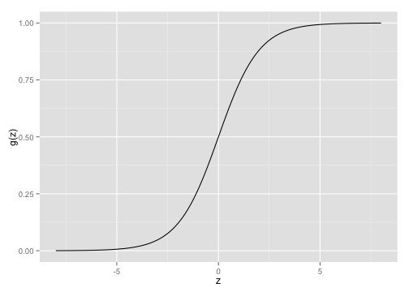
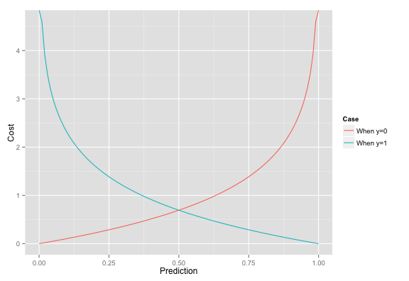
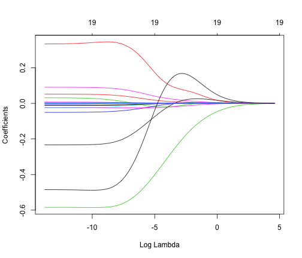
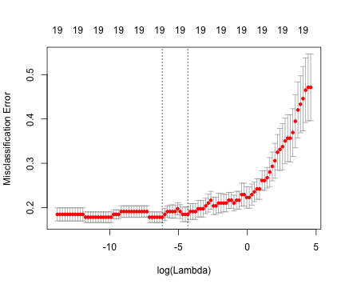
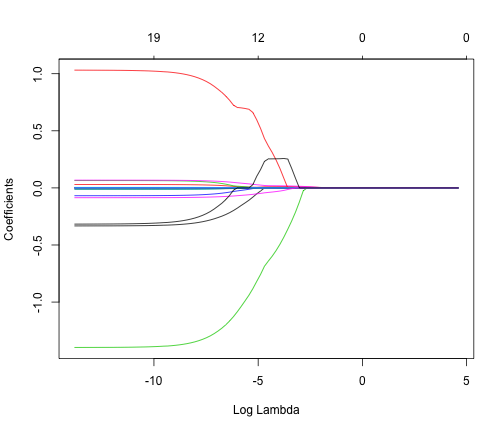
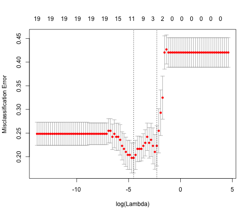

## Overview
- Brief intro to logistic regression
- Motivation for regularization techniques
- Explanation of the most common regularization techniques:  
  * Ridge regression
  * Lasso regression
- An example of each on a sample dataset

<br/>
<br/>
R packages to install if you want to follow along:

```r
pkgs <- c('glmnet', 'ISLR')
install.packages(pkgs)
```

---  

## Logistic Regression  

Widely utilized *classification* technique.  
Regression for when the response variable is qualitative.  
Special case of the general linear model.  
For a response $y$, model the probability that $y$ belongs to a particular class or category.  

$$y \in \{0, 1\}$$

With respect to a simple linear regression, we can think of it as:
$$p^'_\beta(x) = \beta^T x = \beta_0 + \beta_1 x_1 + ... + \beta_p x_p$$

Where we would *like* $p^'_\beta(x)$ to represent the probability that x belongs to a particular class   
But, this formulation does not fit the definition of probability (i.e. on [0,1]), so need model representation, $p_\beta(x)$ s.t.:  

$$ 0 \le p_\beta \le 1$$
  

---

## The logistic function  
AKA Sigmoid function:  
$$g(z) = \dfrac{1}{1 + e^{-z}}$$



---

## Logistic Regression
So if our original representation was  
$$p^'_\beta(x) = \beta^T x$$
then our representation becomes  
$$p_\beta(x) = g(p^'_\beta(x)) = g(\beta^T x)$$ 

where g(z), again, is 
$$g(z) = \dfrac{1}{1 + e^{-z}}$$

---

## Logistic Regression
So, 
$$p_\beta(x) = \dfrac{1}{1 + e^{-\beta^T x}}$$

After a bit of manipulation, we have   
$$ \dfrac{p_\beta(x)}{1-p_\beta(x)} = e^{\beta^T x}$$
which is the "odds" function.  And taking the logarithm of both sides, we have
$$\log\Big(\dfrac{p_\beta(x)}{1-p_\beta(x)}\Big) = \beta^T x$$
which is the "log-odds" or *logit* and gives us the desired property.


---

## The cost function

$$Cost(p_\beta(x), y) = 
\begin{cases}
-log(p_\beta(x)) & \text{if }y=1 \\
-log(1 - p_\beta(x)) & \text{if }y=0
\end{cases}
$$



---

## The cost function
<br/>
We can rewrite the cost function in a simpler form as

$$Cost(p_\beta(x), y) = -ylog(p_\beta(x)) - (1-y)log(1-p_\beta(x))$$

Since when  
- y=1 then $Cost(p_\beta(x), y) = -log(p_\beta(x))$  
- y=0 then $Cost(p_\beta(x), y) = -log(1 - p_\beta(x))$

---

## Motivation For Regularization  

If our $\beta_j$'s are unconstrained:  

- They can explode, become very big
- Are subject to high variance

To control this variance, we can **regularize** these coefficients.  
And so we can think about this regularization in terms of the **bias-variance tradeoff.**

If our $\beta_j$'s are subject to high variance, then we are **overfitting** our model to the particular quirks or noise in our dataset.  So we wish to trade bias, in the form of regularization, to control this variance.

Not obvious that shrinking parameters does this for us.  
And, of course, we don't know which ones to shrink a priori!

---

## Ridge regression 
* Recall our original logistic regression cost function to be:  
$$Cost(p_\beta(x), y) = -ylog(p_\beta(x)) - (1-y)log(1-p_\beta(x))$$

* Ridge regression adds a penalty to this cost that is a function of the coefficient sizes:  
$$Cost_R(p_\beta(x), y) = -ylog(p_\beta(x)) - (1-y)log(1-p_\beta(x)) + \color{blue}{\lambda\sum_{j=1}^{p} \beta_j^2}$$

* $\lambda$ is the **shrinkage parameter**
  - Controls the regularization
  - $\lambda\rightarrow0$ gives us regular logistic regression, $\lambda\rightarrow\infty$ null model  

* $||\beta||_2 = \sum_{j=1}^{p} \beta_j^2$ is called **L2 Norm**.  
  

--- 


## Hitters dataset from ISLR package

```r
Hitters <- ISLR::Hitters
dim(Hitters)
```

```
## [1] 322  20
```

```r
Hitters[1, ]
```

```
##                AtBat Hits HmRun Runs RBI Walks Years CAtBat CHits CHmRun
## -Andy Allanson   293   66     1   30  29    14     1    293    66      1
##                CRuns CRBI CWalks League Division PutOuts Assists Errors
## -Andy Allanson    30   29     14      A        E     446      33     20
##                Salary NewLeague
## -Andy Allanson     NA         A
```

---

## Prep data for model building

```r
library(ISLR)

# Remove NA
Hitters <- na.omit(ISLR::Hitters)
dim(Hitters)
```

```
## [1] 263  20
```

```r
set.seed(42)
train<-sample(1:nrow(Hitters), .6*nrow(Hitters))
test<-(-train)

# Convert Salary to a binary factor variable
Hitters$Salary <- factor(as.numeric(Hitters$Salary > 500))
```


---

## Ridge regression example

```r
library(ISLR)
library(glmnet)

x <- model.matrix(Salary~., Hitters)[,-1]
y <- Hitters$Salary

grid=10^seq(-6,2,length=100)
ridge.mod <- glmnet(x[train,], y[train], family="binomial", alpha=0, lambda=grid)
# family="binomial" => classification, same as glm
# alpha=0 gives us the ridge regularization
# lambda is the regularization parameter
```


---

## Ridge regression example

```r
class(ridge.mod)
```

```
## [1] "lognet" "glmnet"
```

```r
dim(coef(ridge.mod))
```

```
## [1]  20 100
```

---

## Ridge regression example

```r
plot(ridge.mod, xvar="lambda")
```



---

## Choosing regularization parameter  $\lambda$  
Use **cross-validation** to determine the appropriate $\lambda$


```r
cv.ridgemod <- cv.glmnet(x[train, ], y[train], family="binomial", 
                         alpha=0, type.measure="class", lambda=grid)
plot(cv.ridgemod)
```



---

## Improvement over basic logistic regression?

```r
best_lambda <- cv.ridgemod$lambda.min
ridge.pred <- predict(ridge.mod, s=best_lambda, newx=x[test, ], type="response")
table(round(ridge.pred), y[test])
```

```
##    
##      0  1
##   0 51 19
##   1  9 27
```


for an accuracy of 0.7358.  Running a plain-old logistic regression using *glm()* gives us an accuracy of 0.7264, and so the ridge regularization provides a moderate improvement in accuracy.


---

## Lasso regression  
**L**east **A**bsolute **S**hrinkage and **S**election **O**perator   
Coefficients can be set exactly to 0, and so it performs *variable selection*  
This can help with interpretability, especially when # of predictors is large  

$$Cost_L(p_\beta(x), y) = -ylog(p_\beta(x)) - (1-y)log(1-p_\beta(x)) + \color{blue}{\lambda\sum_{j=1}^{p} \left|\beta_j\right|}$$

$||\beta||_1 = \sum_{j=1}^{p} \left|\beta_j\right|$ is the **L1 Norm**  
Similar to ridge:   
- $\lambda\rightarrow0$ gives us regular logistic regression 
- $\lambda\rightarrow\infty$ gives us null model
- But, behavior inbetween is quite different 

--- 

## Lasso regression example

```r
lasso.mod <- glmnet(x[train, ], y[train], lambda=grid, 
                family="binomial", alpha=1)
plot(lasso.mod, xvar="lambda")
```



---

## Lasso regression example

```r
cv.lassomod <- cv.glmnet(x[train, ], y[train], lambda=grid,
                       family="binomial", alpha=1, type.measure="class")
plot(cv.lassomod)
```




---

## Lasso performance

```r
lbest_lambda <- cv.lassomod$lambda.min
new.prob <- predict(lasso.mod, newx=x[test, ], s=lbest_lambda, type="response")
new.class <- round(new.prob)
table(factor(new.class), y[test])
```

```
##    
##      0  1
##   0 54 18
##   1  6 28
```


Which gives us an accuracy of 0.7736, which out-performs both the performance of the original logistic regression and the ridge regression (with accuracies of 0.7264 and 0.7358, respectively).

--- 

## Model selection!

```
## 19 x 1 sparse Matrix of class "dgCMatrix"
##                    s0
## AtBat       0.0022191
## Hits        0.0102524
## HmRun       .        
## Runs        .        
## RBI         .        
## Walks       0.0195095
## Years       .        
## CAtBat      .        
## CHits       0.0018991
## CHmRun      .        
## CRuns       .        
## CRBI        .        
## CWalks      .        
## LeagueN     0.3675261
## DivisionW  -0.6408992
## PutOuts     0.0007079
## Assists    -0.0003869
## Errors     -0.0396275
## NewLeagueN  0.2537524
```

---


## Resources  
[Introduction to Statistical Learning, with applications in R](http://www-bcf.usc.edu/~gareth/ISL/)  
[The Elements of Statistical Learning](http://web.stanford.edu/~hastie/local.ftp/Springer/OLD/ESLII_print4.pdf)  
[Logistic Regression](http://en.wikipedia.org/wiki/Logistic_regression)  
[The Lasso Page](http://statweb.stanford.edu/~tibs/lasso.html)    
[Andrew Ng's Lecture Slides](http://ss.sysu.edu.cn/~py/.%5CDM%5CLecture6.pdf)  
