## Acknowledgments

Thanks to **Michelle Berry** for the presentation outline document. 

Websites used to construct this presentation:  

* [RStudio RMarkdown Documentation](http://rmarkdown.rstudio.com/)  
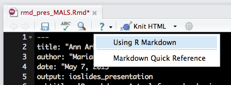     

* [Rmd Cheatsheet](http://www.rstudio.com/wp-content/uploads/2015/02/rmarkdown-cheatsheet.pdf)

* [Knitr Reference Card](http://cran.r-project.org/web/packages/knitr/vignettes/knitr-refcard.pdf)


## Installing Rmarkdown
`install.packages("rmarkdown")`

## What is R Markdown?   
* Markdown file with embedded R code chunks.  
      + **Markdown:**  text-to-HTML conversion tool for web writers.   
          + Allows you to write using an easy-to-read, easy-to-write plain text format.              
*  Rmd -> md -> html (docx, pdf)  
*  Can include both text and code to execute  
  
    
    

## Why R Markdown?
A convenient tool for reproducible and dynamic reports with R!       

*  Execute code with the `knitr`.   
*  Easy to learn syntax 

Use it to consolidate your code and document into a single file:   

* Slideshows, pdfs, html documents, word files   

Easy to use with version control:  **Use with GitHub**   

## Simple Workflow

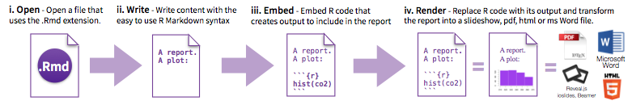

## How to Open an Rmd File
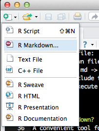
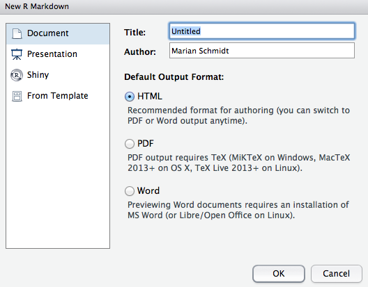


## Choose Output
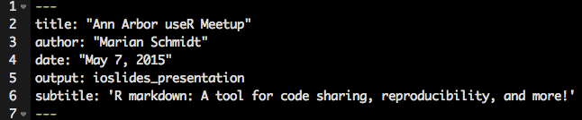

**YAML:**  A set of key value pairs at the start of your file.  Begin and end the header with a line of three dashes (- - -)

***R Studio template writes the YAML header for you***  

output: html_document  
output: pdf_document  
output: word_document  
output: beamer_presentation (beamer slideshow - pdf)  
output: ioslides_presentation (ioslides presentation - html)  


## Markdown basics 
Markdown is a simple formatting language that is easy to use

- Create lists with `*` or `+` sign   
      + like this
      + and this
- Use one or two asterisk marks to provide emphasis such as `*`*italics*`*` and `**`**bold**`**`.  Can even include tables:    

First Header  | Second Header
------------- | -------------
Content Cell  | Content Cell
Content Cell  | Content Cell


## Markdown basics 
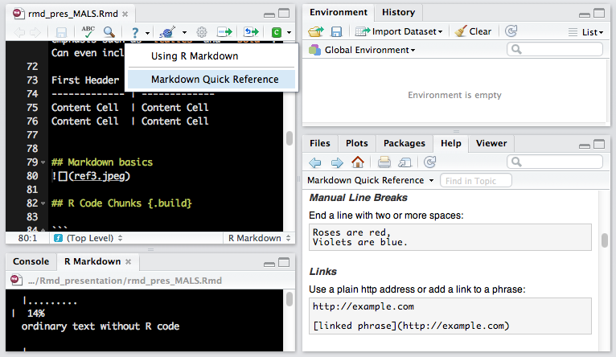

## R Code Chunks 

```
Code blocks display with fixed-width font
```

```{r fig.width = 4, fig.height = 3, message = FALSE}
#quick summary
library(ggplot2)
min(diamonds$price)
mean(diamonds$price)
max(diamonds$price)
```


## R Code Chunks 

```{r example chunk, echo = TRUE, eval = TRUE}
x <- sample(1:100, 5)
x
```

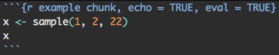

+ You can name the code chunk.  

+ echo = TRUE:  The code **will** be displayed.   

+ eval = TRUE: Yes, execute the code.

## R Code Chunk Arguments
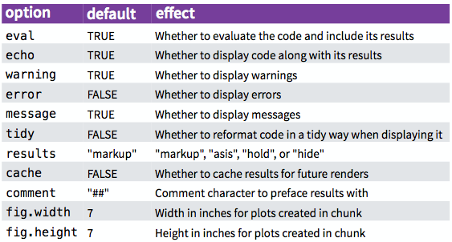

## R Code Chunks:  Displaying Plots 
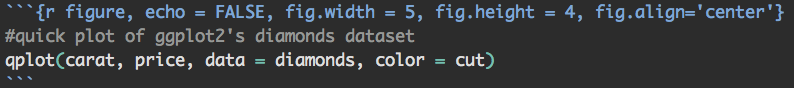

```{r figure, echo = FALSE, fig.width = 5, fig.height = 4, fig.align='center'}
#quick plot of ggplot2's diamonds dataset
qplot(carat, price, data = diamonds, color = cut)
```


## Global Chunk Options

You may want to use the same set of chunk options throughout a document and you don't want to retype those options in every chunk.  

**Global chunk options are for you!**

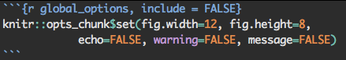


## Inline R Code  
- You can evaluate expressions inline by enclosing the expression within a single back-tick qualified with `r`.

Last night, I saw `r 5 + 2` shooting stars!  

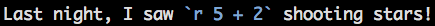  


## Rendering document
1.  Run `rmarkdown::render("<filepath>")`  
2.  Click the **knit HTML** button at the top of the RStudio scripts pane  

When you render, R will:  

- Execute each embedded code chunk and insert the results into your report.  

- Build a new version of your report in the output file type.  

- Open a preview of the output file in the viewer pane.  

-  Save the output file in your working directory.  


## What do you use Rmarkdown for? 

## Thanks


