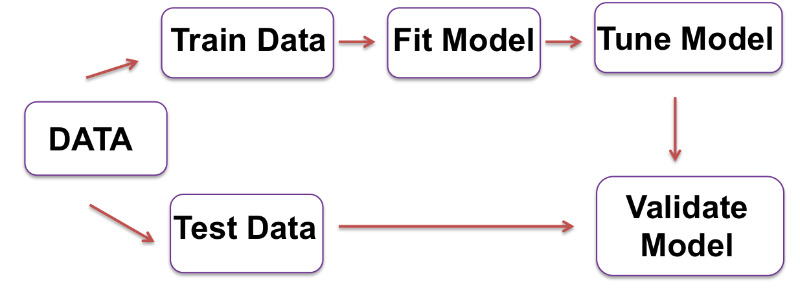
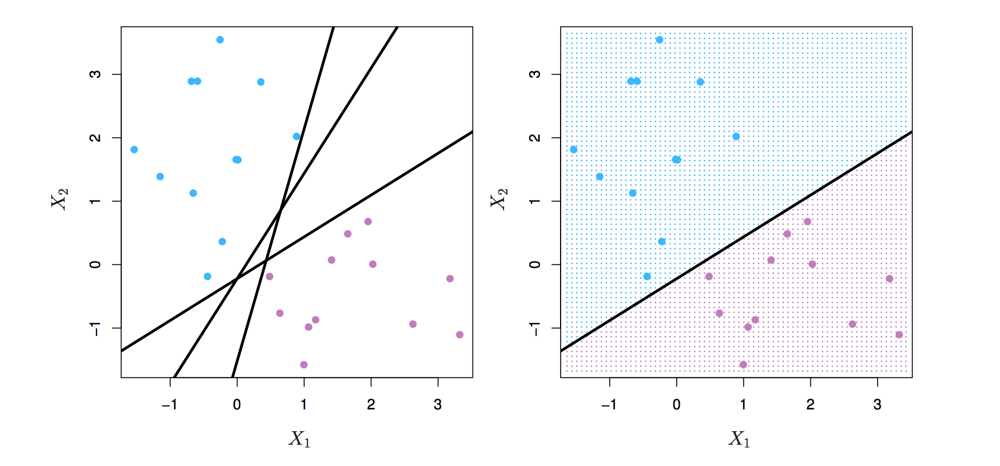
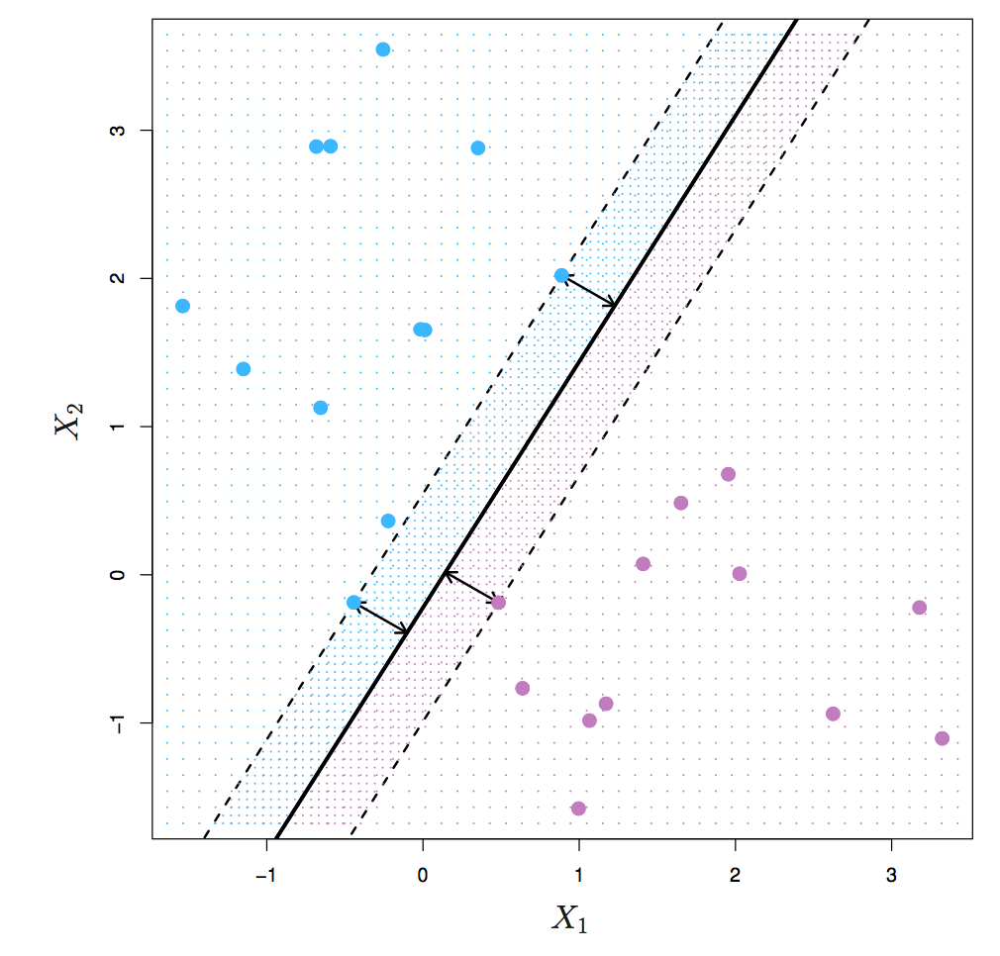
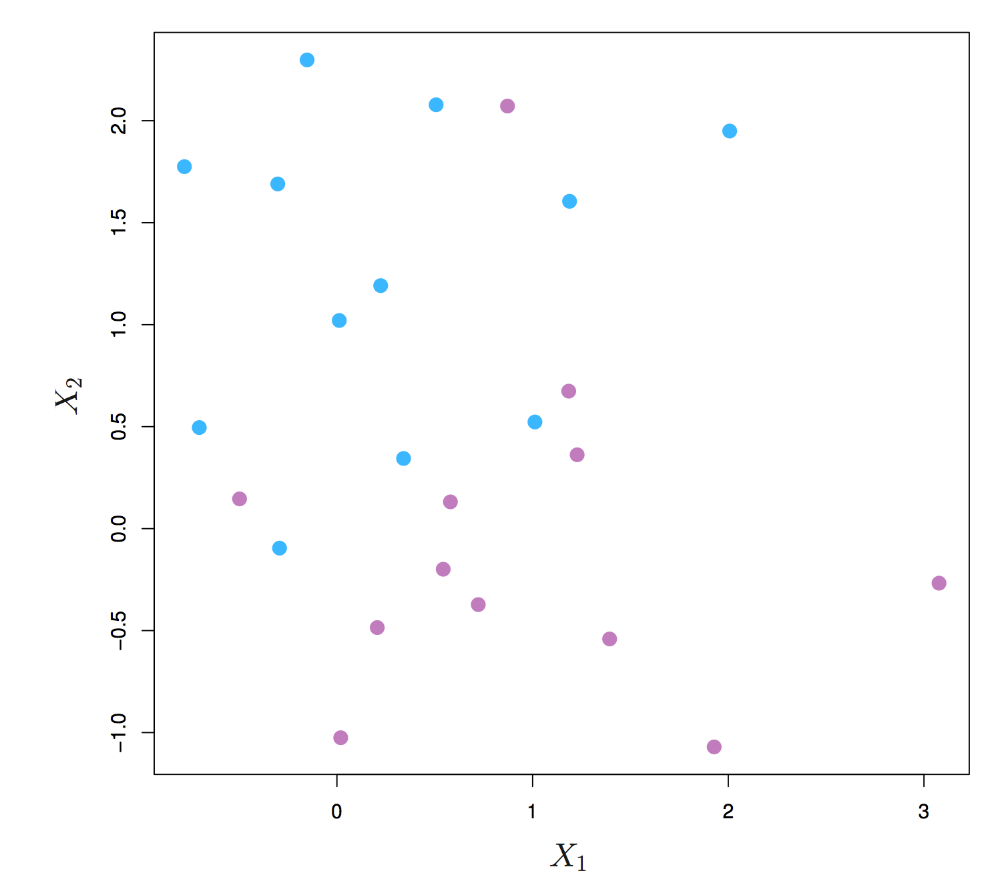
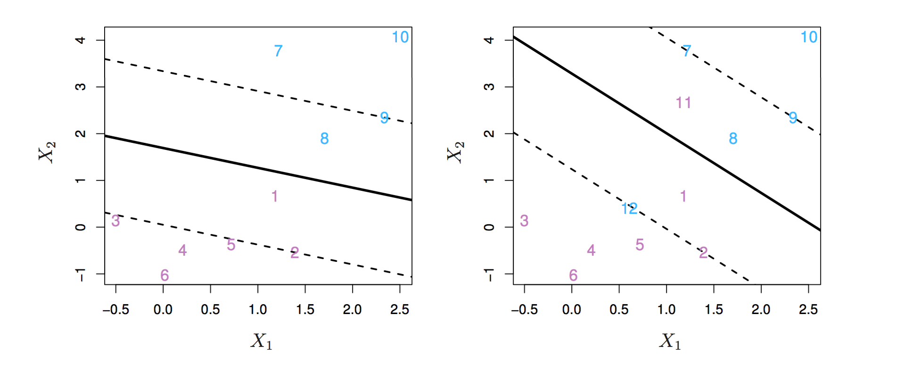
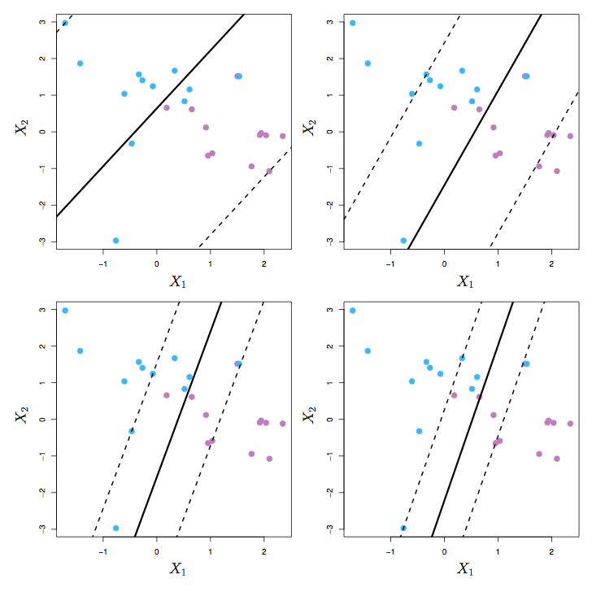
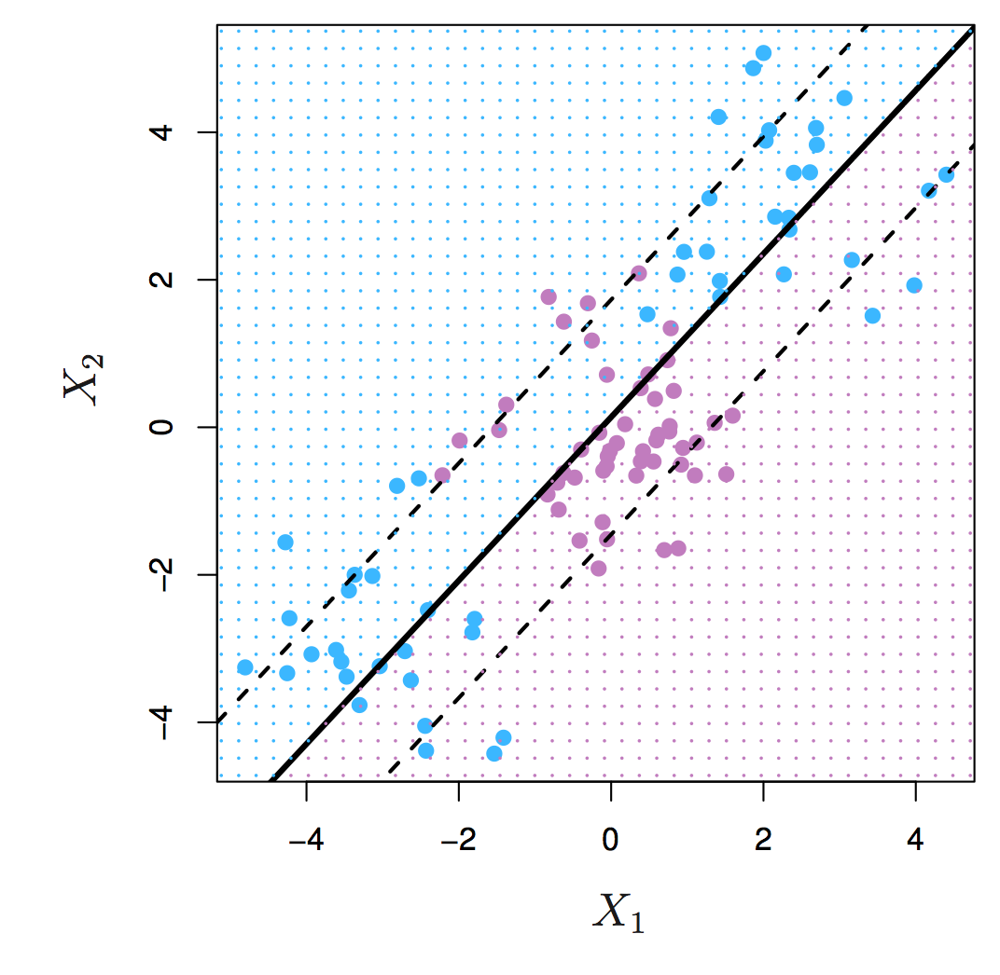
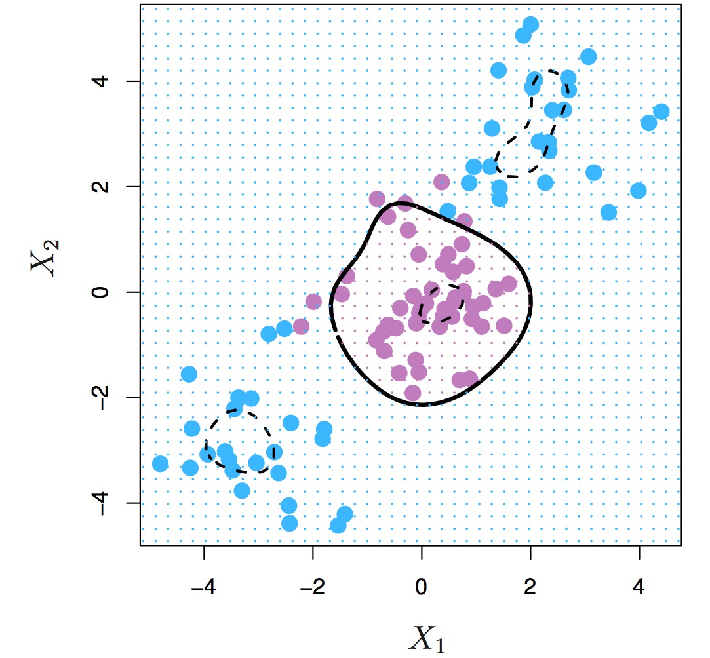

## Acknowledgments

Examples and figures used in this presentation come from:  

James, G., Witten D., Hastie, T., Tibshirani, R. "An Introduction to Statistical Learning, with applications in R". Springer, 2013. 

You can download it here:    
http://www-bcf.usc.edu/~gareth/ISL/ISLR%20First%20Printing.pdf


## Overview of supervised learning

Predictive models that are calibrated on a set of training data
and validated on a set of test data   


 


## What are Support Vector Machines?

SVM is typically used as a classification algorithm 

> - It is an umbrella term for:
     + Maximal margin classifier
     + Support vector classifier
     + Support vector machine

> - It is a popular algorithm because:
    + It works well in a variety of settings 
    + It sounds cool

## Separating Hyperplanes

- SVM classifies data with a separating hyperplane 

- A hyperplane is a flat surface with dimension **p-1** 

- If the data are linearly-seperable, there will be an infinite 
number of separating hyperplanes

 


## Maximal Margin Classifier

- The goal of the maximal margin classifier is to find a hyperplane with the widest margin between the two classes

- We hope that a large margin on the training data will translate to a large margin on the test data

 


## Support Vectors

- Observations on the edge of the margin are called  
**support vectors** 

- If these points were moved slightly, the maximal margin hyperplane would move as well. 

 


## Maximal Margin is not ideal!

- If a separating hyperplane exists, it will necessarily perfectly classify all training points
    + Classifier will likely **overfit** the training data and   
    perform poorly on a naive set of data

- Also, what if your classes are not linearly separable? 

 

## Solution: use a *soft* margin

Support Vector Classifier

- Good solution if your classes are *close* to linearly separable

- More robust than the maximal margin classifier because it is **less sensitive** to individual observations   
    + model has lower **variance**



## How to construct a Support Vector Classifier


Introduce a tuning parameter    **C**    that is like a budget for the amount that data points can violate the margin

- It is also a property of **C** that no more than **C** observations can be on the wrong side of the hyperplane

- **C** is chosen through a cross-validation method such as k-folds

- High **C** = higher bias, lower variance
- Low **C** = lower bias, higher variance


## Examples of different "C" values

 
 
## What if your decision boundary isn't linear at all?

 
 
> - Use a support vector machine to enlarge the feature space in ways to make the boundary linear

## Support Vector Machine

One solution for enlarging the feature space is to use transformations of the features

For example, rather than fitting a support vector classifier with p features:

X1,X2, . . . Xp

Fit it with 2p features:

X1, (X1)^2, X2, (X2)^2, . . . Xp, (Xp)^2

- In the expanded feature space the decision boundary is linear


## Kernels

- The previous method will quickly generate a very large feature space and may become computationally intractable

- Instead, we can apply a kernel

 

## SVM with more than 2 classes

SVM does not translate elegantly to a multiclass situation   

- One vs One   
    + Construct classifiers for all possible pairwise combinations of classes  
    + Pick the class that was selected the most times


- One vs All  
    + Compare one of the K classes to remaining K-1 classes
    + Pick the class that's furthest from the margin 
    + The logic here is we have the most confidence that that data point actually belongs to that class

## Example 1: 
Support Vector Machine with radial kernel


```{r,echo=FALSE,fig.height=4,fig.width=4}

# Generate data
set.seed(1)
x=matrix(rnorm(200*2), ncol=2)
x[1:100,]=x[1:100,]+2
x[101:150,]=x[101:150,]-2
y=c(rep(1,150),rep(2,50))
radial.data=data.frame(x=x,y=as.factor(y))

plot(x, col=y)

```

## Train model {.smaller}
```{r,fig.height=4,fig.width=5.5}
library(e1071)
set.seed(1)
train=sample(200,100)
svmfit=svm(y~., data=radial.data[train,],
           kernel="radial", gamma=1, cost=1)
plot(svmfit, radial.data[train,])
```


## {.smaller}
```{r}
summary(svmfit)

```

## Tune model

```{r}
set.seed(1)
tune.out=tune(svm,y~., data=radial.data[train,], kernel="radial",
              ranges=list(cost=c(.1,1,10,100,1000), 
              gamma=c(.5,1,2,3,4)))
```

## {.smaller}
```{r}
summary(tune.out)

```

## Test model
```{r}
test <- -train
svm.pred <- predict(tune.out$best.model, 
            newx=radial.data[test,])
confusion.table <- table(true <- radial.data[test,"y"],svm.pred)
confusion.table

sum(diag(confusion.table))/sum(confusion.table)
```

## Example 2:
Support Vector Classifier with gene expression data

- Khan dataset:    
    + 83 observations of 2308 genes   
    + Goal is to classify tissue samples into 4 tumor types based on gene expression

## Train model
```{r}
library(ISLR)
khan.train <- data.frame(x=Khan$xtrain,y=as.factor(Khan$ytrain))
# khan.tune <- tune(svm,y~., data=khan.train,kernel="linear",
                  # ranges=list(cost=c(.1,1,10,100,1000)))
khan.svm <- svm(y~., data=khan.train, kernel = "linear", cost=10)


```
- gamma not required for linear kernel 
    + uses 1/data dimension
- this function uses the one vs one approach for multiclass svm

## {.smaller}

```{r}
summary(khan.svm)
```

## Training data results

```{r}
table(khan.svm$fitted, khan.train$y)

```
> - model perfectly classifies all the training data
 
## Test model {.smaller}
```{r}
khan.test <- data.frame(x=Khan$xtest, y = as.factor(Khan$ytest))
pred <- predict(khan.svm, newdata=khan.test)
khan.table <- table(pred,khan.test$y)
khan.table
sum(diag(khan.table)/sum(khan.table))

```
> - model performs very well on test data too!

## SVM vs Logistic Regression

- SVM does better when classes are (nearly) separable
- When classes are not, LR (ridge penalty) and SVM are very similar
- You can estimate probabilities with Logistic Regression
- You can use kernels with LR too, but it is more costly computationally 


## Resources

Parallel predictions with SVM in R
http://www.vikparuchuri.com/blog/parallel-r-model-prediction-building/


