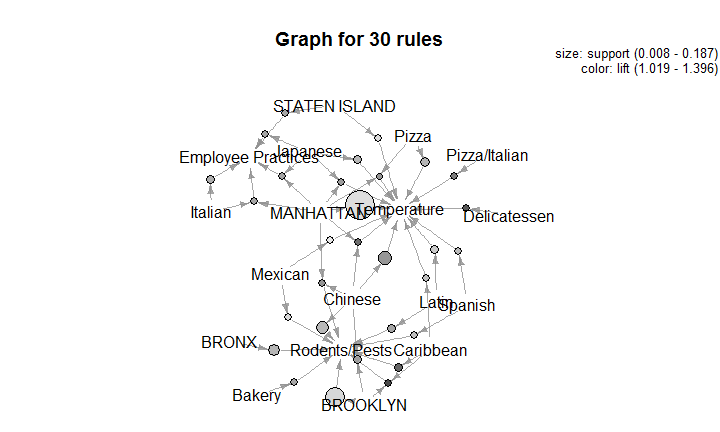

# Association Rule Mining
Brandon Stange  
July 9, 2015  

## My Background


- Currently a Data Scientist at Trinity Health
- Previously a Data Analyst for a large physician practice
- MA Economics (Econometrics, Environmental Econ)

Brandon.Stange@gmail.com    

## Accuracy vs. Interpretability
**Maximally Accurate**

- Non-Linear
- Feature Engineering/Interaction
- Ensembling

**Maximally Interpretable**

- Rule-Based
- Single Decision Trees
- Linear/Logistic Regression

## Association Rule Uses

- Originally used for *market basket analysis*
    - Find sets of products that are often bought together
    - Improve product arrangement
    - Targeted Advertising
    - {Beer} -> {Pizza}
- Can be used for any dataset that can be represented as a binary matrix
- Traditionally unsupervised, but can target specific outcomes
- Can target more than one outcome at once

## Algorithms and Implimentations

- Apriori
    - R, Python, SQL Server, Oracle, everywhere
- Eclat
    - R, Python, C, others
- FP Growth
    - C, Python, mahout
- Graph Databases
    - neo4j, Titan, Giraph

## Arules Package Ecosystem {.flexbox .vcenter .hcenter .bigger}


## Input Data Structure {.flexbox .vcenter}


## Rule Interpretation (Apriori Output)


|   |  lhs  | rhs | support | confidence | lift |
|:--|:-----:|:---:|:-------:|:----------:|:----:|
|16 | {b,c} | {d} |   0.4   |     1      | 2.5  |

<br>
RHS (Outcome) = **{d}**

LHS (Inputs) = **{b,c}**
LHS occurs in **40%** of total population.

RHS occurs in **100%** of these transactions, which is **2.5** times the population at large.

## Apriori Function Call {.bigger}


```r
apriori(data,
         parameter = list(minlen=1, 
                          support=0.05, 
                          confidence=0.4, 
                          maxlen=3),
         appearance = list(rhs=outcomelist, 
                           default="lhs"),
         control = list(verbose=T))
```

## Itemset Graph Representation {.flexbox .vcenter}


## Real Data Example

**490k records from New York City resturant inspections**

requires readr, dplyr, tidyr, arules, arulesviz
(https://data.cityofnewyork.us)

**Fields of interest:**

- ID, name, address, phone, etc.
- Inspection Date
- Borough
- Cuisine Description
- Violation Description
- Action

## Data Pre-Processing

1. Clean up dates and special characters
2. Apply custom violation code grouping
3. Use tidyr::gather to put data in 'long' format
4. Replace keys and measures with integer IDs
5. Convert to sparse matrix


## Pre-Processing steps 3-5 Code


```r
## 3. Use tidyr::gather to put data in 'long' format
nycs <- nycw %>%
  select(INSID, BORO, CUISINE_DESCRIPTION, VIOLATION_TYPE) %>%
  gather(MEASURE, VALUE, -INSID)
nycs$MEASURE <- nycs$VALUE
nycs$VALUE <- 1

## 4. Replace keys and measures with integer IDs
ID <- unique(nycs$INSID)
ME <- unique(nycs$MEASURE)
nycs$MEASURE<-match(nycs$MEASURE,ME)
nycs$INSID<-match(nycs$INSID,ID)

## 5. Convert to sparse matrix
sm<-sparseMatrix(i=nycs$INSID, j=nycs$MEASURE,x=nycs$VALUE,
                 dimnames=list(ID,ME),giveCsparse=T)
```


## Example Function Call {.smaller}


```r
rules <- apriori(sm2,
                   parameter = list(minlen=1, supp=0.001, conf=0.4, maxlen=4),
                   appearance = list(rhs=outcomelist, 
                                     default="lhs"),
                   control = list(verbose=T))
```

```r
outcomelist
```

```
## [1] "Food Handling"      "Rodents/Pests"      "Employee Practices"
## [4] "Temperature"        "Adminstrative"      "Poor Equipment"    
## [7] "Food Source"
```

```r
class(sm2)
```

```
## [1] "transactions"
## attr(,"package")
## [1] "arules"
```

## Results

30 rules were generated.  The top 5 are:

|   |         lhs          |       rhs       | support | confidence | lift  |
|:--|:--------------------:|:---------------:|:-------:|:----------:|:-----:|
|23 | {BROOKLYN,Caribbean} | {Rodents/Pests} |  0.008  |   0.605    | 1.396 |
|1  |    {Delicatessen}    |  {Temperature}  |  0.010  |   0.599    | 1.353 |
|5  |     {Caribbean}      | {Rodents/Pests} |  0.016  |   0.570    | 1.315 |
|35 | {MANHATTAN,Chinese}  |  {Temperature}  |  0.015  |   0.575    | 1.299 |
|2  |   {Pizza/Italian}    |  {Temperature}  |  0.012  |   0.556    | 1.257 |

## arulesViz plots

```r
plot(rules,method="grouped")
```

 

## arulesViz plots contd

```r
plot(rules,method="paracoord")
```

 

## arulesViz plots contd

```r
plot(rules,method="graph")
```

 

## Arules Sequences

- Allows for pattern discovery in ordered sets of discrete data
- Ordered, not temporal (no measure of time between events)
- Right-censored, events *after* the event of interest are ignored
- arulesSequences::cspade()
- Parameters are similar: support, size, gap, window

<div class="centered">

</div>

## Resources

**Christian Borgelt's website**

Various publications and implementations of Association Rules

[www.borgelt.net](www.borgelt.net)

[Efficient Analysis of Pattern and Association Rule Mining Approaches](http://arxiv.org/ftp/arxiv/papers/1402/1402.2892.pdf)
