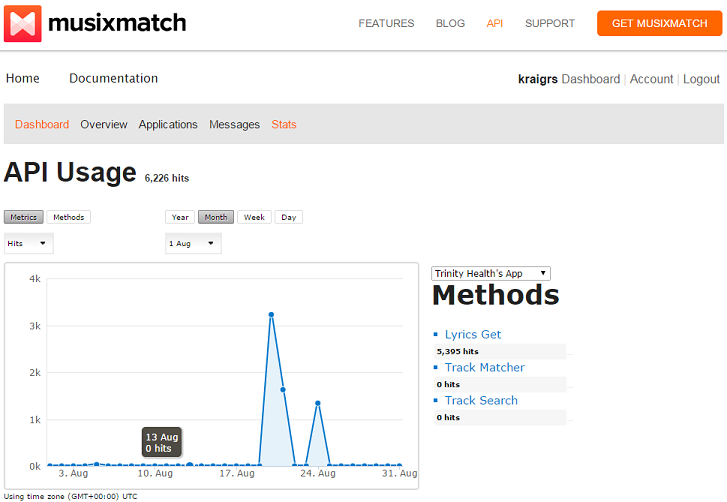
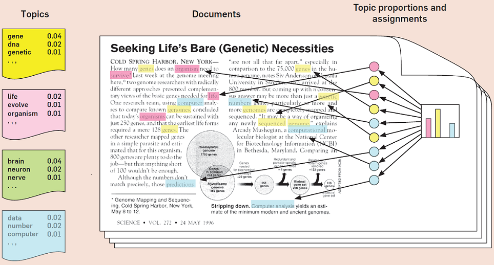

## Introduction

Data Scientist for Trinity Health  
  
  - Healthcare
    * complex and somewhat deep data
    * LOTS of reporting ("how many patients with diabetes?")
    * predicting bad outcomes based on previous events  
  
  - Background: PhD in Bioinformatics
    * Regulation of gene expression
    * Next-generation sequencing data
    * over 1B reads between 50 and 300 bases
    * Deep but not complex data

## Outline

  - Creating corpus with ```tm```  
  
  - Visualization techniques for text  
  
  - Clustering with ```cluster```  
  
  - Topic modeling with ```topicmodels```  
  
  - Word representations with ```word2vec```

## Motivation

Text is everywhere!  

  - Twitter --> 200M tweets/day * 25 words/tweet = 5B words/day!  
  
  - Facebook --> 55M status updates/day  
  
  - Amazon --> customer reviews  
  
  - Healthcare
    * Clinical notes ("family history of high cholesterol")
    * Event descriptions ("patient slipped and fell")

```{r, include=FALSE}
library(stringr)
library(XML)
library(readr)
library(tm)
library(SnowballC)
library(slam)
library(wordcloud)
library(graph)
library(Rgraphviz)
library(cluster)
library(topicmodels)
library(magrittr)
library(stringr)
library(ggplot2)
library(knitr)

apikey = "" #get your own key

#TOOL
artist = "460"

#Taylor Swift
#artist = "259675"

get_artist <- function(artist, apikey){
  
  call = paste("http://api.musixmatch.com/ws/1.1/artist.search?",
               "q_artist=",artist,
               "&apikey=",apikey,
               "&format=xml", sep = "")
  
  xml <- xmlParse(call)
  
  artist_ids <- xmlToDataFrame(nodes=getNodeSet(xml, "//artist/artist_id"))
  artist_names <- xmlToDataFrame(nodes=getNodeSet(xml, "//artist/artist_name"))
  
  return(data.frame(id = artist_ids$text, name = artist_names$text))
}

get_albums <- function(artist, apikey){
  
  call = paste("http://api.musixmatch.com/ws/1.1/artist.albums.get?",
               "artist_id=", artist,
               "&apikey=", apikey,
               "&page_size=100",
               "&format=xml", sep = "")
  
  xml <- xmlParse(call)
  
  albums <- xmlToDataFrame(nodes=getNodeSet(xml, "//album/album_id"))
  #albums <- xmlToDataFrame(nodes=getNodeSet(xml, "//album/album_name"))
  
  return(albums$text)
}

get_tracks <- function(album, apikey){
  
  call = paste("http://api.musixmatch.com/ws/1.1/album.tracks.get?",
               "album_id=", album,
               "&apikey=", apikey,
               "&page_size=100",
               "&f_has_lyrics=1",
               "&format=xml", sep = "")
  
  xml <- xmlParse(call)
  
  tracks <- xmlToDataFrame(nodes=getNodeSet(xml, "//track/track_id"))
  
  return(tracks$text)
}
  
get_lyrics <- function(track, apikey){
  
  call = paste("http://api.musixmatch.com/ws/1.1/track.lyrics.get?",
               "track_id=", track,
               "&apikey=", apikey,
               "&format=xml", sep = "")
  
  xml <- xmlParse(call)
  
  lyrics <- tryCatch(xmlToDataFrame(nodes=getNodeSet(xml, "//lyrics_body")),
                     error = function(e) print("NA"))
  
  lyrics_clean <- lyrics %>% 
    as.character() %>% 
    gsub("This Lyrics is NOT for Commercial use","", .) %>% 
    gsub("\\n", " ", .)
  
  return(lyrics_clean)
}
  
get_corpus <- function(artist, apikey){
  
  #get albums for particular artist
  albums <- get_albums(artist, apikey)
  
  #loop through albums
  tracks <- lapply(albums, get_tracks, apikey) %>% unlist()
  
  #loop through tracks
  lyrics <- lapply(tracks, get_lyrics, apikey) %>% unlist()
  
  obj <- list(lyrics = data.frame(lyrics),
              n_albums = length(albums),
              n_tracks = length(tracks))
  
  return(obj)
}

#collection <- get_corpus(artist, apikey)
#write.table(collection$lyrics, file = "lyrics.txt", sep = "", row.names = F, quote = F)

collection <- read_lines("working/lyrics.txt")

```

## Text source

Song lyrics!

  - Band of choice: TOOL
  - 5 albums
  - famously mysterious, ambiguous lyrics


##


##

First, it's a good idea to have this in your .Rprofile:

```{r, eval=FALSE}
options(stringsAsFactors = FALSE)
```

Then, create functions to access musiXmatch API:

  - requires API key
  - artist search to get ID
  - get all album IDs
  - using artist ID and album IDs, get track IDs
  - get lyrics from track IDs

```{r, eval=FALSE}
call = paste("http://api.musixmatch.com/ws/1.1/track.lyrics.get?",
              "track_id=", track,
              "&apikey=", apikey,
              "&format=xml", sep = "")

xml <- xmlParse(call)
  
lyrics <- tryCatch(xmlToDataFrame(nodes=getNodeSet(xml, "//lyrics_body")),
                   error = function(e) print("NA"))
```


## Creating a collection of lyrics
```{r, eval=FALSE}
get_corpus <- function(artist, apikey){
  
  #get albums for particular artist
  albums <- get_albums(artist, apikey)
  
  #loop through albums
  tracks <- lapply(albums, get_tracks, apikey) %>% unlist()
  
  #loop through tracks
  lyrics <- lapply(tracks, get_lyrics, apikey) %>% unlist()
  
  obj <- list(lyrics = data.frame(lyrics),
              n_albums = length(albums),
              n_tracks = length(tracks))
  
  return(obj)
}

collection <- get_corpus(artist, apikey)
```

# Creating a corpus with ```tm```

## Clean up text and build corpus
```{r, echo=FALSE}
other <- c("instrumental","fuck","fucking","get","shit","fucker","asshole","fucked","know","like","just","got","bullshit")
```

```{r, eval=FALSE}
removeURL <- function(x) gsub("http[[:alnum:]]*", "", x)

collection$lyrics %<>% sapply(., function(x) str_replace_all(x, "[^[:alnum:] ]", ""))

custom_stopwords <- c(stopwords("english"), other) %>%
  sapply(., function(x) gsub("[[:punct:]]", "", x), simplify = "array", USE.NAMES = F)

corpus <- Corpus(VectorSource(collection$lyrics)) %>%
  tm_map(content_transformer(tolower)) %>%
  tm_map(stripWhitespace) %>%
  tm_map(removePunctuation) %>%
  tm_map(removeNumbers) %>%
  tm_map(removeURL) %>%
  tm_map(removeWords, custom_stopwords) %>%
  tm_map(stemDocument) %>%
  tm_map(PlainTextDocument)

tdm <- corpus %>%
  TermDocumentMatrix(control = list(minWordLength = 3))

dtm <- as.DocumentTermMatrix(tdm)
```

```{r, echo=FALSE}
removeURL <- function(x) gsub("http[[:alnum:]]*", "", x)

collection %<>% sapply(., function(x) str_replace_all(x, "[^[:alnum:] ]", ""))

custom_stopwords <- c(stopwords("english"), other) %>%
  sapply(., function(x) gsub("[[:punct:]]", "", x), simplify = "array", USE.NAMES = F)

corpus <- Corpus(VectorSource(collection)) %>%
  tm_map(content_transformer(tolower)) %>%
  tm_map(stripWhitespace) %>%
  tm_map(removePunctuation) %>%
  tm_map(removeNumbers) %>%
  tm_map(removeURL) %>%
  tm_map(removeWords, custom_stopwords) %>%
  tm_map(stemDocument) %>%
  tm_map(PlainTextDocument)

tdm <- corpus %>%
  TermDocumentMatrix(control = list(minWordLength = 3))

dtm <- as.DocumentTermMatrix(tdm)
```

## Term frequency
```{r}
term.freq <- slam::row_sums(tdm, na.rm = T)
high.freq <- sort(term.freq, decreasing = T)[1:20]

freq.terms <- names(high.freq)
```

```{r, eval=FALSE}
df <- data.frame(term = names(high.freq), freq = high.freq)
df$term <- factor(df$term, levels = df$term[order(df$freq)])

ggplot(df, aes(x = term, y = freq)) +
  geom_bar(stat = "identity") +
  xlab("Terms") +
  ylab("Count") +
  coord_flip()
```

##
```{r, echo=FALSE, fig.height = 6, fig.width = 9, fig.align="center"}
df <- data.frame(term = names(high.freq), freq = high.freq)
df$term <- factor(df$term, levels = df$term[order(df$freq)])

ggplot(df, aes(x = term, y = freq)) +
  geom_bar(stat = "identity") +
  xlab("Terms") +
  ylab("Count") +
  coord_flip()
```

# Visualization techniques for text

## (obligatory) Word cloud

<div class="columns-2">
```{r, fig.height = 5, fig.width = 5, fig.align="right"}
word.freq <- sort(term.freq, decreasing = T)[1:100]
pal2 <- brewer.pal(8, "Dark2")

wordcloud(words = names(word.freq),
          freq = word.freq,
          scale = c(4, 0.1),
          colors = pal2,
          rot.per = 0.15,
          random.color = F,
          random.order = F)
```
</div>

## Network of correlated words

```{r, fig.height = 4, fig.width = 6, fig.align="center"}
plot(tdm,
     term = freq.terms,
     corThreshold = 0.2,
     weighting = T)
```

# Clustering with ```cluster```

## k-means clustering

  - unsupervised learning
  - group __n__ documents into __k__ clusters  


## Weighting terms for clustering

  - term frequency-inverse document frequency (tf-idf)
  - offset by term frequency in the corpus  

Example: N = # documents, d = # documents with term  

  - "information content" of a term: log(N/d)
    * rare term = high idf:  log(100/4) = 4.64
    * common term = low idf: log(100/60) = 0.74

```{r, warning=FALSE}
tdm_tfxidf <- weightTfIdf(tdm)

d <- stats::dist(t(tdm_tfxidf), method = "euclidian")

k <- 15

set.seed(12345)
kmean <- kmeans(d, k)

kmean$betweenss/kmean$totss
```

## Automatic labeling of clusters
```{r}
for(i in 1:k){
  inGroup <- slam::row_means(tdm_tfxidf[, kmean$cluster == i])

  words <- names(sort(inGroup, decreasing = T)[1:5])
  
  cat("Cluster ", i, ": ", words, "\n")
}
```

# Topic modeling with ```topicmodels```

##



Blei, 2012, Communications of the ACM

##
```{r}
doc.freq <- slam::row_sums(dtm, na.rm = T)

dtm_subset <- dtm[doc.freq > 0, ]

set.seed(56789)
lda <- LDA(dtm_subset, k, method = "Gibbs")
topics <- terms(lda, 5)

topics
```

# Bonus round: word2vec, AKA Skynet for NLP

## What is word2vec?

  - Neural network
    * learns word representation <--> word  
  
  - Continuous bag of words
    * Input: w[i-2], w[i-1], w[i+1], w[i+2]
    * Output: w[i]
    * Predict word(s) given a context  
    
  - Skip-gram
    * Input: w[i]
    * Output: w[i-2], w[i-1], w[i+1], w[i+2]
    * Predict the context given word(s)


##
Clean up text to prepare for training
```
perl -pe 's/[^A-Za-z \n]//g' lyrics.txt | perl -ne 'print lc' > lyrics_clean.txt

word2vec -train lyrics_clean.txt
         -output lyrics.bin
         -cbow 0
         -size 40
         -window 5
         -negative 5
         -hs 0
         -sample 1e-4
         -threads 2
         -binary 1
         -iter 15
```

gensim: Python API for word2vec
```
import gensim

model = gensim.models.Word2Vec.load_word2vec_format('lyrics.bin', binary=True)
```

## Words most similar to "sober"
```
model.most_similar(positive=['sober'],topn=10)
```
[(u'drink', 0.9925556778907776),  
 (u'forever', 0.9861373901367188),  
 (u'worthless', 0.9771038293838501),  
 (u'liar', 0.9750714898109436),  
 (u'start', 0.9736068844795227),  
 (u'past', 0.9666637182235718),  
 (u'whistle', 0.9328956007957458),  
 (u'jesus', 0.9014797806739807),  
 (u'cant', 0.8932009935379028),  
 (u'something', 0.8820810914039612)]  

Sober  
"Why can't we not be sober"  
"I am just a worthless liar"  

## Word algebra: "shadow" - "shrouding"
```
model.most_similar(positive=['shadow'],negative=['shrouding'],topn=10)
```
[(u'shadows', 0.6374932527542114),  
 (u'scabs', 0.6287078857421875),  
 (u'join', 0.6279171705245972),  
 (u'shedding', 0.6278539299964905),  
 (u'picking', 0.6239765286445618),  
 (u'numb', 0.6163206696510315),  
 (u'through', 0.6030178666114807),  
 (u'child', 0.6013140678405762),  
 (u'skin', 0.5950607061386108),  
 (u'muscles', 0.5946651697158813)]  

46 & 2  
"My shadow's shedding skin"  
"I've been picking my scabs again"  

Sober  
"There's a shadow just behind me"  
"Shrouding every step I take"

## "pieces" + "fit"
```
model.most_similar(positive=['pieces','fit'],topn=10)
```
[(u'cuz', 0.9940807223320007),  
 (u'watched', 0.9926615357398987),  
 (u'tumble', 0.969153106212616),  
 (u'crippling', 0.9584764838218689),  
 (u'fault', 0.9492095112800598),  
 (u'fall', 0.9391438364982605),  
 (u'communication', 0.9290061593055725),  
 (u'none', 0.9206214547157288),  
 (u'mildewed', 0.9142787456512451),  
 (u'cannot', 0.8897439241409302)]  

Schism  
"I know the pieces fit, cuz I watched them tumble down"  
"No fault, none to blame"  
"Crippling our communication"

## Acknowledgements

Thank you very much for your attention!

__Resources__  

gensim: https://radimrehurek.com/gensim/index.html  

word2vec demystified: http://alexminnaar.com/  

major R packages: ```tm```, ```topicmodels```, ```slam```  

