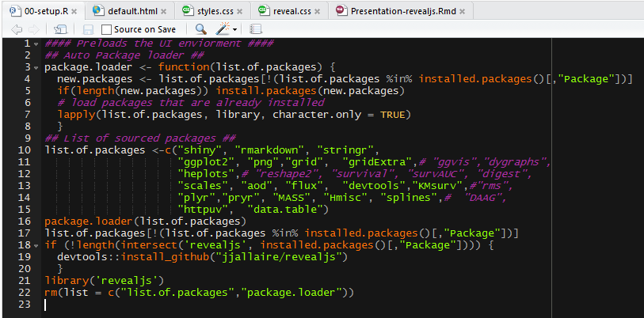
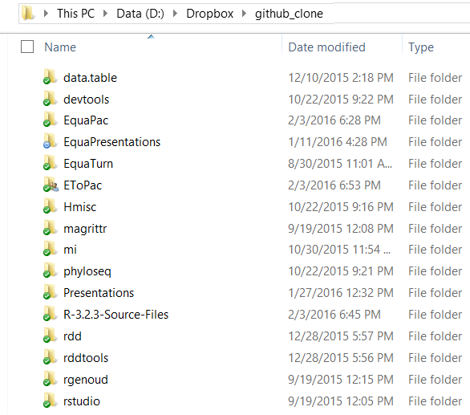

# About Me

* I like,
    + turtles.
    + long walks on the beach.
    + R is ok, I guess.
* Who am I?
    + "Vell, Reino's just zis guy, you know?"

# What to expect? CARNAGE!

- A discussion regarding how to think about writing code so that:
    + you can find where the problem is faster.
    + you have an easier time figuring out what needs to be done.
    + you can avoid bugs occurring all together.
- A buffet of programming hints, tips, and ideas you can choose to incorporate
into your coding style.
- <font color="red">Disclaimer: Use only what works for you, and try to be consistent.</font>

#	Debugging: What is a bug?

* Bugs are not always messages, warnings, or errors.
* Wikipedia's Definition: A software bug is an error, flaw, failure, or fault 
in a computer program or system that causes it to produce an incorrect or 
unexpected result, or to behave in unintended ways.
* If you can't figure out why something is happening - even though it doesn't 
seem to hurt anything - it will likely come back around to bite you.
    + Anomalies can snowball. The knowledge gained from figuring out why
    anomalies happens is often more important than fixing a malfunction.

"The most exciting phrase to hear in science, the one that heralds the most 
discoveries, is not 'Eureka!' (I found it!) but 'That's funny...' "
\ \ \ \ \ \ \ \- Isaac Asimov

# Improve your ability to read your code (literally)
#

<section> 
  <h1>Avoid eye strain</h1>
  As your eyes get tired, you will subconsciously avoid reading details in code
  that might contain errors.
  
  * Take frequent eye breaks, learn to recognize when you are getting tired
  * Increase font size
  * Change text and/or background color
  * Change monitor resolution
  * Adjust the brightness in room and/or the monitor (they should be as close to
  the same brightness as possible)
  * Move light sources so they are not directly in front or behind you
  * Keep your code aligned and visually organized
  
  ---
  
  <a href="https://openclipart.org/detail/217881/a-bird-in-the-bush"></a>
  
  ---
  
   

</section>

--- 

## Conceptualize coding just like normal languages.

Code can be thought of as a language, literally. Programming languages can have
vocabulary, syntax, grammar, pragmatics, etymology, cultural conventions, and
even word roots (prefixes and suffixes) etc. just like normal languages.

It can be helpful to interpret programming semantics as their analogous
counterparts in language.

Programming | Language
------------|---------
Scripts|Essays
Sections|Paragraphs
Lines Breaks|Sentences
Parentheses|Punctuation
Functions|Verbs
Classes|Adjectives
Variables|Nouns

---

## Leave clues within your object names

Even your variable names can contain attributes similar to affixes and word
roots.

Prefixes | Suffixes
:---------------------------------:|:----------------------------------:
Nic-, Ni : (Irish, Scottish) "daughter of" | -datter (Danish, Norwegian) "daughter (of)"
M', Mac, Mc, Mhic, Mic : (Irish, Scottish and Manx Gaelic) "son" | -son (English, Swedish, German, Norwegian, Icelandic) "son (of)" 

### Professions Surnames

* Smith (English) Means "metal worker, blacksmith" from Old English smiþ,
related to smitan "to smite, to hit".
* Thatcher (English) Referred to a person who thatched roofs by attaching straw
to them.

Every bit of forethought that goes into writing a persuasive essay can go into a
script. Your code should endeavor to be an explanation as well as instructions.

The easier your code can be read, the easier it will be to debug. 

# What is it for?

Some things you should consider:

* How do you intend to use the code you are writing?
* Is it to be used within a function?
* Could it be used within a function in the future?
* Is it intended to be used in a R package?
* How often do you think it will be changed or adjusted if used again?
* How often do you use the procedure you're applying?
* Are you likely to use such a procedure in a different context, dataset, and 
data class?
* How similar are other procedures to the one you are currently writing code
for?

It can be really important to have foresight as to how the code you are writing
can be utilized. One of the confusing things about R is it is often used one
time in a semi-disposable fashion.

This results in most R users not being accustomed to writing code using more
modular, adjustable, extendable, robust, and adaptable methods.

# Naming conventions

Typical naming conventions in R suggest avoiding periods (unless assigning S3 
methods), as well as using underscores and/or capitals to visually parse object 
name components. Considering this, it is rarely discussed how one might
go about naming objects in the first place.

"There are only two hard things in Computer Science: cache invalidation and naming things."
\ \ \ \ \ \ \ \- Phil Karlton

# Component break down

One method I sometimes utilize is to consider three components for every object:

1. Where 'it' is going
2. What 'it' contains
3. where 'it' has been

An alternative might be:

1. Purpose or context
2. Descriptive quality
3. Data structure

#

<section>
  <h1>Naming examples</h1>

  * For a global scope constant designed to hold a list of the leap years for past
  2k years.
      + `CONST_leapyear_ivec` / `CONST_leapy_ivec` / `CST_leapy_vec` /
      `CST_lpy2k_v` / `CST_lpy_v` / `const_leapy_vec` (local) /
      `const_leapy` (local) / etc.
      + Notice I avoided using "c_", or "C_" because this can get confusing when
      regarding C++ internal objects.
      + Also, I am calling the object "ivec" or "vec" because it would likely be a
      vector of year integers.
      + For variables that reside higher in the search path I prefer longer
      descriptive names.
      
  ---
  
  * For a function scope, storage data.table which will be returned at the end of
  the function. 
      + `output_results_dt` / `rslt_rbl_dt` (using rbindlist) / 
      `rslt_featcols_dt` / `loop_results_dt` / `rslt_iterstore_dt` / etc.
  * For a very temporary function scope (ephemeral variable) factor vector used in
  a loop, and/or simple placeholder to subset a table.
      + `subset_lefttoproc_fvec` / `reductionjoin_leftover_fac` /
      `ljoin_remaining_Jfac` / `red_lftover_fac` / `ss_lover_fac` / etc.
      + for very temporary variables I find that shorter is better (e.g.
      `red_lov_f`).
      
  ---
  
  * For a fitted linear model which is intended for post processing by a number
  of other functions.
      + `allcond_fullset_lm` (all conditions, all outliers) / `fit_allcon_lm`
      / `allcon_wo_ol_lm` / `majcon_fs_lm` (only major conditions) / etc.
  * Can you think of any other examples? Perhaps examples where this naming
  method is unnecessary? What about packages and function names?

</section>


# General takeaways about "object names"

* When renaming variables throughout a script use the "Rename in File" command
Ctrl+Alt+Shift+M in order to avoid reference errors.
* The more environment scopes / contexts in which an object could potentially be
relevant, the more important it is to have an  easily identifiable name.
* The more times I intend to modify and/or reference an object the shorter I
like the name to be.
* Under many circumstances it is a good idea to rename your objects dependent on
how the variable is being used and within scope.
* Being able to tell what should be in an object will allow you to more quickly
confirm if it is indeed the case.
* It also can make code much easier to read if you have to "remember" less
information.
* Try to be consistent if only in a given project.

# Basic R-Studio useful formatting commands

Use Ctrl+Shift+A to reformat code or Ctrl+I to auto indent code

* Using R-Studio reformat feature will help illuminate issues with parentheses 
and other potential syntax issues, especially if you are scrutinizing the code
for issues.
* I rarely settle with R-Studio's formatting afterwards, however, it can still be
really helpful when handling ugly code from the internet.

# Write shorter lines of code

Shorten page width to 80 characters (important).

* Options > Code > Display > Show margin: Check & Margin column: 80
* Use Ctrl+Shift+/ to reflow comments so you don't have to do it by hand.

##

## Why are shorter lines helpful?

By breaking instructions down into smaller pieces you make code more 
understandable and easier to remember (called chunking). No one understands a 
run-on sentence, so why should anyone understand a run-on instruction? Having 
concise and organized lines of code can make a world of difference when trying
to debug.

# Using magrittr can help ... to a point

| With dplyr                     | With magritter                       | With data.table |
|--------------------|--------------------|-------------------|
| hourly_delay &lt;-             | hourly_delay <-                      | hourly_delay <-                  |
| &nbsp;&nbsp;filter(                      | &nbsp;&nbsp;flights %&gt;%                     | &nbsp;&nbsp;flights&#91;                   |
| &nbsp;&nbsp;&nbsp;&nbsp;summarise(                 | &nbsp;&nbsp;&nbsp;&nbsp;filter(!is.na(dep_delay)) %&gt;% | &nbsp;&nbsp;&nbsp;&nbsp;!is.na(dep_delay),           |
| &nbsp;&nbsp;&nbsp;&nbsp;&nbsp;&nbsp;group_by(                | &nbsp;&nbsp;&nbsp;&nbsp;group_by(date, hour) %&gt;%      | &nbsp;&nbsp;&nbsp;&nbsp;.(                           |
| &nbsp;&nbsp;&nbsp;&nbsp;&nbsp;&nbsp;&nbsp;&nbsp;filter(               | &nbsp;&nbsp;&nbsp;&nbsp;summarise(                       | &nbsp;&nbsp;&nbsp;&nbsp;&nbsp;&nbsp;delay = mean(dep_delay),   |
| &nbsp;&nbsp;&nbsp;&nbsp;&nbsp;&nbsp;&nbsp;&nbsp;&nbsp;&nbsp;flights,            | &nbsp;&nbsp;&nbsp;&nbsp;&nbsp;&nbsp;delay = mean(dep_delay),       | &nbsp;&nbsp;&nbsp;&nbsp;&nbsp;&nbsp;n = .N),                   |
| &nbsp;&nbsp;&nbsp;&nbsp;&nbsp;&nbsp;&nbsp;&nbsp;&nbsp;&nbsp;!is.na(dep_delay)), | &nbsp;&nbsp;&nbsp;&nbsp;&nbsp;&nbsp;n = n() ) %&gt;%               | &nbsp;&nbsp;&nbsp;&nbsp;by = .(date, hour)&#93;&#91; |
| &nbsp;&nbsp;&nbsp;&nbsp;&nbsp;&nbsp;&nbsp;&nbsp;date, hour),          | &nbsp;&nbsp;&nbsp;&nbsp;filter(n > 10)                   | &nbsp;&nbsp;&nbsp;&nbsp;n > 10&#93;                 |
| &nbsp;&nbsp;&nbsp;&nbsp;&nbsp;&nbsp;delay = mean(dep_delay), |                                      |                                  |
| &nbsp;&nbsp;&nbsp;&nbsp;&nbsp;&nbsp;n = n()),                |                                      |                                  |
| &nbsp;&nbsp;&nbsp;&nbsp;n > 10)                    |                                      |                                  |

# But who really writes code like that anyways?

```{r, eval = FALSE}
hourly_delay <- 
  filter(summarise(group_by(filter(flights, !is.na(dep_delay)), date, hour),
      delay = mean(dep_delay), n = n()), n > 10)

hourly_delay <- 
  flights %>% 
    filter(!is.na(dep_delay)) %>% 
    group_by(date, hour) %>% 
    summarise(delay = mean(dep_delay), n = n) %>% 
    filter(n > 10)

hourly_delay <- 
  flights[!is.na(dep_delay),
          .(delay = mean(dep_delay), n = .N),
          by = .(date, hour)][n > 10]
```

# 

<section>
  <h1>Manage options</h1>

  These options allow the user to set and examine a variety of global options
  which effect the way in which R computes and displays its results.
  
  Most options are not set by default (NULL), but R has a list of standard options
  on the help 
  [website.](https://stat.ethz.ch/R-manual/R-devel/library/base/html/options.html) 
  Also, you can set your own custom options if you wish. This can be useful if you
  want your custom functions to change their behavior in a global sense.
  
  A quick way to look at all the current option settings:
```{r, eval = FALSE}
.Options
str(.Options)
```
  
  To get a single option setting use `getOption("<option>")`. This is often used
  in the formals / prototype / arguments of function -- more on that later.
  
  ---
  
  `options()` can receive either a named vector or named list, therefore many
  options can be set at the same time.
  
  For example: 
```{r, eval = FALSE}
options(verbose = TRUE)
options(warn = 1)
options("error" = NULL)
option_list <- list(warn = 1, error = NULL)
options(option_list)
```

</section>

#

<section>
  <h1>Options that help with debugging</h1>

  For more detailed information read the guides [R-studio Debugging](https://support.rstudio.com/hc/en-us/articles/205612627-Debugging-with-RStudio) & [Debugging, condition handling, and defensive programming](http://adv-r.had.co.nz/Exceptions-Debugging.html) are helpful.
  
  * digits: options(digits = 4)
      + Control digits printed, default 7, 1-22 possible integer entry
      + Sometimes it can be easier to read outputs, and thus sort out issues. 
  * showErrorCalls: options(showErrorCalls = TRUE)
      + In addition, R-Studio has debugging options: Debug tab -> On Error ->
      'Message Only', 'Error Inspector', 'Break in Code'
      + You can do the same thing with `options(showWarnCalls = TRUE)` if you
      wish.
  
```{r, eval = FALSE}
test_it <- function() {inner_fn <- function() {stop("test it")} ; inner_fn()}
test_it() 
> Error in inner_fn() : test it
> Calls: test_it -> inner_fn # Added the call trace
```
  
  ---

  * show.error.locations: options(show.error.locations = 'top')
      + This shows what line in the source code the error appears, and it will 
      respect any line break code arrangement as specified in the function source.
      
```{r, eval = FALSE}
test_it <- function() {    # Line 1 Relative from the functions starting
  a <- "apple"             # Line 2
  inner_fn <- function() { # Line 3
    b <- "bungalow"        # Line 4
    stop("test it")        # Line 5 refers to the (from #5)
    }                      # Line 6
  inner_fn()               # Line 7
}                          # Line 8

test_it() 
> Error in inner_fn() (from #5) : test it  # "(from #5)" is added. 
> Calls: test_it -> inner_fn
```
  
  * stringsAsFactors: options(stringsAsFactors = FALSE)
      + As a rule of thumb, stringsAsFactors is more of a problem than it is 
      worth. It is more for historical reasons; it used to be faster to read
      in data from a file if the strings were treated as factors. That is no
      longer the case; the speed issue is no longer relevant.
      + If a vector needs to be in factor / ordered form then convert it just
      prior to using the function that requires it.
      
  ---
  
  * warn: options(warn = 0)
      + If warn < 0 then all warnings are ignored
      + If warn == 0 then the warnings are stored until top–level function returns
      + If warn == 1 then warnings are printed as the occur. (My favorite)
      + If warn >= 2 then all warnings are turned to errors. This can be really
      helpful if you are having a hard time tracking down a warning message,
      because you can set all errors to automatically initiate the debugger
      browser.
  * error: options(error = NULL)
      + This allows you to set what functions are executed once an error occurs. 
      + Many of these tools can be very awkward and difficult to use, therefore, I
      would always suggest using defensive programming techniques instead of 
      relying on r-studio debugger.
  * options(error = recover)
      + At the moment before an error occurs, a readout asks what environment you
      would like to investigate, and drops into browser() debugger mode.
      + This can be useful if the error is occurring in a deeply nested function,
      and/or you believe the cause of the error originates due to processes which
      pass through a number of layers of abstraction.
      
  ---
      
  * options(error = browser)
      + Interrupts the execution of an expression and allows the inspection of the
      environment where browser was called from.
  * options(error = dump.frames)
      + Runs the dump.frames function, which makes all temporary variables in
      cache save to the global environment via an object called "last.dump".
      + Whenever you would like to make a dump manually you can use, 
      `dump.frames(dumpto = "last.dump", to.file = FALSE)`
      + If you want to look more closely at your last dump use `debugger(dump =
      last.dump)` which will call the dumped environment as if one was using
      `recover()`.
      + dump.frames can be convenient because it does not require you to be in the
      interactive browser.
  * options(error = function() traceback(2))
      + Runs `traceback()` (shows the function nesting structure) two levels up
      from the scope in which the error was generated showing, yet does not load 
      debugger.

</section>

# Option tip

Sometimes you might want to change the options within a function temporarily.

Using `on.exit()` can be a convenient way to undo whatever changes you might
have made within the function. This also works for global objects.

```{r, eval = FALSE}
test_fn <- function(x) {
options(digits = 4)
	print(x)
	on.exit(options(digits = 12))
}
> test_fn(pi) # 3.142
> print(pi) # 3.14159265359
```

Undoing temporary changes is really important if you want to avoid writing code
that will surprise / sabotage you later.

# Function structure 

When writing functions, the better sense you have of how and where it will be
used, the better chance you have of writing a bug free or easily debugged
function.

You also want to have a good sense of what data is entering the function, and
what results are returned (if any) once completed.

R functions can be categorized into 4 general tiers or levels of application.

---

## 1. Calculation / core / raw / binary functions

* These functions are designed to be as fast and memory-efficient as possible. 
* Have very little in the way of warning and error handling, and usually no
messages.
* Should usually be written in C++/Rcpp, or other fast methods.
* Usually are designed to be vectorized calculations.
* R usually lists these kinds of function as [.internals and .primitives](https://cran.r-project.org/doc/manuals/r-release/R-ints.html#g_t_002eInternal-vs-_002ePrimitive)
but that does not mean you can't write your own.
* Not normally meant for interactive programming, and are rarely implemented
outside of function calls.
* Can be generalizable, but not necessarily.

---

## 2. Handling / typical / simple functions

* These can be understood as essentially just wrappers for binary functions,
which provide a degree of control and stability.
* Very commonly used interactively. 
* Often are implemented as components of other functions.
* They handle basic data testing and prepossessing before implemented.
* Will typically have several internal tests which will output 
warnings, and errors, but are unlikely to produce messages. 
* Will often coerce incoming data structures into usable forms.
* Usually very generalizable.

---

## 3. Procedural / algorithmic / process functions

* These functions conduct multi-step processes, and often have multi-faceted
implementation.
* Usually very powerful, flexible, and robust for a number of different data
structures.
* Usually have a large variety of argument settings designed to vastly change
function behavior.
* Are usually much more complicated than simple functions, and can be
hundreds of lines long.
* Most often used interactively, but are commonly called inside of other
procedural functions.
* Will usually use a great deal of simple functions, but mainly for testing and
processes purposes.
* Will usually have very descriptive and important / relevant messages,
warnings, and error messages, which communicate the viability of the
function's function.
* Often return results of their own class format.
* Usually very generalizable, but also designed to do something very specific. 

---

## 4. Context functions

For the purposes of this discussion, *context* refers to any idiosyncratic 
analysis scenario of which the analysis methods used are assumed, common, and/or
particular to the area applied. Some examples of different *contexts* include, 
but are not limited to, fields of science, governments, companies, projects, and
individuals, etc. a process can be simplified and streamlined for in-context
use.

* These functions can be very similar to binary, simple and process functions,
however, they are designed to be convenient within a context.
* Can be extremely temporary and thus are discarded / replaced soon after an
initial use.
* Are commonly used to clean up scripts for readability.
* Often are exact replicas of common functions with their default settings 
altered.
* Are likely to have useful context specific objects -- usually constants --
saved inside the function's closure.
* Usually not generalizable outside of their context other than by chance.

#

<section>
  <h1>Toolbox analogy</h1>

  These 4 function structures can be explained with a tool analogy. 
  
  * __Simple functions__ are like basic tools such as screwdrivers, wrenches, or
  rolls of tape. They are good for general use, but often fall short of very
  specific tasks.
      + R examples: `cut`, `%in%`, `intercept`, `setdiff`, `Reduce`, `mean`, `sd`, 
      etc.

  * __Process functions__ are like a toolbox of tools being applied in sequences
  based on the job at hand.
      + R examples: `lm`, `summary`, `describe` {psych}, `print`, `plot`,
      `as.data.table` {data.table}, `train` {caret}
  
  ---
  
  * __Context function__ are like having a toolbox specific for plumbing or car
  engine repair. Many, of the tools will be subtly different in order to work 
  better within the context applied.
      + R examples: {phyloseq} (for microbiome census research), {wccmh} (for
      Washtenaw mental health), {metrumrg} (for pharmacometric data), {psych} (for
      psychology), etc.
      
  * __Binary functions__ are the mechanical components within a single tool that do
  all the heavy lifting -- so to speak. For instance:
      + Wrenches are hinged levers.
      + Screwdrivers transfer applied handle torque to a central point, etc.
      + Tape has an adhesive on its side(s) that form a chemical or physical bond. 
      + R examples: `.bincode` (from cut), `.Internal(match(` (from %in%), 
      `forceAndCall(` (from Reduce, etc.), `.Internal(mean(` (from mean),
      `.Call(C_cov` (from sd), `.Call(C_Cdqrls` (from lm), `+`, `if`, etc. 

</section>

---

## Why does a function's purpose matter? 

* Because Having a clear idea of what a function does will result in a better
sense of what could be going wrong with it.
    + e.g. A convergence warning will likely be the product of a processes 
    function instead of a simple function. 
    + Likewise, an NA intolerance error will likely be a product of a simple
    function even though the function is nested inside of a process function.
* The most appropriate / useful function (a) messages, (b) warnings, and (c) 
errors are highly dependent on a function's purpose, and are critical for
debugging and/or defensive programming later on down the road.
* When functions are consistently designed with defensive programming in mind at
every level, it is far easier to apply such functions in other contexts (e.g. 
such as within other functions with less certain input data). Making functions 
more independent and interchangeable is called modularization, or sometimes 
agile programming.
* More on this later. 

---

## Function structure hierarchy

```{r, eval = FALSE}
context_fun <- function() {
  process_fun <- function() {
    simple_fun <- function() {
      .binary_fun <- function() {
        
      }
    }
  }
}
```

#

<section>
  <h1>Code squawking</h1>
  
  For the purposes of this presentation the term "squawking" will refer to any
  printing, messages, warnings, or errors rendered in R.
  
  "Not all problems are unexpected. When writing a function, you can often
  anticipate potential problems (like a non-existent file or the wrong type of
  input). Communicating these problems to the user is the job of conditions:
  errors, warnings, and messages." 
  
  \ \ \ \ \ \ \ \- Hadley Wickham [Advanced R]
  
  ---
  
  * Messages: messages(\<text\> & \<simple objects\>)
      + Inform the user of non-critical information such as descriptive
      statistics, progress and performance reports, and sometimes results.
      + Can sometimes be used to provide procedural status updates that can be a
      useful window into the information being processed and passed on.
      
      
  * Warnings: warning(\<text\> & \<simple objects\>)
      + Report concerning information which __may__ lead to unexpected, 
      uninterpretable, unreliable, inconclusive, flawed, or otherwise useless
      results.
      
  ---
  
  * Errors: stop(\<text\> & \<simple objects\>)
      + Terminate the entire process stack due to a catastrophic irreconcilable
      malfunction.
      + All information pertaining to the cause of an error has to be provided
      within -- or prior to -- the `stop()` function execution.
      + Can use functions such as `try()` and `tryCatch()` to "test" whether an
      error will occur as a result.
      
      
  * Concatenate: cat(\<strings w/ escape characters\>)
      + Outputs the objects verbatim while concatenating their representations to
      the console.
      + Use [ASCII escape characters](https://stat.ethz.ch/R-manual/R-devel/library/base/html/Quotes.html):
      `\n` (newline), `\t`(tab), `\r` (carriage return), etc. to format outputs.
  
  ---
  
  * Print: print(\<strings\> & \<objects\>)
      + Calls an R method based on an object's class, and displays the object's
      unique contents formatted for readability (sometimes).
      + Using `print()` can be somewhat cleaner than using messages because print
      results are usually easier to read.
      + In order to see printed results when the function is evaluated within a
      loop for function, use the command `flush.console()` in order display the
      output to the console window.

</section>

---
    
## Helpful functions for displaying formatted information

* The following functions are extremely useful for arranging and formatting 
information strings, and are staple functions for programming print methods. This
is helpful because the easier your messages are to read, the more likely you
will be able to sort out issues.
    + `paste()` and `paste0()` are used for joining strings together. Learning
    to use the arguments `collapse` and `sep` is particularly important.
    + `sprintf()` is a powerful string creation tool that allows you insert
    and format multiple numbers and strings into a one string using a special
    syntax. Used `example("sprintf")` for more information. 
    + `format()` is a commonly used function designed to format particular
    objects that have alternative forms such as with the date and time classes.
    + `prettyNum()` and `formatC()` use C style format specifications.

---

<section>
  <h1>Squawk suppression</h1>

  Every so often you will come across a function that squawks for reasons that you
  have chosen to ignore. When this happens you might wish to suppress any future 
  interruptions if only to make other notices less cluttered on the screen. You can
  use `capture.output`, `suppressMessages`, and `suppressWarnings` to accomplish 
  this, however, use it sparingly. Suppress and capture functions are not 
  selective about what messages they suppress. If you can manage to suppress only
  the conditions you want to ignore, you will be better off.
  
```{r, eval = FALSE}
adele <- function(x) {
  options(warn = 1) ; on.exit({options(warn = 0)}, add = TRUE)
  cat("Hello, how are you?\n")
  message("It's so typical of me to talk about myself I'm sorry.")
  warning("I hope that you're well.")
  as.numeric("Nope")
  if (!missing(x))
    stop("Did you ever make it out of that town where nothing ever happened?")
  invisible("Yep")
}
```

  ---

```{r, eval = FALSE}
adele() # With no suppressed squawking
# With the console output suppressed and saved in lyric, and the function's
# output saved as answer.
lyric <- capture.output({answer <- adele()}) ; lyric ; answer
# With all messages suppressed
suppressMessages(adele())
# With all warnings suppressed
suppressWarnings(adele())
# Function used to ONLY suppress the "NAs introduced by coercion" leaving all
# other warnings and errors through.
suppressNAwarn <- function(expr) {
  withCallingHandlers(expr,
    warning = function(w) {
      if (grepl("NAs intro", w$message))
        invokeRestart("muffleWarning")})}

suppressNAwarn(adele())
```
  
  [Condition handling](http://adv-r.had.co.nz/beyond-exception-handling.html) is a
  rather involved topic, and it takes some serious practice to get the hang of it.
</section>

---

## Using the verbose option

It is very common practice for programmers to provide a means of suppressing
unnecessary messages or warnings from being displayed. This is most often
accomplished by adding a “verbose” argument at the end of the formals pairlist.

`verbose` is a boolean option in R that is set to FALSE by default, and is 
referenced using the `getOption("verbose")` command. It is used by placing an 
`if(verbose) {}` in front of any message you would like to keep quiet by 
default. When debugging a process it can be helpful to display the content 
passing through such functions even though the actual issue might arise before 
or after the function in question. Many functions in base R have this feature
built in.

---

```{r, eval = FALSE}
loquacious_function <- function(person1 = 0, person2 = 0, data = NULL, 
                                envir = parent.frame(), 
                                verbose = getOption("verbose")) {
  if (verbose) {
    message("Hi, my name is Mr. Loquacious, and your 'person1' and 'person2'", 
            " values are, ", person1, ", ", person2, ", respectively.")
  }
  if (verbose && person1 >= 4) {
    warning("Be careful, your 'person1' input value is ", person1, 
            " popped-collars cool. This could lead to issues with ", 
            "later date results.")
    browseURL("http://www.maniacworld.com/four-popped-collars-cool.jpg")
  }
```
```{r, eval = FALSE}
  if (person2 <= person1 -3) { 
    warning("The person1 variable 3 or more popped-collars greater",
            " than the person2 variable. Reliable date results", 
            " cannot be obtained.")
  }
  if (person2 > person1) {
    stop("An impossible sitation has arisen.",
         " Please rechecking input values is suggested.")
  }
  (date_prob <- 0.5 - (person1 - person2) / 4)
}
loquacious_function(4,0)
```

---

### Shiny foot note

Shiny has its own analogous verbose option called shiny.trace -- 
`options(shiny.trace = FALSE)` -- and it is set to FALSE as default. Moreover, 
sometimes shiny squawks behind the scenes. That is, issues can arise during a 
period when shiny is communicating with the hosted webpage. In order to debug
such problems the command `debug(httpuv::service)` can be helpful.

---

As mentioned before, there are different types of functions and each function 
has its own requirements for what is taken in and returned. It is the 
programmer's responsibility to make sure that a function either works as expected
or communicates the nature of the issue as soon and effectively as possible.

```{r, eval = FALSE}
context_fun <- function() {
  process_fun <- function() {
    simple_fun <- function() {
      .binary_fun <- function() {
        
      }
    }
  }
}
```

That is, it is better to identify issues higher and earlier up in the nested 
function structure, however, this can require a lot of foresight and planning 
beforehand.

---

## Important side note

* cursor_on_\<function\>+F1 is better than `?<function>` and `help("<function>")`
    + Help documentation can be extremely helpful for coding and bug checking.
    + Functions' detail section often has important information.
* `example("<function>")` can be a slick convince shortcut to figure out what
how to use a function quickly.
* `str(<object>)` can save you a lot of headache when you are trying to figure
out what and where the sought after pieces of a complex object reside.
    + `example("str")` is very illuminating.
* cursor_on_\<function\>+F2 is better than `<function>`
    + Read a function's code when trying to figure out why it might be going
    awry.
    + When using F2, searching the code with Ctrl+F
    + The more code you read __and understand__ the better of you will be.
    + Look up unfamiliar functions. It will payoff in the long run.
* You can use `methods(<function>)` and `getAnywhere("<function>.<method>")` 
when you are having trouble finding code. For example try `?methods`,
`methods("mean")`, and `getAnywhere("mean.default")` look up R method code.

---

## Search source code

I find __Ctrl+shift+F__ to be critically important:

* When I have lost code, and I can't remember where it is located.
* When I am trying to reuse and improve functions I have already written.
* If I am searching for snippet of code or an advanced function use case as an
example.
    + Save [CRAN package source code](https://cran.r-project.org/web/packages/available_packages_by_name.html)
    or clone a package's github repo into a common folder; this can be ridiculous
    convenient because it bypasses R entirely.
    + You can also search R's hidden C++ source files from the 
    [R  website](https://cran.r-project.org/) at 
    [R-3.2.3 SourceFiles](https://cran.r-project.org/src/base/R-3/R-3.2.3.tar.gz)

 

---

## Context functional checks

Because context functions are being applied to very specific situations it is
usually useful to make sure whatever qualities that are unique to the context
are intact within the input.

```{r, eval = FALSE}
context_fun <- function(x, ...) {
  if(!inherits(x, what = 'custom_bio_object')) 
    stop("\nOnly objects generated by 'get_some_data' from the 
        {custom_bio} package can be used in this function.")
  if(length(x) > 1000) 
    warning("The custom_bio_object supplied is very large, and the results 
            might take a few hours to process.")
  message("Process time estimated to be ", time_estimate, "hours.")
  process_fun <- function(...) {...
```

---

## Quasi-anonymous context functions

Not all functions have to be named. If you believe a function will only be
applied once in a particular context you do not need to name it anything
memorable, and you can keep using the same name repeatedly. 

```{r, eval = FALSE}
# Anonymous function
function() NULL # meant to be ephemeral
# Example of lapply with an anonymous function applied to each item in the list.
lapply(some_list, function(x) as.vector(unlist(bootstrap(boundary_trim(x)))))
# This can get somewhat hard to read though. For this reason, I usually like to
# temporarily assign a function to 'f'.

# Quasi-anonymous function
f <- function(x) as.vector(unlist(bootstrap(boundary_trim(x))))
# or
f <- function(x) boundary_trim(x) %>% bootstrap %>% unlist %>% as.vector
lapply(some_list, f)
```

One benefit of this is that the code can be much clearer to the reader.
Additionally, you are much less likely to make mistakes with parenthesis or
copy-pasting when your expression is simplified with `f()`.

---

## Loopy horror story

The temporary assignment method for quasi-anonymous functions has an unexpected 
benefit. Using the assignment operator `<-` to reassign a temporary / holder 
value can sometimes create problems. This problem often arises when loops (such 
as for, while, and repeat) are use with holder objects that are intended to be 
reassigned / replaced / overwritten by a subsequent loop iteration. These holder
objects do not always receive the new object due to a malfunction within the 
loop. This is why it is common to see loops with 
`object1<-object2<-object3<-NULL` at the beginning or end of their loop closure 
because re-initializing insures subsequent iterations will not use outdated 
objects. The nice thing about `f <- function(){}` is that it will reliably
re-assign `f()` or you will receive an error.

```{r, eval = FALSE}
holder_object <- NULL
for(i in 1:3) {
  object1 <- func1(holder_object)
  object2 <- func2(object1)
  object3 <- func3(object2)
  holder_object <- funcy(object3)
  object1 <- object2 <- object3 <- NULL
}
```

--- 

## Debugging for, while, & repeat loops

Loops often get a bad rap in R because they are widely considered to be slow,
difficult to manage, and error prone. Out of these three criticisms the only
assertion I partly agree with is that loops can sometimes be harder to
manage.

```{r, eval = FALSE}
ask <- function (envir = parent.frame()) {
  cat("\rAre you ready to debug yet (y or n)? [i =", i, ']')
  ans <- readLines(con = stdin(), n = 1)
  if (length(intersect(ans, c("y")))) with(envir, {browser()})
  return(invisible(NULL))
}
for (i in iterseq <- seq(3L)) {
  ask() ## It can ask you
  if (i <= 1) print(Sys.time()) ; flush.console()
  if (i == 2) message("Last run")
  if (i >= max(iterseq)) browser() ## Conditional browsing
  warning("For loop warning")
}
```
In such situations using break points are not convenient because you might not 
want the debugger to run until after some number of iterations have been
completed.

The `if (TRUE) browser()` method also works for function under situations in
which abnormalities are hard to duplicate in a contrived manner.

---

## Process functional checks

In addition to input validation, process functions typically go through many 
layers of functional checks and analyses whereby internal results can trigger 
decisions as to how to continue towards the functions' intended purpose. It can 
be helpful for these functions to (1) tell the user what decisions have/are 
being made, (2) provide progress reports, (3) ask the user how to proceed, (4) 
warn the user about dubious result, and (5) explain why a process failed to
achieved a result.

```{r, eval = FALSE}
...
  process_fun <- function(x1, ...) {
    # Step 1: Decide how to proceed based on argument and data specifics.
    # Step 2: Test to see if the input adheres the to required format.
    # Step 3: Coerce data structure if necessary.
    # Step 4: Test if resultant coerced data is viable.
    # Step 5: Choose what simple function(s) are necessary to derive a result.
    # ...
    # glm() advanced example of a powerful process function
    simple_fun <- function(x2, ...) {
      # glm.fit() is an good example of a simple function that borders on
      # process level complexity, and it is function that lm() actually calls to
      # start the calculation.
      ...
```

---

## Simple functional checks

Their role is usually as simple as coercing and validating input information,
while reporting anomalies or malfunctions. Where these functions can get
complicated is when argument settings can effect how coercion and validation is
performed, or even which .binary function(s) are used.

```{r, eval = FALSE}
    simple_fun <- function(x, na.rm = FALSE, unlists = FALSE, scaler = 1) {
      # Step 1: Test, coerce, and validate inputs.
      if (any(is.na(x))) stop("NA detected within vector, and simple_fun cannot 
       complete calcuations unless na.rm = TRUE is set.")
      # Step 2: Reformat results based on function arguements, and revalidate.
      # Step 3: Select what optimized binary function(s) is selected.
      
      .binary_fun1 <- function(x2) {...}
      .binary_fun2 <- function(x2) {...}
      ...
    }
```

Using descriptive arguments labels can help make setting selections more
intuitive, however, shorter argument names are more convenient when you are
trying to keep your lines short. Loading function arguments by position can simplify your code, but may effect referential integrity.

---

<section>
  <h1>Arguement labeling (side note)</h1>

  I sometimes find it useful to either set default function arguments to 
  fictitious objects names which I do not intend to defining. Sometimes you can 
  pick the fictitious object name to just be an abbreviated version of what 
  intended object input -- up_src_ext_vec could be 
  uploaded_sourced_external_vector.
  
  I use these names as an extra reminder as to what a function argument does and
  how to debug it, before any formal documentation exists. Moreover, providing a
  number of options in your function's arguments can be a helpful reminder of the
  acceptable options.

```{r, eval = FALSE}
simple_fun <- 
  function(data, FUN = Vectorized_delimitation, # VD short description
           recode_key = string_or_list_format, 
           # RK long drawn out and usually useless description
           na.rm = c(TRUE, FALSE, "mean_replace", 
                     "median_replace", "twod_interpolate"),
           bin_method = c("inf_right", "inf_left", "inf_bounds",
                          "inclusive", "exclusive", "95ci", ".bincode"),
           rtrn_objects = c("simple_result", "summary", "ci", "bin_vec")
           ...) { # ... pass to .bincode
```

  ---

```{r, eval = FALSE}
    na.rm <- match.arg(type)
    bin_method <- match.arg(bin_method)
    rtrn_objects <- match.arg(rtrn_objects, several.ok = TRUE)
    # match.args's 'several.ok' argument is useful for simplifying code by
    # reducing the amount of arguments necessary when a number of options are
    # not mutually exclusive.
    if (bin_method == ".bincode") bin_method <- .bincode(...)
    ...
    output <- list()
    if (pmatch("res", rtrn_objects, 0L)) output$result   <- final_rslt
    if (pmatch("sum", rtrn_objects, 0L)) output$summary  <- info_smry
    if (pmatch("ci" , rtrn_objects, 0L)) output$conf_int <- confint_rslt
    if (pmatch("bin", rtrn_objects, 0L)) output$bin_vec  <- bc_rslt
    return(output)
  }
```

  Referencing the __actual__ default object name is sometimes easier (especially
  with functions inside of functions), however, I find myself prone to either:
  1. Unwittingly changing the referenced object's name thereby breaking the 
  function.
  2. Forgetting an argument even exists while I am trying to use the function in
  another script.

</section>

---

<section>
  <h1>Switch statment (side note)</h1>

  I often find reading chained if-else statements difficult to read and debug.
  This is especially the case when those if-else closures have even more if-else 
  statements nested within them. People often have trouble keeping such code 
  organized, and it only takes little mistakes to be a huge problem later on.
  
  For this reason it can sometimes be helpful to use switch statements instead of
  if-else chains.

```{r}
x <- FALSE
choice <-
  if(is.na(x)) {
    "bop_it"
  } else if(x > 0) {
    "twist_it"
  } else if(is.numeric(x)) {
    if(x < 0) {
      "pull_it"
    } else {
      "flip_it"
    }
  } else if(is.name(x)) {
    "shout_it"
  } else if(is.character(x)) {
    "throw_it"
  } else "ifelse_dropout"
```

  ---

```{r}
result <- switch(
  choice, 
  "bop_it" = {1}, 
  "twist_it" =, "pull_it" = {
    choice <- NULL
    (x + 1)
  },
  "shout_it" = {3}, 
  "throw_it" = {4}, 
  {0})
```

</section>

---

## .binary functional checks

With .binary functions you want to limit the errors to situations where there is
some mathematically necessary requirement such as avoiding division by zero, or
unequal vector lengths, etc. It should be noted that binary errors are the most
difficult to debug because of the depth of their nesting. Therefore, adding
errors into binary functions should be considered minimally sufficient error
reporting -- better than a stock C++ error at least. The above example, uses
`tryCatch` to help make the explanation for the error more clear.

```{r, eval = FALSE}
simple_fun <- function() {
  ...
  .binary_fun <- function() {
    if(denominator == 0) {
      stop("Division by zero produces empty set")
      } # Often written in C++
  }
  result <- tryCatch(.binary_fun(), error = function(e) e)
  if (inherits(result, what = "simpleError"))
    stop("The function f()", as.list(sys.call())[[1]], 
         " has recieved data from which it is impossible to 
         derive a finite answer.\n", result)
  ...
}
```

---

## Using debugger functions

Out of all the debugger functions R-Studio has to offer, 95% of the time I 
use is `debugonce()`. It is simple and easy, and you don't have to turn it off
like `debug()` and `undebug()`.

```{r, eval = FALSE}
f1 <- function(x) paste0(x,"_f1")
f2 <- function(x) paste0(x,"_f2")
f3 <- function(x) paste0(x,"_f3")
debugonce("f3")
f1(f2(f3("Start")))
```

---

<section>
  <h1>Basic scoping trick</h1>

  The operators <<- and ->> are normally only used in functions, and cause a
  search to made through parent environments for an existing definition of the
  variable being assigned. If such a variable is found (and its binding is not
  locked) then its value is redefined, otherwise assignment takes place in the
  global environment.

```{r, eval = FALSE}
deeper     <- function(x) {movie <<- "Office Space" ; paste0(x,"_deeper")}
and_deeper <- function(x) paste0(x,"_and_deeper")
way_down   <- function(x) paste0(x,"_way_down")
way_down(and_deeper(deeper("relax")))
movie
```

  So `<<-` can be used to save one or more objects for temporary viewing much like
  last.dump does, however, it is important to make sure the name you choose is 
  unique. Using `<<-` for this reason assigns the chosen object in the search path
  so all child / nested environments will be able reference it. This can create 
  non-obvious dependencies between functions, so `<<-` is usually only considered 
  safe within functions.

  ---

  From [closures](http://adv-r.had.co.nz/Functional-programming.html#closures):
  
```{r, eval = FALSE}
new_counter <- function() {
  i <- 0
  function() {
    i <<- i + 1
    i
  }
}
new_counter()
```

</section>

---

## Use labels when referencing columns and rows

Sometimes it is easier / quicker to use index numbers when reference items 
inside of an object, however, in the long run using labels is far easier to read
because over time we forget what the index numbers are referencing. The
following are some example dos and dont's:

```{r, eval = FALSE}
library("data.table")
ivec <- setNames(seq(26L), letters[])
l <- list(u_case = LETTERS[], l_case = letters[], int = seq(26L), 
          num = seq(0, 1, length.out = 26))
dt <- as.data.table(l) ; df <- as.data.frame(l) # mtx <- as.matrix(df)
# Integer vector
ivec[letters[1:4]] OR ivec[['c']]   NOT   ivec[1:4] OR ivec[[3]]
# Mixed list
l[c('int','num')] OR l[['l_case']]   NOT   l[c(3, 4)] OR l[[2]]
# data.table
setkey(dt, u_case)
# data.table by setkey and column name. 
dt[c('A', 'Z'), c('l_case', 'num'), with = FALSE] # OR
dt[c('A', 'Z'), .SD, .SDc = c('l_case', 'num')]
# NOT
dt[c(1, 26), c(2, 4), with = FALSE] # OR
dt[c('A', 'Z'), .SD, .SDc = c(2, 4)]

# data.frame
row.names(df) <- LETTERS[]
df[c('A','Z'), c('l_case', 'num')]
# NOT
df[c(1, 26), c(2, 4)]
```

---

Sometimes it is fine to use indexes, especially when items inside of an object 
are not named and in an arbitrary order. However, at a minimum you should try to
at least label the index vector with something descriptive.

```{r, eval = FALSE}
the_cool_kids <- c(1, 3, 5, 7, 9)
math_class_students <- c('Chad', 'Albert', 'Trent', 'Niels', 'Brad', 
                         'Leonardo', 'Guy', 'Nikola', 'Brody')
math_class_students[the_cool_kids]

```

---

## Section breaks & code commenting

Coding in sections using [Code Folding and Sections](https://support.rstudio.com/hc/en-us/articles/200484568-Code-Folding-and-Sections)
like `#### ####` can be really helpful for organization.

The commands Ctrl+Alt+B and Ctrl+Alt+T can make it really easy to test changes.

Also, comments should explain the 'why', not the 'what'. It is not a good idea 
to flood your code with useless comments because you -- or the person trying to 
read your code -- will be saturated with obvious comments and might miss the
comments that are really important.

---

<section>
  <h1>Last advice</h1>

  Don't be afraid of NA (NA\_integer\_, NA\_real\_, NA\_complex\_,
  NA\_character\_), NaN, missing, or Inf values.
  
  Non-finite values can result from code malfunctions, but they are often just 
  placeholders for values that never existed or couldn't be calculated. When
  problems arise, the type and location of an object's non-finite values can
  provide valuable clues as to what might be going wrong. It is better to write
  functions that handle unacceptable values appropriately instead of always
  omitting them. At a minimum you can use functions like `na.omit()`, which pass
  result attributes that could be captured and displayed as messages or warnings.

  ---

```{r, eval = FALSE}
x <- c(1, 2, NA, 5)
na.omit(x)
# [1] 1 2 5
# attr(,"na.action")
# [1] 3
# attr(,"class")
# [1] "omit"
```

Many functions are even designed to target NA values for imputation such as
`na.approx()`, `na.spline()`, and the excellent multiple imputation package
[{mi}](https://cran.r-project.org/web/packages/mi/mi.pdf)

</section>

---

# Guides & References 

[R-Studio's Official Debugging Guide](https://support.rstudio.com/hc/en-us/articles/205612627-Debugging-with-RStudio)

[Hadley's Advanced R "companion website" to the book](http://adv-r.had.co.nz/) 

[Advanced R Chapter: Exceptions and debugging](http://adv-r.had.co.nz/Exceptions-Debugging.html)

[What Can We (R Programmers) Learn from Software Engineers? ](http://www.quantdevel.com/public/CSP2015/Course/index.html)

[Predictive Analytics World](http://www.predictiveanalyticsworld.com/patimes/defensive-data-science-what-we-can-learn-from-software-engineers0811153/6067/) 
(You will have to register for a free account)

[Google's R Style Guide](https://google.github.io/styleguide/Rguide.xml) 
(I personally divert from this quite a bit, but it is a nice starting point.)

#### For fun
[List of family name affixes](https://en.wikipedia.org/wiki/List_of_family_name_affixes)

[Surnames dictionary](http://surnames.behindthename.com/)

# Would you like to see more?

Debugging data.table?

Debugging parallel processes?

Advanced environment management?
