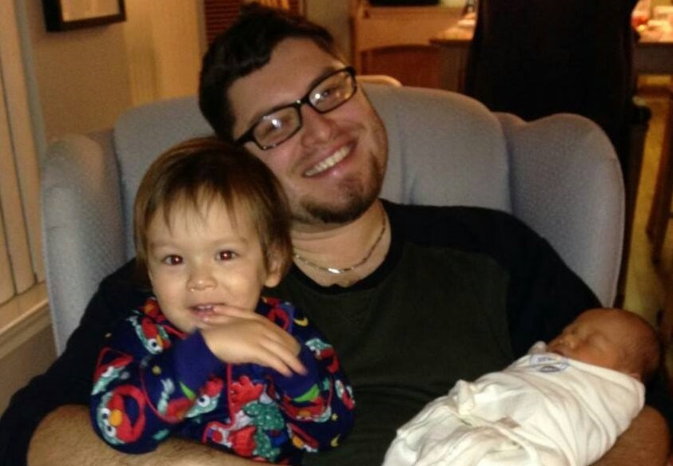

## Introduction
  
  - Background
    * PhD in Bioinformatics, MS Biostatistics (U of M)
    * Data Scientist at Trinity Health (1.5 years)
    * Two boys (2.5 and 0.25 years)
    * Hipster metalhead
  
  - Motivation
    * Medical billing codes assigned to encounter
    * Date of the encounter
    * Aggregate code usage (monthly)
    * "Did we observe more live births at SJMHS than usual in November?"

##

## Outlier Detection

## Change Point Detection

## Acknowledgements

Thank you very much for your attention!

__Resources__  

AnomalyDetection: https://github.com/twitter/AnomalyDetection  

BreakoutDetection: https://github.com/twitter/BreakoutDetection  

Quandl: https://www.quandl.com  

