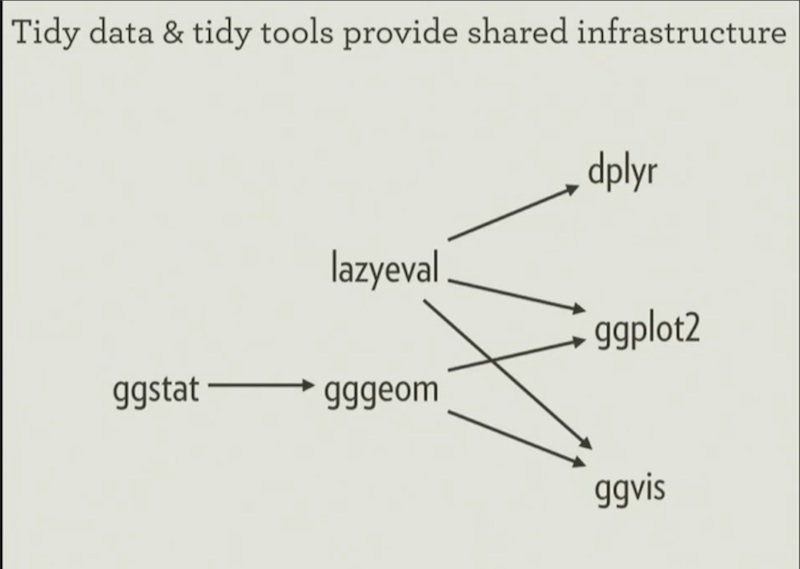

```{r include = FALSE, message = FALSE}
library(gggeom)
library(ggplot2)
library(dplyr)

```

## UseR 2016

- Happened at the end of June
- Most talks are available [online](https://channel9.msdn.com/Events/useR-international-R-User-conference/useR2016/)


## A note on nomenclature {.tidyverse}


<div class="centered">
  Hadleyverse -> **Tidyverse**
</div>


## Tenets of the tidyverse

1) Uniform data structures
2) Uniform APIs 



## Uniform data structures

- Data goes in a data frame
- Variables go in columns

**Tibbles are lazy, surly data frames**

```{r}
library(tibble)

tibble::data_frame(x = 1:3, y = list(1:5, 1:10, 1:20))

```

## Uniform APIs 

- A set of tidy tools for manipulating tidy data


## gggeom {.smaller}


```{r fig.height=2, fig.width=3.6}

head(nz)
plot(nz)

```

## ggstat 

Extracts stats needed by viz tools and makes them fast

```{r, fig.height=3.6, fig.width=6}

ggplot(mtcars, aes(x = wt, y = mpg)) +
  geom_point() +
  geom_smooth(method = "lm")

```


## lazyeval

R is not just a programming language,
it's an interactive data environment.    


```{r, eval = FALSE}
# Interactive use
mtcars %>% filter(cyl == 8)

# Doesn't work
x <- cyl == 8
mtcars %>% filter(x)

# Also doesn't work
var <- cyl
mtcars %>% filter(var == 8)
```
*NSE violates **referential transperancy***

## lazyeval
Formula notation is used as a **quoting** operator


```{r, eval = FALSE}
mtcars %>% filter_(~ cyl == 8)

# Works now
x <- ~ cyl == 8
mtcars %>% filter_(x)

# Will work soon
var <- ~ cyl
mtcars %>% filter_(~ uq(var) == 8)
```

*Look for lazyeval throughout the future tidyverse*


## Links to talks

Hadley Wickham: [Towards a grammar of interactive graphics](https://channel9.msdn.com/Events/useR-international-R-User-conference/useR2016/Towards-a-grammar-of-interactive-graphics) 

Richard Becker: [Forty years of S](https://channel9.msdn.com/Events/useR-international-R-User-conference/useR2016/Forty-years-of-S)

Karl Browman: [R/qtl: Just barely sustainable](https://channel9.msdn.com/Events/useR-international-R-User-conference/useR2016/Rqtl-Just-Barely-Sustainable)

David Robinson: [Broom](https://channel9.msdn.com/Events/useR-international-R-User-conference/useR2016/broom-Converting-statistical-models-to-tidy-data-frames)

Alice Daish: [Transforming a museum to be data driven using R](https://channel9.msdn.com/Events/useR-international-R-User-conference/useR2016/Transforming-a-museum-to-be-data-driven-using-R)
