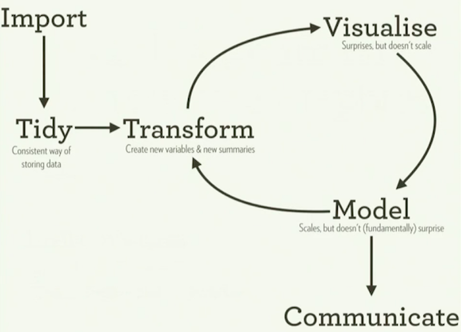
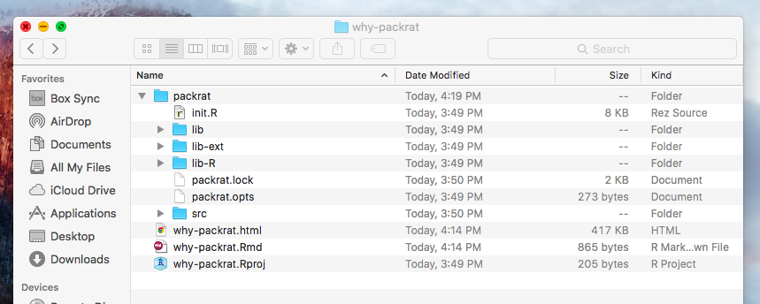
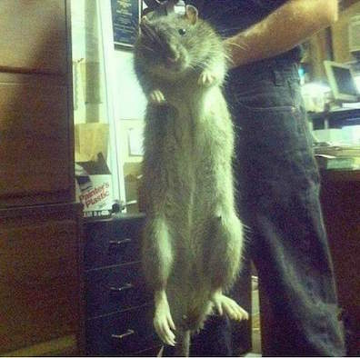

## Some data!

```{r, echo = FALSE, message = FALSE, warning = FALSE}
library(ggplot2)

packcount <- readRDS("packrat-counts.rds")

packplot <- ggplot(packcount, aes(x = date, y = value, color = key)) + 
  geom_line() +
  scale_color_brewer(palette = 10) + 
  theme_minimal() + 
  labs(x = "", y = "", title = "Packrat Downloads (since mid-2014)") +
  theme(
    legend.position  = c(.15, .7),
    legend.title     = element_blank(),
    panel.grid.minor = element_blank()
  )

packplot
```


## Tidy workflow {.centered}



* screen-cap'd from Hadley Wickham's useR 2016 talk on the [Tidyverse](https://channel9.msdn.com/Events/useR-international-R-User-conference/useR2016/Towards-a-grammar-of-interactive-graphics)

<div class="notes">
Typical project workflow

1. Create a new directory (and/or Git Repo)
2. Gather materials/data, install packages, write scripts
3. Produce R-Markdown with results and figures
4. Share & store results
</div>

## 6 months later...

- Sharing code with colleague
    - "Clone my repo, it's all in there"
    - Packages no longer on CRAN
    - Packages have been updated: code breaks/behavior changes
- Problematic if you need to update results or reproduce work

## What packrat solves | AKA why you should use it {.centered}


- Everything that happens inside this box occurs *within an environment*

## What is it?

- A package dependency management system for R
    - Influenced by `bundler` for Ruby
    - Developed by RStudio
        - designed to work well with projects (.Rproj files)
    - Ensures projects maintain reproducibility long-term
- Need to be able to build packages in order to use

## What is it? | Basic concepts

- **Private Package Library**
    - local package tar balls (source code)

- **Snapshots**
    - current state of a project

- **Restoring**
    - rebuilding a project's environment based on a snapshot

<div class="notes">
- Specific versions of packages
    - ~~not your R version~~ (you'll need docker or another solution for this level of control)
</div>

## Updated workflow



- A new folder added: `packrat/`
    - add and remove packages normally, as you would in any other setting

<div class="notes">
- packrat/packrat.lock: 
    - Lists the precise package versions that were used to satisfy dependencies, including dependencies of dependencies. (This file should never be edited by hand!)
- packrat/packrat.opts: 
    - Project-specific packrat options. These can be queried and set with get_opts and set_opts; see ?"packrat-options" for more information.
- packrat/lib/: 
    - Private package library for this project.
- packrat/src/: 
    - Source packages of all the dependencies that packrat has been made aware of.
- .Rprofile: 
    - Directs R to use the private package library (when it is started from the project directory).
    - Updates .libPaths()
</div>

## Key changes

- When you start an R session in a directory associated w/ a packrat project:
    - R only sees the packages installed in your *private package library*
    - installations and removal of packages will only affect the *private package library*

## Getting started

- Quick tutorial on setting up a project

## Wrap-up {.centered}

- CRAN data: http://cran-logs.rstudio.com/
- http://rstudio.github.io/packrat/



