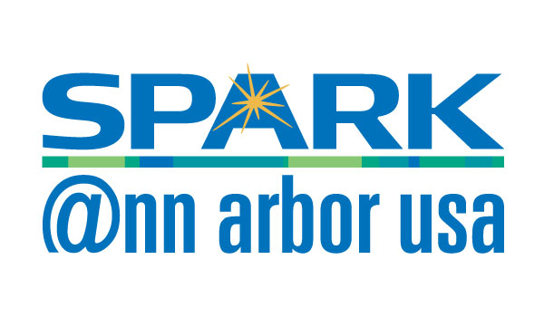

## Group Info {.reallybig}

[AnnArborRUserGroup.github.io](https://AnnArborRUserGroup.github.io)

[meetup.com/Ann-Arbor-R-User-Group](http://meetup.com/Ann-Arbor-R-User-Group)

**AARUG Organizers:**

 Ellis

 Clayton

 Rob

 Michelle

 Andrew

AnnArborRUserGroup@gmail.com

## Slack {.bigger}

[AnnArborRUserGroup.github.io/slack](https://AnnArborRUserGroup.github.io/slack)

## Sponsors

## October Meetup {.reallybig}

* **You:** We need 1-2 more speakers.

* **Date:** TDB

## Other Events {.bigger}

ASA: [Fall Kick-off Meeting at SPARK](https://www.meetup.com/Ann-Arbor-Chapter-of-the-American-Statistical-Association/events/233957244/) - Tuesday, September 20 @7PM

Coffee House Coders: [Meetup at Espresso](https://www.meetup.com/Ann-Arbor-Coffee-House-Coders/events/233642749/) - Wednesday, September 21 @7PM

Machine Learning: [Machine Learning to Accelerate Insurance Performance](https://www.meetup.com/Machine-Learning-Data-Science-and-Industry/events/233996690/) - Thursday, September 22 @6PM

NLP: [Language Detection in the Wild](https://www.meetup.com/Ann-Arbor-Detroit-NLPers-A2D-NLP/events/234004384/) - Thursday, September 22 @7PM

Duo Tech Talks: [Lawful Hacking: Using Existing Vulnerabilities to Wiretap Internet Communication](https://www.meetup.com/Duo-Tech-Talks/events/233427349/) - Thursday, September 29 @6PM

# Presentations
