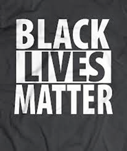

## Who I am
- Neuroscience Researcher @UMich
- Study brain connectivity & psychiatric disorders
- twitter: @dankessler
- web: www.dankessler.me
- I use R for data wrangling and behavioral/fancier analyses (e.g. mixed effects)
- New to Stan and Police Shooting data

## Who I am *not*
- Sociologist/Demographer
- Expert on Stan
- Well-trained Bayesian statistician
- Person of Color
- Police Officer

## Acknowledgements
- Mike Angstadt
- Chandra Sripada
- Kerby Shedden
- Cody Ross
- AARUG & Ann Arbor ASA
- SPARK

## What to Expect
- Review Cody Ross's Method & Finding
- Introduce Stan
- Anatomy of a Stan program
- Alternative Model for Police Shootings
- Our very tentative results


# Background

## The Problem


The US has recently witnessed a number of high-profile deaths of African-Americans at the hands of police.
<br>
<br>
<br>
<br>

There is a pressing need to study this phenomenon quantitatively. Why?

- Case reports are insufficient and could even be misleading
- Better understand the causes
- Help shape solutions

## An Important Step Forward

A Multi-Level Bayesian Analysis of Racial Bias in Police Shootings at the County-Level in the United States, 2011-2014
Cody T. Ross*

US Police-Shooting Database (USPSD)

- crowd-sourced database
- covers years 2011-2014
- n=721

## Ross' Two Step Modeling Strategy

For each county i, let $C_{i}$ be the ratio of: $\frac{P(killed_{unarmed} | black)}{P(killed_{unarmed} | white)}$

- Step 1: Use Bayesian methods to estimate the $C_{i}$'s
- Step 2: Use Bayesian methods to examine the effects of county-level covariates in accounting for variance in the $C_{i}$'s

<br>
<br>
<br>
<br>
```
Ross, C. T. (2015). A Multi-Level Bayesian Analysis of Racial Bias in Police Shootings
at the County-Level in the United States, 2011-2014. PLoS ONE, 10(11), e0141854-34
```

## Key Results
1. Unarmed black civilians are 3.49 times as likely to be shot by police compared to unarmed white civilians
2. There is substantial variation in the county-level risk ratios
    - Miami-Dade 22.88, Los Angeles 10.25, New Orleans 9.29
3. County-level risk ratios are not related to county-level race-specific crime rates
    - This finding is particularly important because black people are overrepresented in violent crime. One might otherwise use this observation to explain away elevated risk ratios
  
## Our Work builds on Ross (2015) in two ways
1. We use a newly available Washington Post database
    - likely more comprehensive
    - spans 2015-present
2. We adopt a different modeling framework, while retaining the spirit of Ross's Bayesian methods

## Our main questions
1. Are Ross's main results replicated in WashPo database?
    - black/white racial disparity, large spatial variation, disparity unaccounted for by crime rates
2. Is there temporal stability in spatial variation in risk ratios?
    - in other words, will Miami-Dade, Los Angeles, and New Orleans (and other counties with elevated risk) tend to still have higher risk ratios in the WashPo database?
  

# Stan

## What is stan
- mc-stan.org
- Bayesian statistical inference w/Markov-Chain Monte Carlo (MCMC) sampling
- Named for Stanislaw Ulam: co-inventor of Monte Carlo methods
- R Bindings (plus other languages)

## Bayesian Statistics Quickstart
- Treat parameters as random with underlying distribution (prior)
- Interest: Distribution of parameter conditional on observed data (posterior)
- Parameters can depend on hyper-parameters, and those in turn...
- MCMC: Procedurally sample from posterior of parameters
- Powerful approach enables computation to handle o/w difficult math

## Anatomy of a Stan Program
- Organized into blocks
- Lines are either declarations (`real[100] Counts`) or statements (`x = 5`)
- data (what you read from environment, declarations ONLY)
- transformed data (mix declarations & statements)
- parameters (declarations only)
- transformed parameters (declarations & statements; define parameters in terms of one another)
- model (sampling statements / log probability incrementers)
- generated quantities (values to store/extract later)

# Our Approach

## New Data: WaPo Database
- Covers 2015+
- Under version-control on [github](https://github.com/washingtonpost/data-police-shootings)
- Only fatal shootings by on-duty police

## Binomial -> Poisson Regression
- Ross's approach is based on a binomial (sum of bernoulli trials)
- But, data is captured at an aggregate count level
- Discrete counts of rare events -> Poisson distribution ($\lambda$)
- $\lambda$ changes based on covariates
- Poisson Regression
- $log(E[Y \ mid x)) = \theta'x$ or $E(Y \mid x) = e^{\theta'x}$
- Relative Risk: Covariates that interact with race give us RR
- $\frac{\lambda_{Black}}{\lambda_{White}} = \frac{e^{\theta_{1}'x_1 + \theta_{2}'x}}{e^{\theta_{2}'x}}$
- $\text(Relative Risk_{Black:White}) = e^{\theta_{i}}$ for any $\theta_i$ coded to interact with race

## Leveraging Repeated Measurements
- Are regional disparities in shooting persistent over time?
- Introduce a random variable $\beta_{i,d}$
- $\vec{\beta_{i}} = \begin{bmatrix} \beta_{i,1} & \beta_{i,2} \end{bmatrix}$
- $\vec{\beta_{i}} \sim N(0,\Sigma)$
- Introduce two such $\beta$, one interacts with race (random slope) other doesn't (random intercept)
- Off-diagonal of $\Sigma$ for random slope indicates persistent racial disparity in shooting

## Parameterization
- Step 1: Shooting ~ Race | Population(Offsets), Dataset
- Step 2: Shooting ~ Race | Population(Offsets), Dataset, B:W Ratio
- Step 3: Shooting ~ Race | Population(Offsets), Dataset, B:W Ratio, Arrest Rate Ratio
- Very limited data for Step 3 (for now)

## Model Specification
Let $C_x$ be an observed count of shootings with associated predictors $x$.
$C_x \sim \text{Poisson}(\lambda_x)$
$\lambda_x = e^{\theta'x}$
$\theta$ is the vector of coefficients for the GLM. 
Let $\theta$ have block structure as 
$\theta = \begin{bmatrix} \theta_{Race:Demo} & \theta_{Offset} & \theta_{Race}  & \theta_{County:Time} & \theta_{Race:County:Time} \end{bmatrix}$
In most cases the elements of $\theta_{*}$ are simply one or more beta coefficients, which unless otherwise specified have uninformative priors.
Introduce two additional random variables:
$\vec{\beta}_{County:Time}^{i} = \begin{bmatrix} \beta_{\textit{D1, County:Time}}^i & \beta_{\textit{D2, County:Time}}^i \end{bmatrix}$

$\vec{\beta}_{Race:County:Time}^{i} = \begin{bmatrix} \beta_{\textit{YD, Race:County:Time}}^i & \beta_{\textit{D2, Race:County:Time}}^i \end{bmatrix}$

$\vec{\beta}_{County:Time}^{i} \sim N(0,\Sigma_1)$

$\vec{\beta}_{Race:County:Time}^{i} \sim N(0,\Sigma_2)$


## Results
- Step 1
RR Black:White = 4.13
RR Var = 1.31
RR Cov(D1,D2)  = .225
- Step 2: 
RR Black:White = 2.70
RR Var = 1.17
RR Cov(D1,D2) = .204
- Step 3: 
RR Black:White = 2.66
RR Var = 1.29
RR Cov(D1,D2) = .265

# Conclusions
- Evidence of real problem, not easily explained by covariates
- BUT: useful covariates are hard to acquire & structure
- Evidence suggests disparities persist over time
- Modeling can return ranked lists to enable closer study of both those at top & bottom

# Questions?
- Thank you for your attention!
