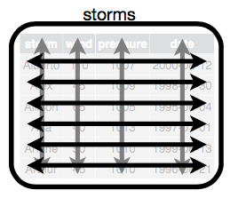
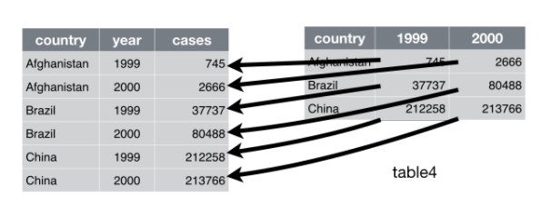
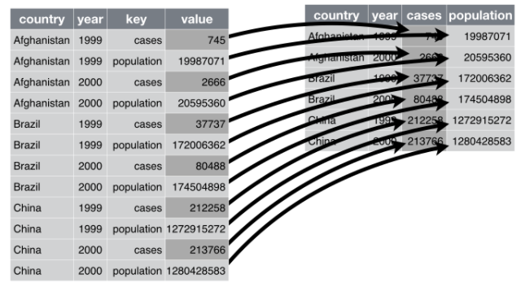
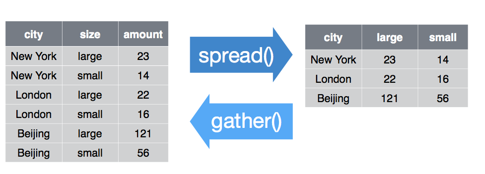
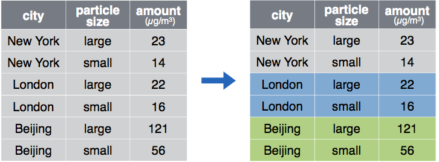
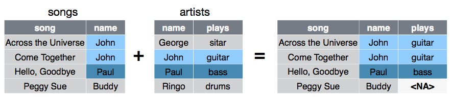
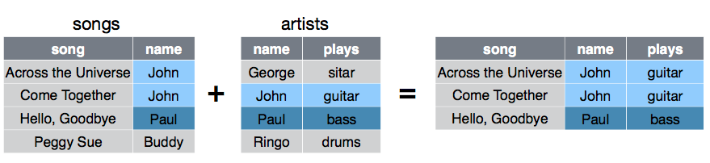
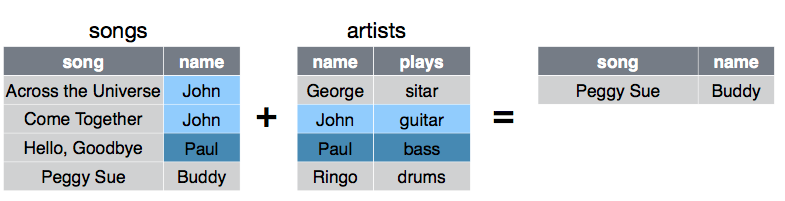

## Who am I?

- 5th year PhD student in Ecology & Evolutionary Biology 
    - **Dissertation work:** patterns of microbial diversity in freshwater lakes.
- R enthusiast/user since 2014.  
    - *Exactly* one year ago today, I taught an [RMarkdown workshop](https://rpubs.com/marschmi/RMarkdown).
- Graduate Teaching Consultant (with specialty in instructional technology) at the [Center for Research on Learning and Teaching](http://www.crlt.umich.edu/) (CRLT)  
- [Software Carpentry](https://software-carpentry.org/) Instructor
- [FEMMES](http://femmes.studentorgs.umich.edu/) Executive board member (Females Excelling More in Math Engineering in Science)  
- Rock climber
- Once I swam from Asia to Europe 


## Who am I *not*?

- An expert on tidy data  
- An expert R programmer  


## What to Expect

Using datasets from the EDAWR package [@R-EDAWR]...  

 - What's tidy data? [@tidy-data]  
 - Helpful `tidyR` verbs [@R-tidyr]  
 - Pipes from the `magrittr` package [@R-magrittr]  
            - Send piped output to `ggplot2` [@R-ggplot2]  
- Useful `dplyR` [@R-dplyr] verbs  
 
## Raise your hand if over the last year you have worked with data ...
- **daily**?  
- A few times a **week**?  
- A few times a **month**?
 
 
## Raise your hand if you work in the ...
- **humanities**?  
- **social sciences**?  
- **STEM** (science, technology, engineering, math)?
  
 
## Why use tidyR & dplyR?
- 50-80% of data analysis is spent on cleaning and preparing data [@tidy-data]  
      - These packages were developed to make data cleaning/preparation/reshaping more efficient and easy  
- Avoid "metadata hell" and being a culprit on [#otherpeoplesdata](https://twitter.com/search?q=%23otherpeoplesdata&src=typd)

## Prepare your R environment

```{r, message=FALSE}
library(tidyr)      # Let's organize our data!
library(dplyr)      # Let's manipulate our data!
library(EDAWR)      # Some data examples
library(ggplot2)    # For plots
```


# `tidyR` Efficient data reshaping

## Tidy Data

1. Each **variable** is saved in its own **column.**  
2. Each **observation** is saved in its own **row.**  
3. Each "type" of observational unit is a **single table.**  

### Easy access to variables & Automattically preseve observations

## Tidy Data

### Easy access to variables & Automattically preseve observations
```{r}
head(storms, n = 2)
```




## Characteristics of messy data [@tidy-data] 

1. Column headers are values, not variable names.  
2. Multiple variables are stored in one column.  
3. Variables are stored in both rows and columns.  
4. Multiple types of observational units are stored in the same table.  
5. A single observational unit is stored in multiple tables.  


## Part 1: Is this data tidy?
```{r}
cases # Tuberculosis cases from 3 countries
```

What **variables** are in this data?

## Part 1: Is this data tidy?
```{r}
cases # Tuberculosis cases from 3 countries
```

**No, column headers are values, not variable names.**  

3 variable names should be:  
1. `country`  
2. `year`  
3. `count` or `n`  

### How to make this data tidy?

## How to make the data tidy?  With `gather()`

```{r, echo = FALSE}
cases
```

`gather(data, "year", "cases", 2:3)`

   


## How to make the data tidy?  With `gather()`

`gather()` *collapses* multiple columns into 2 columns:  
      1. **Key:** Column with former column names.  *E.g. **"year"***  
      2. **Value:** Column with values in former column cells. *E.g. **"n"***  
      3. **Indices**: *Which* columns to gather

`gather(data, "key", "value", indices)`     
```{r}
gather(cases, "year", "n", 2:4)
```


## Part 2: Is this data tidy?
```{r}
pollution # particulate load from 3 cities
```

What **variables** are in this data?

## Part 2: Is this data tidy?
```{r}
pollution # particulate load from 3 cities
```

**No, multiple variables are stored in one column.**  

3 variable names should be:  
1. `city`  
2. Amount of `large` particles  
3. Amount of `small` particles   


## How to make the data tidy?  With `spread()`

```{r, echo = FALSE}
head(pollution, n = 2) # particulate load from 3 cities
```

`spread(data, "key", "value")`

   

## How to make the data tidy?  With `spread()`

`spread()` creates multiple columns *from* 2 columns:  
      1. Unique values in the **key** column become a column name.  *E.g. **"size"***  
      2. Each value in the **value** column becomes a cell in new columns. *E.g. **"amount"***
      
`spread(data, "key", "value")`           
```{r}
spread(pollution, "size", "amount")
```


## Rename columns with `rename()`

```{r}
head(pollution, n = 3)

rename(pollution, concentration = amount) 
```


## 2 helpful `tidyR` verbs

`gather()` vs `spread()`  




# the pipe operator: %>%

## Pipes: %>%

- R's copy of the unix pipe: |  
- Will directly move the output of one function to another function  
- Reduces the number of variables needed  
- Increases code readability 

## Pipes: %>%

`gather(cases, "year", "n", 2:4)`

```{r}
cases %>%                    # Dataframe in use
  gather("year", "n", 2:4)   # Spread the data into columns: size and amount
```

Also known as: `cases %>% gather("year", "n", 2:4)`


## Pipe into a plot & build ggplot layers with +
```{r, fig.align='center', fig.height=3.5, fig.width=4}
cases %>%                       # Dataframe in use
  gather("year", "n", 2:4) %>%  # Spread the data into columns: size and amount
  ggplot(aes(x = country, y = n, color = country, fill = country)) +     # Plot the data 
    geom_boxplot(alpha = 0.5) + geom_jitter(size = 2.5) +theme_bw()
```


# `dplyR` Efficient data transformation

## Helpful `dplyR` functions

### Accessing information  

1. **Extract** existing variables: `select()`  
2. **Extract** existing observations: `filter()`
3. **Calculate/derive** new variables: `mutate()`  
4. `summarise()` multiple values into one value.  
5. `group_by()` groups factors together  

### Joins 

`left_join()`, `right_join()`, `anti_join()`, `inner_join()`, and more


## 3 ways to Pick columns with `select()`

- List the column names you **do** want    
```{r, eval = FALSE}
storms %>%  select(storm, wind)   # Pick only storm and wind columns
storms %>% select(storm:wind)     # Pick storm to wind columns
```

- List the column names you **don't** want
```{r, eval = FALSE}
storms %>% select(-pressure)            # Remove one column, pressure 
storms %>% select(-c(pressure, date))   # Remove multiple columns, pressure and date 
```

- Select the column indices
```{r, eval = FALSE}
storms %>% select(1:2)      # Pick only columns 1 & 2 
```

## Helper functions with select 

Select columns that:  

- `contains()`: Are based on a character string  
- `starts_with()` or `ends_with()`:  Contain part of a character string    
- `one_of()`: Names are in a group of names  
- `matches()`: Name matches a regular expression  

```{r}
storms %>% select(contains("s")) %>% head(n = 3)
```


## Pick rows with `filter()`

```{r}
storms %>% filter(wind >= 50) # Wind speeds equal to or greater than 50 mph

storms %>% filter(storm %in% c("Ana", "Alberto")) # Pick Ana & Alberto
```

## Create new variables with `mutate()` 
```{r}
head(storms, n = 2)
```

Calculate the ratio of pressure to wind
```{r}
storms %>% mutate(ratio = pressure/wind) %>% head(n = 2)
```


## Create new variables with `mutate()`
```{r, fig.align='center', fig.height=3.5, fig.width=4}
storms %>% 
  mutate(ratio = pressure/wind) %>%     # Calculate the ratio of pressure to wind
  ggplot(aes(x = date, y = ratio)) + geom_line(size = 1.5, color = "grey") + 
  theme_bw() + geom_point(size = 4, color = "cornflowerblue")
```


## `summarise()` multiple values to one value
```{r}
head(storms, n = 1)
```

```{r}
storms %>% 
  summarise(mean_wind = mean(wind),           # Mean wind of storms
            max_wind = max(wind),             # Max wind of storms
            median_pres = mean(pressure),     # Mean pressure of storms
            n = n())                          # Number of values measured
```

## Sort values with `arrange()`

Sort in ascending order
```{r}
storms %>% arrange(wind)
```

## Sort values with `arrange()`

Sort in descending order
```{r}
storms %>% arrange(desc(wind))  
```


## Sort values with `arrange()`

Sort first by wind, then date
```{r}
storms %>% arrange(wind, date)    
```


## `group_by()`

```{r, eval = FALSE}
pollution %>% 
  group_by(city)    # Group by city 
```



## `group_by()`  

Efficient group statistics with `group`
```{r}
pollution %>% 
  group_by(city) %>%
  summarise(mean_particles = mean(amount))
```


# Joins

## Joining data sets together 

```{r}
songs

artists
```

## Join 2 datasets together  

* `right_join(a, b, by = "V1")`: Join matching rows from **a** to **b**  
* `left_join(a, b, by = "V1")`: Join matching rows from **b** to **a**

```{r, eval = FALSE}
left_join(songs, artists, by = "name")
```




## Join 2 datasets together  

* `full_join(a, b, by = "V1")`: Join data and retain everything  
* `inner_join(a, b, by = "V1")`: Join data but only keep rows in both sets  

```{r, eval = FALSE}
inner_join(songs, artists, by = "name")
```




## Filtering joins  

* `semi_join(a, b, by = "V1")`: Keep all rows that *have a match* in **b**  
* `anti_join(a, b, by = "V1")`: Keep all rows that *do not* have a match in **b**

```{r, eval = FALSE}
anti_join(songs, artists, by = "name")
```




## Resources

- [These slides](http://rpubs.com/marschmi/tidyR_dplyR)  
- Data wrangingling [cheatsheet with tidyr & dplyr](https://www.rstudio.com/wp-content/uploads/2015/02/data-wrangling-cheatsheet.pdf)
- Garrett Grolemund [Data Wrangling with R slides](https://dl.dropboxusercontent.com/u/5896466/wrangling-webinar.pdf)  
    - **Note:** Many of the images from my presentation are from Garrett's presentation above. 

# Questions?

## References  

