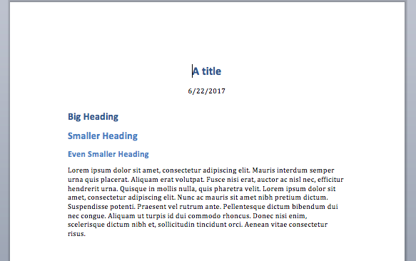
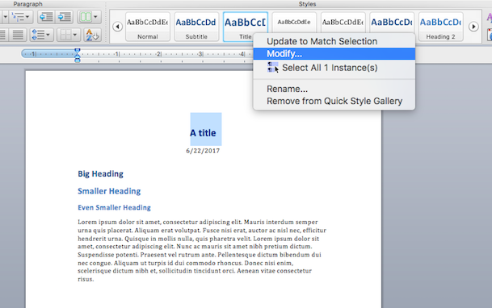
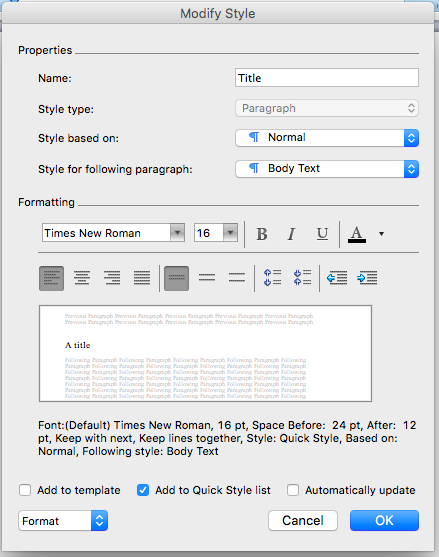
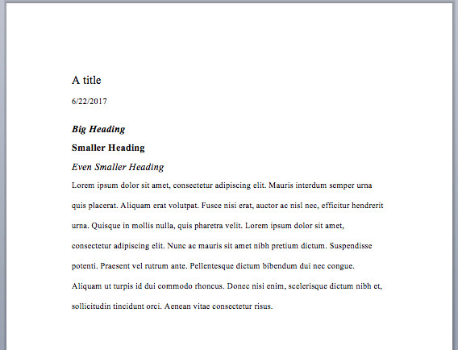

## Introduction

- Data analyst in the UM School of Social Work
- Co-organizer for AARUG
- useR for around 4 years
- Literate programming is awesome

## What to Expect

- How to pull a little more value from R Markdown as a reporting tool
- References are another kind of data we often have to care about
- Likely most helpful for students & academics, but handy if you're integrating any kind of writing and R code
- We'll talk about how to insert and control:
    1. Citations
    2. (Word) document styling

# Citations

## Getting started: Gathering citations
### Only undergrads & masochists don't use reference managers

<!-- picture of books here? -->

- Pick a good reference manager
- All store/organize sources, just need to be able to export metadata (citations) in various formats
- Free:
    - Zotero
    - Mendeley
- Not free:
    - EndNote
    - Refworks (students)

## Getting started: bibliography files

This is an example `.bib` file. Regardless of the format, your reference manager should export a text file holding the metadata from each source.

<!-- lots of information packed into each line, but you only really need to think about the top line -->

```{r}
library(readr)
cat(read_file("mybib.bib"), sep = "\n")
```

## The YAML header

- Every RMarkdown/Markdown document usually begins with a YAML header, which gives some instructions on how the document should be rendered
- We're adding a new line: `bibliography` which points to the file containing the sources the document cites

```
---
title: "Sample Document"
output: html_document
bibliography: mybib.bib
---
```

## The YAML header

Lots of different bibliography files are supported by pandoc/RMarkdown:

| Format | File extension |
| :----- | :------------- |
| BibLaTeX | .bib |
| BibTeX | .bibtex |
| RIS | .ris |
| EndNote | .enl |
| EndNote XML | .xml |

*(For a complete list, head to [RStudio's website](http://rmarkdown.rstudio.com/authoring_bibliographies_and_citations.html))*

## The YAML header

You can also manually enter citations; seems not ideal...

```
---
references:
- id: cohen_power_1992
  title: A power primer
  author:
  - family: Cohen
    given: Jacob
  container-title: Psychological Bulletin
  volume: 112
  DOI: 10.1037/0033-2909.112.1.155
  issue: 1
  page: 155-159
  type: article-journal
  issued:
    year: 1992
    month: 7
---
```

## Inserting citations: markdown syntax

*Refer to a given article's ID `[@article_id]` from your bibliography file*

```
Conventions on the 'size' of an experimental effect have 
been long established [@cohen_power_1988, @cohen_power_1992].
```

<!-- pandoc defaults to Chicago style when rendering -->

> Conventions on the 'size' of an experimental effect have been long established (Cohen, 1988; Cohen, 1992).

*You can negate the author name(s) by adding a `-` in front of the article tag/ID*

```
Effect sizes in this manuscript were evaluated using Cohen's conventions of 
'small', 'medium' and 'large' [-@cohen_power_1992, pp. 155-156].
```

> Effect sizes in this manuscript were evaluated using Cohen's conventions of 'small', 'medium', and 'large' (1992, pp. 155-156).

## Reference style

Depending on your needs, a certain format for both the in-line citations and the reference section might be required. You can support this by adding a `.csl` file to your markdown's directory and the appropriate line to your YAML.

```
---
title: "Sample Document"
output: html_document
bibliography: mybib.bib
csl: apa-5th-edition.csl
---
```

Zotero maintains a [repository](https://www.zotero.org/styles) for different csl files. You can also find them on [github.](https://github.com/citation-style-language/styles)

*Note: reference sections always render as the last section of your document!*

# Styling a word document for collaborators

## Customizing word document output

- I prefer to do my written reporting where my R code for tables and graphics lives, but this becomes less feasible when working with multiple collaborators. 
- MS Word is still one of the most common editors used to pass around content. 
- Being able to control how RMarkdown/pandoc renders these files is handy for setting up a first draft (or reports you'll re-use).
- We control this through a reference document, and another line in the YAML header.

```
---
title: "Sample Document"
output: 
  word_document:
    reference_docx: word-styles-reference-02.docx
bibliography: mybib.bib
csl: apa-5th-edition.csl
---
```

## Starting a reference document (1)

We start by creating a sort of template in RMarkdown-- something like this:

```
---
title: "A title"
date: "6/22/2017"
output: word_document
---

# Big Heading
## Smaller Heading
### Even Smaller Heading

Lorem ipsum dolor sit amet, consectetur adipiscing elit. Mauris interdum semper urna quis placerat. Aliquam erat volutpat. Fusce nisi erat, auctor ac nisl nec, efficitur hendrerit urna. Quisque in mollis nulla, quis pharetra velit. Lorem ipsum dolor sit amet, consectetur adipiscing elit. Nunc ac mauris sit amet nibh pretium dictum. Suspendisse potenti. Praesent vel rutrum ante. Pellentesque dictum bibendum dui nec congue. Aliquam ut turpis id dui commodo rhoncus. Donec nisi enim, scelerisque dictum nibh et, sollicitudin tincidunt orci. Aenean vitae consectetur risus.
```

## Starting a reference document (2)

When we knit the file, we get back something like this...



## Word styles

`Rmd -> docx` is depending on preconfigured options in Word called "styles". Below are the types of text we included in our markdown that we'll update.

| Markdown | Word Style |
| :------- | :--------- |
| Heading 1 `#` | Heading 1 |
| Heading 2 `##` | Heading 2 |
| Heading 3 `###` | Heading 3 |
| YAML title | Title |
| YAML date | Date |
| Plain text | Normal (or First Paragraph) |

## Modifying styles (1)

We don't want to create or delete any styles-- just change the ones that pandoc etc. is expecting.



## Modifying styles (2)

After you open up the modify window, you can adjust the font, size, and emphasis, and see changes reflected in the sample box.



## Modifying styles (3)

After you've modified each relevant style, save this document with a new file-name. This updated docx with the styles you've chosen can now be used as a reference docx for other reports you run. The original markdown we used can be deleted.



## Further reading

- [Citations in RMarkdown](http://rmarkdown.rstudio.com/authoring_bibliographies_and_citations.html)
- [Styling word documents](http://rmarkdown.rstudio.com/articles_docx.html)
- Several [other](http://www.carlboettiger.info/2012/03/24/citations-in-markdown-using-knitr.html) [packages](https://tclavelle.github.io/blog/reference_tips/) that provide other forms of managing bibliography files with RMarkdown
- Questions?
- Thanks!