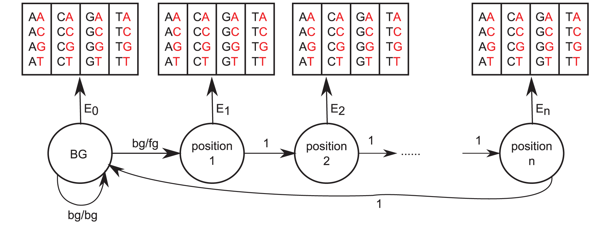

# Introduction

## About me
- GVSU Math / UMich Bioinformatics
- Worked with Prof. Aaron King to build biological models in R
- I was an R novice a year and a half ago!

## About Markov Models
- Markov models are great for time series!
- They allow us to incorporate understanding of mechanisms in a system.

# Markov Models

## Markov Chain
- A stochastic process that satisfies the Markov property
- All the information about the future state of the system is contained in the present state of the system.
- States of the system at sequential time points are related by a stochastic process with parameters $\theta$.

$$X_0 \overset{\theta}{\rightarrow} X_1 \overset{\theta}{\rightarrow} X_2 \overset{\theta}{\rightarrow} \cdots$$

## Markov Chain
- A stochastic process that satisfies the Markov property
- All the information about the future state of the system is contained in the present state of the system.
- States of the system at sequential time points are related by a stochastic process with parameters $\theta$.

$$\begin{bmatrix}A_0\\B_0\\C_0\end{bmatrix} \overset{\theta}{\rightarrow} \begin{bmatrix}A_1\\B_1\\C_1\end{bmatrix} \overset{\theta}{\rightarrow} \begin{bmatrix}A_2\\B_2\\C_2\end{bmatrix} \overset{\theta}{\rightarrow} \cdots$$

## Markov Chain Example
```{r, out.width = "500px", echo=FALSE, fig.align='center'}

```

## Markov Chain Example

- The state variables in this system are binary-valued:

- Best way to estimate parameters in this case is to calculate MLE for the transition probabilities

## Hidden Markov Model
- The underlying system is a Markov process, with unobserved states.
- Data is generated by a (stochastic) observation process, and comprise "observed" states.
- Observation states and Process states may have any of a variety of relationships.

$$ \begin{matrix}
X_0        & \rightarrow & X_1        & \rightarrow & X_2        & \rightarrow & \cdots & \text{Signal}       \\
\downarrow &             & \downarrow &             & \downarrow &             &        &                     \\
Y_0        &             & Y_1        &             & Y_2        &             & \cdots & \text{Observations}
\end{matrix} $$

## Transcription Factor Binding Site Prediction

- Hidden state: position in binding site.
- Observed state: nucleic acid sequence

$$\begin{array}
\text{B} & B & B & B & 1 & 2 & 3 & 4 & B & \text{Signal} \\
A & C & G & A & A & C & T & C & A & \text{Observations}
\end{array}$$

```{r, out.width = "500px", fig.align='center', echo=FALSE}

```
<footnote>Mathelier, A., & Wasserman, W. W. (2013). The next generation of transcription factor binding site prediction. PLoS computational biology, 9(9), e1003214.</footnote>

## Likelihood
- Calculated in the same way as probability
$$\mathcal{L}(\theta | x) = P(x | \theta)$$


## Likelihood for HMMs
$$ \begin{matrix}
X_0        & \rightarrow & X_1        & \rightarrow & X_2        & \rightarrow & \cdots        \\
           &             & \downarrow &             & \downarrow &             &               \\
           &             & Y_1        &             & Y_2        &             &
\end{matrix} $$

- $f_{X_0}$ : PDF of the system state at time $t=0$

- $f_{X}$ : PDF of $X_t$ given $X_{t-1}$

- $f_{Y}$ : PDF of $Y_t$ given $X_t$

- Probability of initial state $x_0$, state transition $x_0 \rightarrow x_1$, and observation $y_1$:
$$f_{X_0}(x_0; \theta) f_X(x_1 | x_0; \theta) f_Y(y_1 | x_1; \theta)$$

## Likelihood for HMsM
- Probability of initial state $x_0$, transitions $x_1, \ldots x_N$, and observations $y_1, \ldots, y_N$:
$$f_{X,Y}(x_{0:N}, y_{1:N}; \theta) = f_{X_0}(x_0; \theta) \prod_{t=1}^N f_X(x_t | x_{t-1}; \theta) f_Y(y_t | x_t; \theta)$$

- We have data $y_{1:N}^*$, but no observations for $x_{1:N}$. The solution is to compute the marginal PDF of $y_{1:N}$ and evaluate at the data $y_{1:N}^*$:

$$ \mathcal{L}(\theta) = \int_{x_{0:N}} f_{X,Y}(x_{0:N}, y_{1:N}^*; \theta) \; d x_{0:N}$$

## Likelihood for HMMs
We can sum the log-likelihood of successive transitions to obtain the log-likelihood of the entire sequence (due to the Markov property). But since the hidden state transitions are unknown, we have to sum over all possibilities. This is usually impossible.

$$ \begin{matrix}
X_0        & \rightarrow & X_1        & \rightarrow & X_2        & \rightarrow & \cdots        \\
           &             & \downarrow &             & \downarrow &             &               \\
           &             & 4          &             & 6       &             &
\end{matrix} $$

## Using **pomp**
- We can use the **pomp** package to encode Hidden Markov Models as R objects.
- **pomp** comes with tools to evaluate models.

## Ricker model
- A Ricker model is a population model that relates the population at time $t$ to the population at time $t + 1$.
$$N_{t+1} = N_t e^{r\left(1-\frac{N_t}{k}\right)}$$

- $r$ is the intrinsic growth rate

- $k$ is the carrying capacity


## Ricker model
```{r include = FALSE}
library(ggplot2)
```
```{r}
data <- read.csv("./data/rickerdata.csv")
ggplot(data, aes(time, )) + geom_point()
```


## Using **pomp**
- **pomp** requires a few things to build a minimal model:
```{r}
library(pomp)

rickerModel <- pomp(data = data,
                    times = 'time',
                    t0 = 0)
```

- Specifying a few more arguments will help us in the next step:
```{r}
rickerModel <- pomp(rickerModel,
                    statenames = c('N', 'e'),
                    obsnames = c('pop'),
                    paramnames = c('r','k','sigma'))
```

## Initialization process

```{r}
init <- function (params, t0,...){
  return(c('N' = params[['N.0']], 'e' = params[['e.0']]))
}

rickerModel <- pomp(rickerModel, initializer = init)
```

## Specifying the stochastic process

```{r}
rproc <- discrete.time.sim(
  step.fun = function(x, t, params, delta.t, ...) {

    sigma <- params[['sigma']]
    r <- params[['r']]
    k <- params[['k']]

    N <- x[['N']]
    e <- x[['e']]

    result <- c('e' = rnorm(1, mean=0, sd=sigma),
                'N' = r * N * exp(e - N/k))

    return(result)
  },
  delta.t = 1
)

rickerModel <- pomp(rickerModel, rprocess = rproc)
```

## Specifying the measurement model
```{r}
rmeas <- function (x, t, params, ...) {
  N <- x[['N']]
  phi <- params[['phi']]
  result <- c('pop' = rpois(n=1, lambda=phi * N))

  return(result)
}

rickerModel <- pomp(rickerModel, rmeasure = rmeas)
```

## Specifying the measurement model distribution function
```{r}
dmeas <- function(y, x, t, params, log, ...) {
  N <- x[['N']]
  pop <- y[['pop']]
  phi <- params[['phi']]

  return(dpois(x, phi*N, log=log))
}

rickerModel <- pomp(rickerModel, dmeasure = dmeas)
```

## Simulation
library(magrittr)
rickerModel <- pomp(rickerModel, params = c(N.0=1,e.0=0,r=20,k=1,sigma=0.1,phi=200))
simulate(rickerModel, as.data.frame = T) %>% ggplot(aes(time, pop)) + geom_point()
