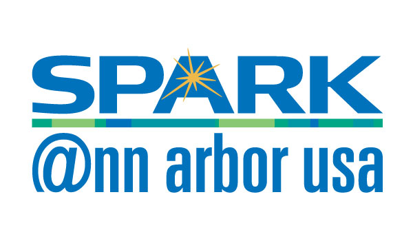

.pull-left[
## Group Info

[AnnArborRUserGroup.github.io](https://AnnArborRUserGroup.github.io)

[meetup.com/Ann-Arbor-R-User-Group](http://meetup.com/Ann-Arbor-R-User-Group)

[AnnArborRUserGroup@gmail.com](AnnArborRUserGroup@gmail.com)
]

.pull-right[
## Organizers

]

---
class: center, middle

### [https://a2mads.herokuapp.com/](https://a2mads.herokuapp.com/)

---
class: center, middle

# Sponsors

---
class: center, middle

# 2017 Spring Meetups

### October 12 - 6:30 PM @ SPARK

### November 9 - 6:30 PM @ SPARK

Speakers and topics TBA! Please reach out to the organizers if you are interested in presenting.

---
class: center, middle

# Other Events

[Big Data Ignite](http://www.bigdataignite.com/)

September 27 - 29th in Grand Rapids, MI

Get 50% off with code: `BDIA2FLASH`

---
class: inverse, center, middle

# Presentations
