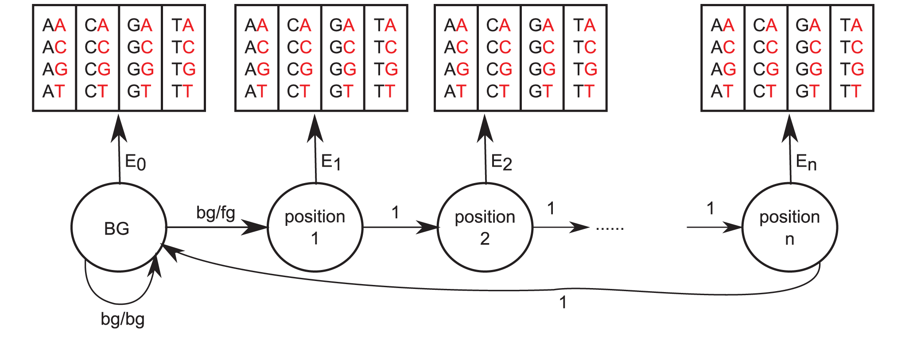
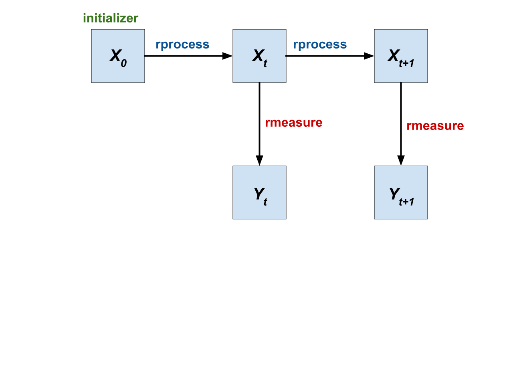
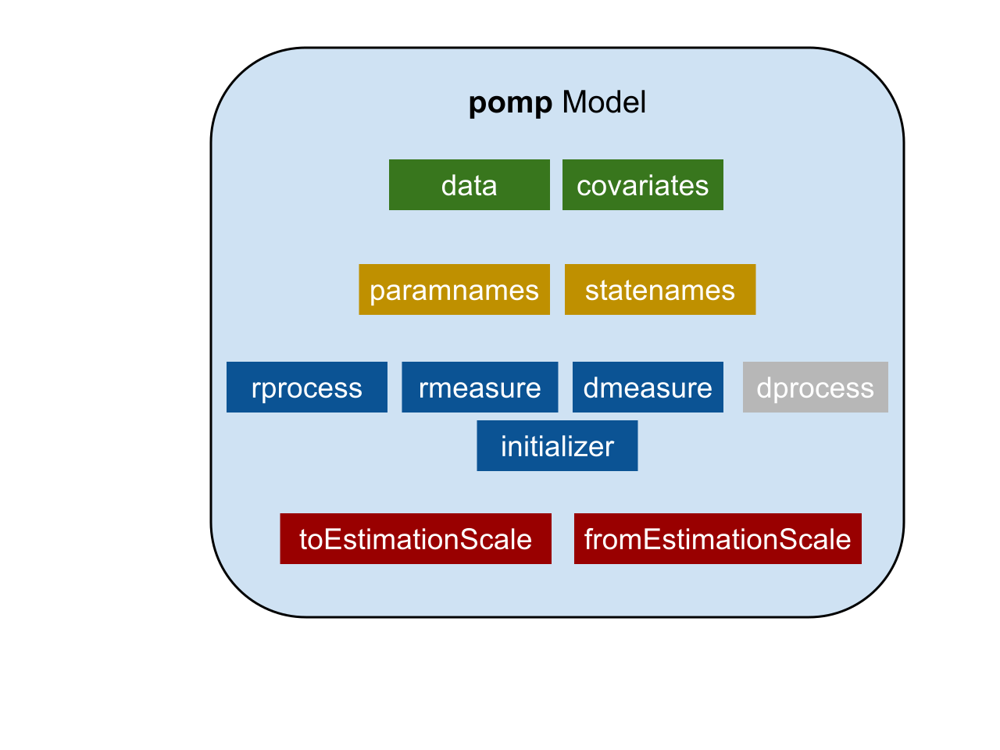

<style>
div.footnotes {
  position: absolute;
  bottom: 0;
  margin-bottom: 10px;
  width: 80%;
  font-size: 0.6em;
}
</style>

<script src="https://ajax.googleapis.com/ajax/libs/jquery/3.1.1/jquery.min.js"></script>
<script>
$(document).ready(function() {
  $('slide:not(.backdrop):not(.title-slide)').append('<div class=\"footnotes\">');

  $('footnote').each(function(index) {
    var text  = $(this).html();
    var fnNum = (index+1).toString();
    $(this).html(fnNum.sup());

    var footnote   = fnNum + '. ' + text + '<br/>';
    var oldContent = $(this).parents('slide').children('div.footnotes').html();
    var newContent = oldContent + footnote;
    $(this).parents('slide').children('div.footnotes').html(newContent);
  });
});
</script>

# Introduction

## About me
- GVSU Math / UMich Bioinformatics
- Worked with Prof. Aaron King to build biological models in R
- I was an R novice a year and a half ago!
- ashtonsb@umich.edu
- github.com/ashtonbaker

## About Markov Models
- Much more than the Markov Chains you might have seen in Linear Algebra
- Markov models are great for time series!
- They allow us to use our understanding of the mechanisms that are generating data.

# Markov Models

## Markov Chain
- A stochastic process that satisfies the Markov property
- All the information about the future state of the system is contained in the present state of the system.
- States of the system at sequential time points are related by a stochastic process with parameters $\theta$.

$$X_0 \overset{\theta}{\rightarrow} X_1 \overset{\theta}{\rightarrow} X_2 \overset{\theta}{\rightarrow} \cdots$$

## Markov Chain
- A stochastic process that satisfies the Markov property
- All the information about the future state of the system is contained in the present state of the system.
- States of the system at sequential time points are related by a stochastic process with parameters $\theta$.

$$\begin{bmatrix}A_0\\B_0\\C_0\end{bmatrix} \overset{\theta}{\rightarrow} \begin{bmatrix}A_1\\B_1\\C_1\end{bmatrix} \overset{\theta}{\rightarrow} \begin{bmatrix}A_2\\B_2\\C_2\end{bmatrix} \overset{\theta}{\rightarrow} \cdots$$

## Markov Chain Example
```{r, out.width = "500px", echo=FALSE, fig.align='center'}

```

## Markov Chain Example

- The state variables in this system are binary-valued:
```{r echo=FALSE}
head(read.csv('./data/stockdata.csv', header=TRUE))
```
- Best way to estimate parameters in this case is to calculate MLE for the transition probabilities

## Hidden Markov Model
- The underlying system is a Markov process, with unobserved states.
- Data is generated by a (stochastic) observation process, and comprise "observed" states.
- Observation states and Process states may have any of a variety of relationships.

$$ \begin{matrix}
X_0        & \rightarrow & X_1        & \rightarrow & X_2        & \rightarrow & \cdots & \text{Signal}       \\
\downarrow &             & \downarrow &             & \downarrow &             &        &                     \\
Y_0        &             & Y_1        &             & Y_2        &             & \cdots & \text{Observations}
\end{matrix} $$

## Transcription Factor Binding Site Prediction

- Hidden state: position in binding site.
- Observed state: nucleic acid sequence

$$\begin{array}
\text{B} & B & B & B & 1 & 2 & 3 & 4 & B & \text{Signal} \\
A & C & G & A & A & C & T & C & A & \text{Observations}
\end{array}$$

```{r, out.width = "500px", fig.align='center', echo=FALSE}

```
<footnote>Mathelier, A., & Wasserman, W. W. (2013). The next generation of transcription factor binding site prediction. PLoS computational biology, 9(9), e1003214.</footnote>

# Using **pomp**

## Using **pomp**
- We can use the **pomp** package to encode Hidden Markov Models as R objects.
- **pomp** has names for each random process, inspired by the names of distribution functions in R

```{r, out.width = "700px", fig.align='center', echo=FALSE}

```

## The structure of a **pomp** model
- Our goal is to use **pomp** to perform "simulation-based inference"
- We need to encode everything that we need to simulate the process that we hypothesize

```{r, out.width = "600px", fig.align='center', echo=FALSE}

```

## Ricker model
- A Ricker model is a population model that relates the population at time $t$ to the population at time $t + 1$.
$$N_{t+1} =r N_t e^{\left(-\frac{N_t}{k}\right)}$$<footnote>https://kingaa.github.io/sbied/intro/ricker.html</footnote>

- $r$ is the intrinsic growth rate

- $k$ is the carrying capacity

## A stochastic Ricker Model
- If we assume that the growth rate $r$ is log-normally distributed, then
$$N_{t+1} = r N_t \exp(-N_t/k + \epsilon_t),$$
where $\epsilon_t \sim \text{Normal}(0, \sigma)$.

- In any real system, we need to model measurement error:
$$y_t \sim \text{Poisson}(\phi N_t)$$

## Ricker model
```{r}
library(ggplot2)
data <- read.csv("./data/rickerdata.csv")
ggplot(data, aes(time, pop)) + geom_line()
```

## Using **pomp**
- **pomp** requires a few things to build a minimal model:
```{r}
library(pomp)

rickerModel <- pomp(data = data,
                    times = 'time',
                    t0 = 0)
```

- Specifying a few more arguments will help us in the next step:
```{r}
rickerModel <- pomp(rickerModel,
                    statenames = c('N'),
                    obsnames = c('pop'),
                    paramnames = c('r','k','sigma'))
```

## Initialization process
- In our model, the initial value for $N$ is a *parameter*.
- This gives the model an additional degree of flexibility.
```{r}
init <- function (params, t0,...){
  return(c('N' = params[['N.0']] ))
}

rickerModel <- pomp(rickerModel, initializer = init)
```

## Specifying the stochastic process
$$N_{t+1} = r N_t \exp(-N_t/k + \epsilon_t),$$

```{r}
rproc <- discrete.time.sim(
  step.fun = function(x, t, params, delta.t, ...) {
    sigma <- params[['sigma']]
    r <- params[['r']]
    k <- params[['k']]
    N <- x[['N']]
    e <- rnorm(1, mean=0, sd=sigma)
    result <- c('N' = r * N * exp(e - N/k))
    return(result)
  },
  delta.t = 1
)

rickerModel <- pomp(rickerModel, rprocess = rproc)
```

## Specifying the measurement model
$y_t \sim \text{Poisson}(\phi N_t)$
```{r}
rmeas <- function (x, t, params, ...) {
  N <- x[['N']]
  phi <- params[['phi']]
  result <- c('pop' = rpois(n=1, lambda=phi * N))

  return(result)
}

rickerModel <- pomp(rickerModel, rmeasure = rmeas)
```

## Specifying the measurement model distribution function
- `dmeasure` should be the PDF of the Poisson distribution we used for `rmeasure`. This is available in R as the `dpois` function.

```{r}
dmeas <- function(y, x, t, params, log, ...) {
  N <- x[['N']]
  pop <- y[['pop']]
  phi <- params[['phi']]

  return(dpois(pop, lambda = phi*N, log=log))
}

rickerModel <- pomp(rickerModel, dmeasure = dmeas)
```

## Simulation
```{r}
p <- c(N.0=1, r=20, k=1,sigma=0.1,phi=200)
sim <- simulate(rickerModel, params = p, as.data.frame = T)
ggplot(sim, aes(time, pop)) + geom_line()
```

## Comparing simulations to the data
```{r out.width = "600px", fig.align='center'}
sim <- simulate(rickerModel, params = p, nsim=8,
                as.data.frame=TRUE,include.data=TRUE)
ggplot(data=sim,aes(x=time,y=pop,group=sim,color=(sim=="data")))+
  geom_line()+guides(color=FALSE)+facet_wrap(~sim,ncol=3)
```

## Adjusting parameters
```{r out.width = "600px", fig.align='center'}
p <- c(N.0=68, r=40, k=11,sigma=0.1,phi=1)
sim <- simulate(rickerModel, params = p, nsim=8,
  as.data.frame=TRUE,include.data=TRUE)
ggplot(data=sim,aes(x=time,y=pop,group=sim,color=(sim=="data")))+
  geom_line()+guides(color=FALSE)+facet_wrap(~sim,ncol=3)
```

# A Crash Course on Likelihood

## Likelihood
- Calculated in the same way as probability
$$\mathcal{L}(\theta | x) = P(x | \theta)$$

- Probability: How likely is outcome $x$ under this model and parameters $\theta$?

- Likelihood: How likely do the parameters $\theta$ explain the data $x$ under the model?

- The data, model, and parameters together are defined by a single number: likelihood. This can be used to compare models.

## Likelihood for HMMs
$$ \begin{matrix}
X_0        & \rightarrow & X_1        & \rightarrow & X_2        & \rightarrow & \cdots        \\
           &             & \downarrow &             & \downarrow &             &               \\
           &             & Y_1        &             & Y_2        &             &
\end{matrix} $$

- $f_{X_0}$ : PDF of the system state at time $t=0$

- $f_{X}$ : PDF of $X_t$ given $X_{t-1}$

- $f_{Y}$ : PDF of $Y_t$ given $X_t$

- Probability of initial state $x_0$, state transition $x_0 \rightarrow x_1$, and observation $y_1$:
$$f_{X_0}(x_0; \theta) f_X(x_1 | x_0; \theta) f_Y(y_1 | x_1; \theta)$$

## Likelihood for HMMs
- Probability of initial state $x_0$, transitions $x_1, \ldots x_N$, and observations $y_1, \ldots, y_N$:
$$f_{X,Y}(x_{0:N}, y_{1:N}; \theta) = f_{X_0}(x_0; \theta) \prod_{t=1}^N f_X(x_t | x_{t-1}; \theta) f_Y(y_t | x_t; \theta)$$

- We have data $y_{1:N}^*$, but no observations for $x_{1:N}$. The solution is to compute the marginal PDF of $y_{1:N}$ and evaluate at the data $y_{1:N}^*$:

$$ \mathcal{L}(\theta) = \int_{x_{0:N}} f_{X,Y}(x_{0:N}, y_{1:N}^*; \theta) \; d x_{0:N}$$

## Likelihood for HMMs
We can sum the log-likelihood of successive transitions to obtain the log-likelihood of the entire sequence (due to the Markov property). But since the hidden state transitions are unknown, we have to sum over all possibilities. This is usually impossible.

$$ \begin{matrix}
X_0        & \rightarrow & X_1        & \rightarrow & X_2        & \rightarrow & \cdots        \\
           &             & \downarrow &             & \downarrow &             &               \\
           &             & 4          &             & 6       &             &
\end{matrix} $$

## Better ideas
- If we specify the pdf of the measurement model, $f_Y(y_t | x_t; \theta)$ (or in **pomp**, the `dmeasure` function), then we can run simulations of the underlying markov process using `rprocess`, and compute the likelihood of the data using `dmeasure`.
- This gives an unbiased estimate of the likelihood! So all we have to do is compute the likelihood this way many times, and take the average.
- Unfortunately, this scales poorly with long time series.

## Even better ideas
- The Particle Filter uses the same basic idea, but at each step the probability of survival of the simulation, or "particles", is weighted by the likelihood of the simulation at that time point.

- It's easy to use in **pomp**!

```{r echo=TRUE}
p <- c(N.0=68, r=40, k=11,sigma=0.1,phi=1)
pf <- pfilter(rickerModel, params = p, Np = 5000)
logLik(pf)
```

## Comparing parameters
```{r echo=TRUE}
p1 <- c(N.0=1, r=20, k=1,sigma=0.1,phi=200)
p2 <- c(N.0=68, r=40, k=11,sigma=0.1,phi=1)
pf1 <- pfilter(rickerModel, params = p1, Np = 5000)
pf2 <- pfilter(rickerModel, params = p2, Np = 5000)
```
```{r echo = TRUE}
logLik(pf1)
logLik(pf2)
```

# Finding the MLE parameters

## MLE parameters
- Replaced the model with a C implementation behind the scenes
```{r include = FALSE}
pompExample(ricker)
rickerModel <- ricker
```

- One way of maximizing likelihood is to use a regular optimization function:

```{r warning=FALSE}
f <- function(par) {
  -logLik(pfilter(rickerModel, params = par, Np = 1000))
}

fit <- optim(par = c(r=44.60118, sigma=0.3, phi=10.0,
                     c=1.0, N.0 = 7.0, e.0=0.0), fn = f)
```

## MLE parameters
- The `optim` function has given us a better set of parameters. Let's get a good estimate for the log-likelihood using `pfilter`:

```{r}
logLik(pfilter(rickerModel, params = fit$par, Np = 5000))
```

## Iterated filtering
- A better way is to use "iterated filtering" implemented in **pomp** as `mif2()`
- Maximum likelihood by iterated, perturbed Bayes maps
- Uses a process similar to simulated annealing.

```{r}
mif <- mif2(rickerModel, Nmif=5, start=c(r=44.60118, sigma=0.3, phi=10.0,
                     c=1.0, N.0 = 7.0, e.0=0.0), Np=5000,
            rw.sd=rw.sd(r=0.05, sigma=0.05, phi=0.05,
                        c=0.05, N.0 = 0.05, e.0=0.05),
            transform=TRUE, cooling.type='geometric',
            cooling.fraction.50=0.05)
```

## Iterated filtering
- How do the MLE estimates compare? How do the likelihood estimates compare?
```{r}
coef(mif)
fit$par
logLik(pfilter(mif, Np=5000))
```

## Iterated filtering
- We might not have gotten better results here, but we can pick up our `mif` object and keep working:

```{r}
mif <- mif2(mif, Nmif=30)
logLik(mif)
```
