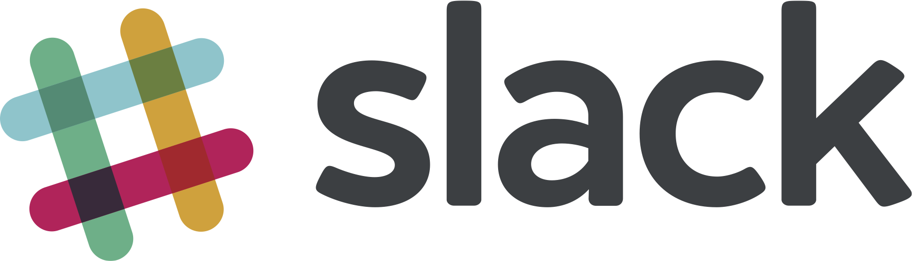

.pull-left[
## Group Info

- [AnnArborRUserGroup.github.io](https://AnnArborRUserGroup.github.io)

- [meetup.com/Ann-Arbor-R-User-Group](http://meetup.com/Ann-Arbor-R-User-Group)

- [AnnArborRUserGroup@gmail.com](AnnArborRUserGroup@gmail.com)
]

.pull-right[
## Organizers

 Ellis

 Clayton

 Rob

 Andrew
]

---
class: center, middle

### [https://a2mads.herokuapp.com/](https://a2mads.herokuapp.com/)

---
class: center, middle

# Sponsors

---
class: center, middle

# Future AARUG Meetups

### November 9 - 6:30 PM @ SPARK
#### `spotifyr` / package-development and...you?

### December - social TBD

---
class: center, middle

# Other Events

### PyData Ann Arbor - Tuesday, November 14 @ TD Ameritrade

### a2-dlearn - November 17, 2017 @ Bob and Betty Beyster Building

---
class: center, middle

# This month in R

### RStudio 1.1 released!
Dark theme, better terminal support, etc.
<https://www.rstudio.com/products/rstudio/download/#download>

---
class: center, middle

# Big Data Ignite

<http://www.bigdataignite.com/>

September 27 - 29th @ DeVos Place in GR

---
class: inverse, center, middle

# Presentations
