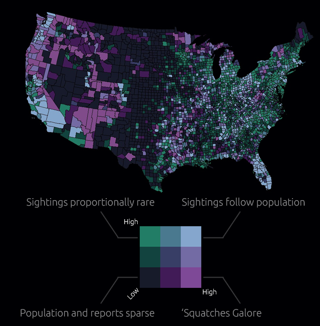

```{r opts, include = FALSE}
knitr::opts_chunk$set(echo = FALSE, message = FALSE, warning = FALSE)
```

# Introduction

## Data

- Can be found on [Kaggle](https://www.kaggle.com/NUFORC/ufo-sightings)

```{r init, echo = TRUE}
library(tidyverse)
library(lubridate)
library(stringr)

us <- read_csv("scrubbed.csv.zip") %>%
  mutate(
    date_time    = mdy_hm(datetime),
    year_sighted = year(date_time)
  ) %>%
  filter(country == "us", year_sighted < 2014) # 2014 is incomplete
```

```{r theme-set}
library(scales)
library(forcats)
library(magrittr)
library(glue)

theme_set(
  theme_minimal()
)
```

# Sighting trends

## Shapes over time

```{r shapes over time}
shape_df <- us %>%
  mutate(shape = fct_explicit_na(shape, "missing")) %>%
  count(year_sighted, shape) %>%
  spread(shape, n, fill = 0) %>%
  gather(shape, n, -year_sighted) %>%
  group_by(year_sighted) %>%
  mutate(
    pct   = n / sum(n),
    shape = fct_reorder(shape, n, .desc = TRUE)
  ) %>%
  filter(year_sighted > 1949)

p1 <- shape_df %>%
  filter(year_sighted != 1995, year_sighted != 1996) %>%
  ggplot(aes(x = year_sighted, y = pct, fill = shape, group = shape)) +
  geom_area(aes(fill = shape, group = shape)) +
  scale_y_continuous(label = percent, name = "") +
  scale_x_continuous(breaks = seq(1950, 2013, 5), name = "") +
  theme(
    panel.grid   = element_blank(),
    legend.title = element_blank()
  ) +
  annotate(geom = "text", x = 2005, y = .45, label = "Lights") +
  annotate(geom = "text", x = 1960, y = .77, label = "Disks") +
  annotate(geom = "text", x = 1992, y = .14, label = "Triangles") +
  annotate(geom = "text", x = 2005, y = .82, label = "Circles") +
  annotate(geom = "text", x = 2003, y = .71, label = "Fireballs")

p1
```

## Average number of sightings per state

```{r sightings-per-state}
sightings_per_state <- us %>%
  count(year_sighted, state) %>%
  filter(between(year_sighted, 1990, 2013))

avg13 <- sightings_per_state %>%
  filter(year_sighted == 2013) %$%
  round(mean(n), 2)

p2 <- sightings_per_state %>%
  ggplot(aes(x = year_sighted, y = n, group = year_sighted)) +
  scale_y_log10(name = "# Sightings / State (Log-10)") +
  geom_violin() +
  geom_jitter(alpha = .15) +
  labs(
    x = "",
    title = "Reported numbers of sightings in each state have been increasing since the 90s.",
    subtitle = glue("The average number of sightings per state in 2013 was {avg13}.")
  )

p2
```

## Can we do anything to explain the differences between states?

- Are demographic characteristics related to the number of reported sightings?

- Is it just population density?

- Drunk people?

## How about a choropleth?

Bigfoot sightings, 1921-2013 (Joshua Stevens [`@jscarto`](https://twitter.com/jscarto))

```{r, out.width="450px", fig.align="center"}

```

## We can use `tidycensus` and the `sf` package to get our population data

```{r build-df, echo = TRUE}
library(tidycensus)
library(sf)

# sign up at: https://api.census.gov/data/key_signup.html
# hiding my key, but calling census_api_key() to enable requests
source("census-api-key.R")

# set up the point data
us$geometry <- 1:nrow(us) %>%
  lapply(function(x) st_point(c(us$longitude[x], us$latitude[x]))) %>%
  st_sfc(crs = 4269)

# fortify the tbl
us2 <- st_sf(us)
```

## Query the census API

- `get_acs()`: primary workhorse for ACS data
  - `get_decennial()`
- `load_variables()`: retrieve table of variables you're wanting to pull
- `moe_` functions to calculate margin of error

```{r, echo = TRUE}
glimpse(load_variables(2013, "acs5"))
```

## Query the census API

```{r census-query, echo = TRUE}
countydat <-
  get_acs(
    geography = "county",
    variables = c("B17006_001", "B17006_002"),
    output    = "wide",
    geometry  = TRUE
  ) %>%
  mutate(area = st_area(geometry)) %>%
  st_transform(4269) %>%
  st_join(us2, join = st_contains) # here we match each point into their county

class(countydat)
```

- `geometry = TRUE` ensures that the TIGRIS files that provide the outlines of each county are returned with the query

<!--
  - data is returned as a list column
  - files can be cached if needed
- using a few functions from `sf`:
  - `st_area()` to get the number of $m^2$ for each county
  - `st_transform()` to set the coordinate system
  - `st_join()` to match our sightings (points) to each county
-->

## Get totals by county

```{r, echo = TRUE}
# drop the st class here, then create a count of sightings per county
rates <- countydat %>%
  as.data.frame %>%
  count(`NAME`) %>%
  right_join(
    countydat %>%
      select(NAME, B17006_001E, area, geometry) %>%
      distinct
  ) %>%
  mutate(
    d = B17006_001E / as.numeric(area / 1000000),   # <-- gotta make sure it's km^2
    dm = Hmisc::cut2(d, g = 3, levels.mean = TRUE), # next we cut up the distribution
    nm = Hmisc::cut2(n, g = 3, levels.mean = TRUE)  # on both vars, for bivariate comparison
  )
```

<!-- B17006_001E is population for our county unit -->

## Building the map

```{r, echo = TRUE}
levels(rates$dm) <- 1:3
levels(rates$nm) <- 1:3

rates$bin <- str_c(rates$dm, "-", rates$nm) %>%
  factor(levels = c(
    "3-1", "2-1", "1-1",  # col 1 -->
    "3-2", "2-2", "1-2",  # col 2 -->
    "3-3", "2-3", "1-3"   # col 3 -->
  ))

# from colorbrewer
vals <- c(
  "#8c510a", "#bf812d", "#dfc27d", # col 1 -->
  "#f6e8c3", "#f5f5f5", "#c7eae5", # col 2 -->
  "#80cdc1", "#35978f", "#01665e"  # col 3 -->
)
```

<!-- sightings vs density -->
<!-- each county now has a value of 1-3 for density and 1-3 for level of sightings -->
<!-- can stick these two values together to get a 9-level factor -->

## Building the map

```{r, echo = TRUE}
library(leaflet)

# set up a palette for leaflet
pal <- colorFactor(palette = rev(vals), rates$bin)
```

- `leaflet` works well with `sf` class data frames
- Can compose maps with lines, tiles, markers (points), and polygons

- `leaflet()` to initialze a leaflet plot
- features strung together by the `%>%` operator
- `addPolygons()` to make use of geometry data we have in a `sf` data frame

## Building the map

```{r, echo = TRUE}
bv_choro <- rates %>%
  filter(!str_detect(NAME, "Alaska|Hawaii|Puerto")) %>%
  st_sf() %>%
  st_transform(crs = "+proj=longlat +datum=WGS84") %>%
  leaflet() %>%
  addPolygons(       # uses geometry features to draw counties
    color = "black", # popups will be highlighted and contain data on n of sightings & density
    popup = ~glue_data(., "{NAME}; Sightings: {n}, Density: {round(d, 2)}"),
    stroke = TRUE,
    weight = 1,
    smoothFactor = 0.2,
    fillOpacity = 1,
    fillColor = ~pal(bin),
    highlightOptions = highlightOptions(color = "white", weight = 2, bringToFront = TRUE)
  )
```

```{r legend}
# no clean way to integrate our special legend into the plot itself
# will build one from scratch using ggplot2
legend_p <- rates %>%
  select(dm, nm, bin) %>%
  distinct %>%
  arrange(bin) %>%
  ggplot(aes(x = nm, y = dm, fill = bin)) +
  geom_tile() +
  scale_fill_manual(values = rev(vals)) +
  theme_minimal() +
  labs(x = sprintf("Sightings \u2192"), y = sprintf("Density \u2192")) +
  theme(
    panel.grid = element_blank(),
    axis.text  = element_blank(),
    legend.position = "none"
  )
```

## Product

```{r}
bv_choro
```

```{r, fig.align="right"}
legend_p
```

## Resources & Wrap-Up

- [Intro to leaflet](https://rstudio.github.io/leaflet/)

- [tidycensus](https://github.com/walkerke/tidycensus)
  - [basic usage](https://walkerke.github.io/tidycensus/articles/basic-usage.html)
  - [working with spatial data](https://walkerke.github.io/tidycensus/articles/spatial-data.html)

- Twitter: [@theysayHeyDrew](https://twitter.com/theysayHeyDrew)
- GitHub: [@mooreaw](https://github.com/mooreaw)
- Email: [andwilmo@umich.edu](andwilmo@umich.edu)
- [Website/blog](mooreaw.github.io)

