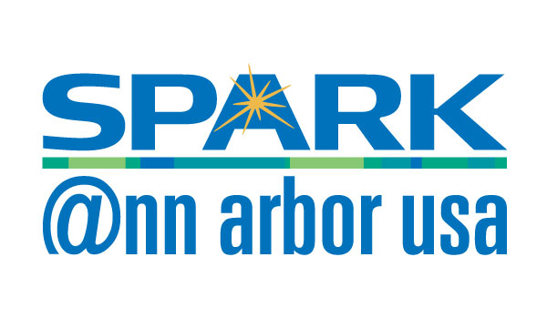

.pull-left[
## Group Info

- [AnnArborRUserGroup.github.io](https://AnnArborRUserGroup.github.io)

- [meetup.com/Ann-Arbor-R-User-Group](http://meetup.com/Ann-Arbor-R-User-Group)

- [AnnArborRUserGroup@gmail.com](AnnArborRUserGroup@gmail.com)

  

  
  <a href="https://a2mads.herokuapp.com/">https://a2mads.herokuapp.com/</a>

]

.pull-right[
## Organizers

  

  </img>
   Ellis
  

  
  

  </img>
   Clayton
  

  
  

  </img>
   Rob
  

  
  

  </img>
   Andrew
  

]

---
class: center, middle

# Sponsors

---
class: center, middle

# Upcoming AARUG Events

### December - TBD
#### Social Event

### January 11 - 6:30 PM @ SPARK
#### TBD

### February 8 - 6:30 PM @ SPARK
#### rstudio::conf(2018) recap
#### TBD

---
class: center, middle

# Other Events

### PyData Ann Arbor - Tuesday, November 14 @ TD Ameritrade

### a2-dlearn - November 17, 2017 @ Bob and Betty Beyster Building

---
class: center, middle

# This month in R

### R version 3.4.2 patched
Released 2017-11-06

### R version 3.4.3 (Kite-Eating Tree) 
Prerelease versions will appear starting Monday 2017-11-20.

Final release is scheduled for Thursday 2017-11-30.

---
class: inverse, center, middle

# Presentations
