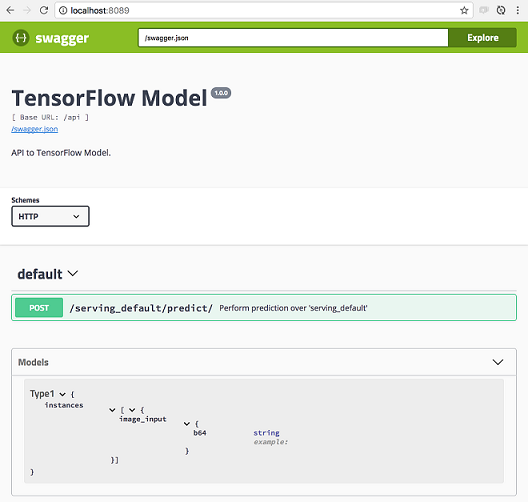

```{r setup, include=FALSE}
knitr::opts_chunk$set(echo = FALSE)
```

```{r libs, include=FALSE}
library(tidyverse)
library(plumber)
library(keras)
library(reticulate)
```

## Introduction

- data scientist @dominos
- R evangelist
- recent attendee of rstudio::conf
- "... I guess if you use `ifelse()` you're doing AI" - JJ Allaire

Production and Interoperability

- database best practices
- building APIs
- TensorFlow API

## Highlight{.centered}


## Database best practices

- **tl;dr** don't use `RODBC`
- use `odbc` + `DBI` instead

```{r connectDNS, echo=T, eval=F}
# connect using locally-defined Domain Name System (DNS)
conn <- DBI::dbConnect(odbc::odbc(), "MyDataMart")
```

```{r connectDriver, echo=T, eval=F}
# connect using DB-specific driver
conn <- DBI::dbConnect(
  odbc::odbc(),
  driver = "SQL Server",
  server = "Server",
  database = "DB",
  port = 12345
)
```

## Database best practices

- simple read/write

```{r io, echo=T, eval=F}
query <- "
SELECT
flight
,tailnum
,origin
FROM flights
ORDER BY origin
"

dataset <- DBI::dbGetQuery(conn, query)

message <- DBI::dbWriteTable(conn, "iris", iris)
```

## Database best practices

- using `dplyr` functions

```{r dplyr, echo=T, eval=F}
flights_db <- tbl(conn, "flights")

# set up the query
tailnum_delay_db <- flights_db %>% 
  group_by(tailnum) %>%
  summarise(
    delay = mean(arr_delay),
    n = n()
  ) %>% 
  arrange(desc(delay)) %>%
  filter(n > 100)

# show the query
tailnum_delay_db %>% show_query()

# execute query and collect the data
tailnum_delay <- tailnum_delay_db %>% collect()
```

## Database best practices

- using `pool` to manage DB connections
- mostly relevant for Shiny developers
- handles in-app connections (active and idle)
  - one/app --> fast but no simultaneous requests
  - one/query --> slow but allows simultaneous requests
  
```{r pool, echo=T, eval=F}
pool <- pool::dbPool(
  odbc::odbc(),
  driver = "SQL Server",
  server = "Server",
  database = "DB",
  port = 12345
)

dataset <- pool %>% 
  tbl("flights") %>% 
  collect()
```

## Building APIs

- `plumber` package (see [Ellis' plumber talk](https://cdn.rawgit.com/AnnArborRUserGroup/Presentations/master/2016-11/plumber/plumber-presentation.html#1))

```{r plumber, echo=T, eval=F}
# myfile.R

#* @get /mean
normalMean <- function(samples=10){
  data <- rnorm(samples)
  mean(data)
}

#* @post /sum
addTwo <- function(a, b){
  as.numeric(a) + as.numeric(b)
}
```

```{r expose, echo=T, eval=F}
library(plumber)
r <- plumb("myfile.R")
r$run(port=8000)
```

## R interface to Keras

- all the functionality of Python interface
- achieved through `reticulate`

```{r keras, echo=T, eval=F}
# instantiate the model
model <- application_resnet50(weights = 'imagenet')

# load the image
img_path <- "images/elephant.jpg"
img <- image_load(img_path, target_size = c(224,224))
x <- image_to_array(img)

# preprocess the input for prediction using resnet50
x <- array_reshape(x, c(1, dim(x)))
x <- imagenet_preprocess_input(x)

# make predictions then decode and print them
preds <- model %>% predict(x)
imagenet_decode_predictions(preds, top = 3)[[1]]
```

## Deploying TF models

- train and export models from `keras`
- test local deployment with `tfdeploy`
- deploy into production with `cloudml` and/or `rsconnect` (not shown)

```{r, echo=T, eval=F}
# Run local server with model
tfdeploy::serve_savedmodel("count-pepperoni")
```

## Deploying TF models{.centered}



## Bonus: embedding TF models in JavaScript!

- package `kerasjs` converts model to JS

```{r kerasjs, echo=T, eval=F}
# Install kerasjs from GitHub
devtools::install_github("rstudio/kerasjs")

# Train and Export model from Keras as HDF5
# or use an existing model
model_path <- system.file(
  "models/keras-mnist.hdf5",
  package = "kerasjs"
)

# Convert model to JavaScript and Preview
kerasjs_convert(model_path)
```

[Link to talk with demo](http://rpubs.com/jluraschi/deploying-tensorflow-rstudio-conf)

## Links

- [odbc + DBI](https://db.rstudio.com/)
- [pool](http://db.rstudio.com/pool/)
- [plumber](https://www.rplumber.io/)
- [keras](https://keras.rstudio.com/)
- [tfdeploy](https://tensorflow.rstudio.com/tools/tfdeploy/articles/introduction.html)
- [rstudio::conf 2018 slides](https://github.com/simecek/RStudioConf2018Slides)

