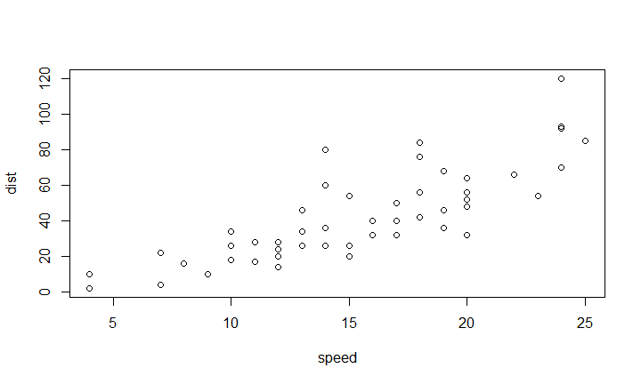

# An Introduction to SuperLearner, a loss-based ensemble prediction algorithm
Scott Grey, PhD  

## Overview

- Background on the development of super learner and targeted learning
- Theory behind the super learner algorithm
- Application of super learner in R
- Some (hopefully) helpful comments on utilizing super learner

## Background

"Essentially, all models are wrong, but some are useful" - George Box, 1979

- Mantra of statisticians regarding the development of statistical models for many years
- In the 1990s an awareness developed among statisticians (Breiman, Harrell) that this lackadaisical approach was wrong
- Simultaneously, computer scientists and some statisticians developed the machine learning field to address the limitations of parametric models

## Targeted learning
- Combines advanced machine learning with efficient semiparametric estimation to provide a framework for answering causal questions from data
- Developed by Mark van der Laan research group at UC Berkeley
- Started with the seminal 2006 article on targeted maximum likelihood estimation

## Slide with R Code and Output

<math display='block' xmlns='http://www.w3.org/1998/Math/MathML'>
 <mrow>
  <mi>M</mi><mo>:</mo><msub>
   <mi>P</mi>
   <mn>0</mn>
  </msub>
  <mo>&#x2208;</mo><mi>M</mi></mrow>
</math>

## Slide with Plot

---
An introduction to SuperLearner, a loss-based ensemble prediction algorithm
By Scott Grey, PhD
Ann Arbor R User Group
